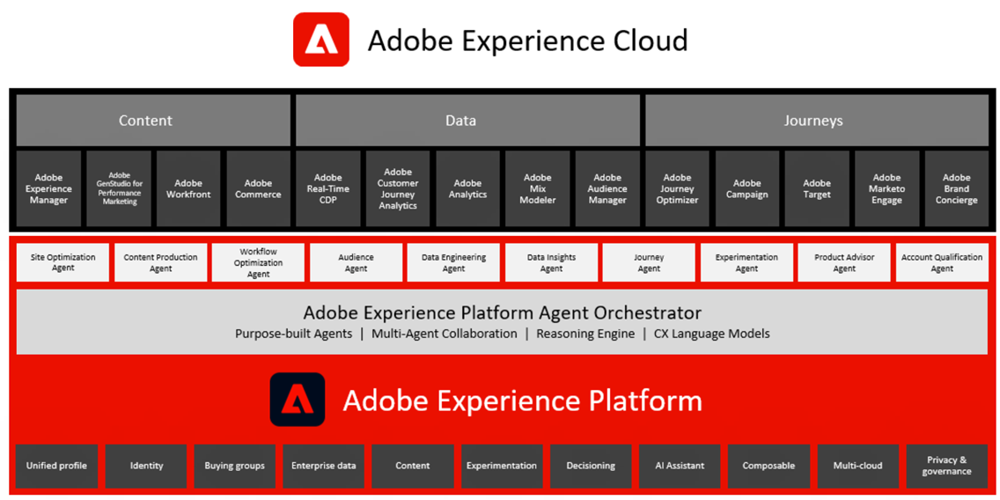
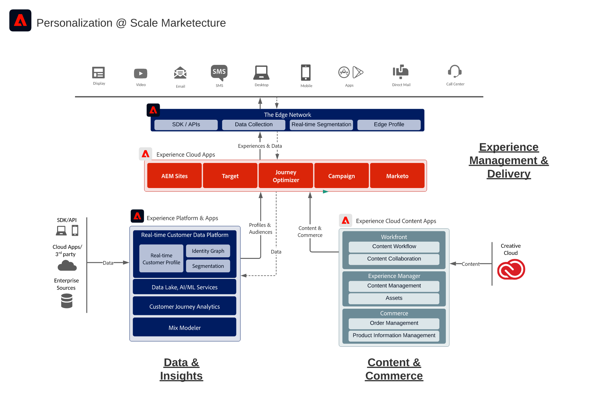
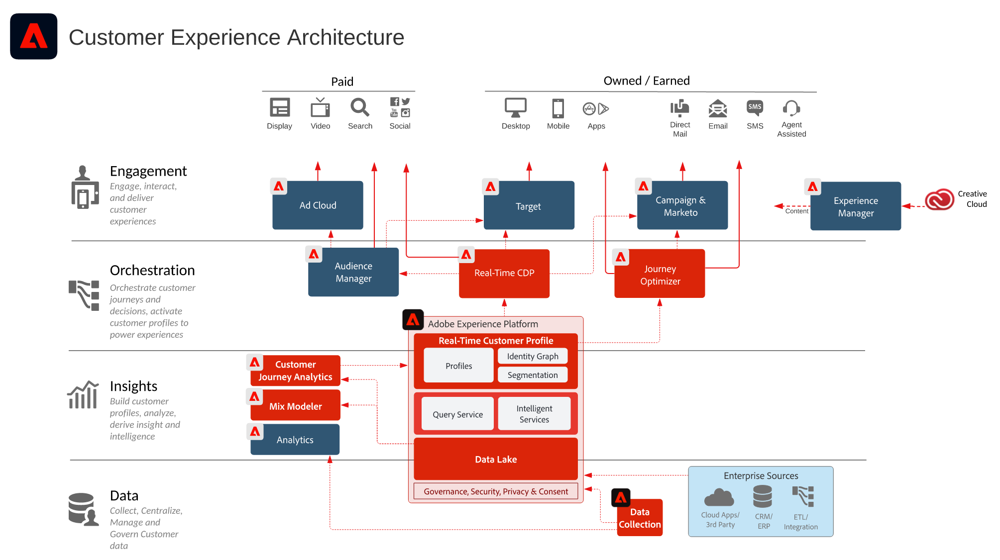

# Adobe Experience Cloud

這些圖表顯示Experience Cloud應用程式、應用程式服務和Experience Platform如何配合企業行銷架構。

## Adobe Experience Cloud 行銷架構

下圖說明 Adobe Experience Cloud 在 Adobe Experience Platform 基礎上所建置及整合之資料輪廓與客群、內容與商務、客戶歷程、行銷工作流程中各種元件的分佈情況。

{width="1000" zoomable="yes"}

## 資料與見解、內容與商務以及體驗傳送的整合架構

以下架構圖表說明 Adobe Experience Cloud 的各種元件如何連接和整合，以在資料、內容和體驗傳送之間大規模實現個人化。

{width="1000" zoomable="yes"}

## 在企業層面的 Adobe Experience Cloud

以下架構圖表說明 Adobe Experience Cloud 應用程式和 Adobe Experience Platform 如何整合到資料、洞察、策劃和參與這四個類別的企業客戶體驗架構中。

{width="1000" zoomable="yes"}
