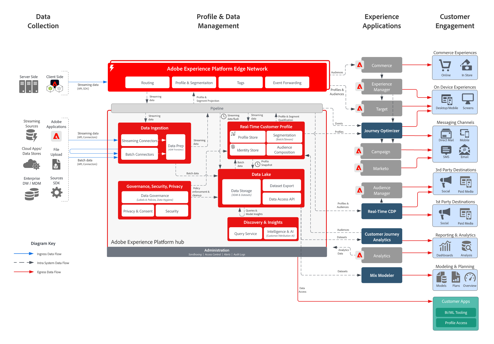

# Adobe Experience Platform與應用程式

這些架構圖表顯示Experience Platform (AEP)與其他Experience Cloud應用程式和應用程式服務的關聯性。

>[!MORELIKETHIS]
>
>Experience Cloud應用程式整合的[整合設定](https://experienceleague.adobe.com/docs/integrations-learn/experience-cloud/overview.html?lang=en)。

## 架構圖

此架構圖顯示 Adobe Experience Platform 如何與 Adobe Experience Cloud 應用程式及應用程式服務連結。

{width="1000" zoomable="yes"}

## 詳細的架構圖

{width="1000" zoomable="yes"}