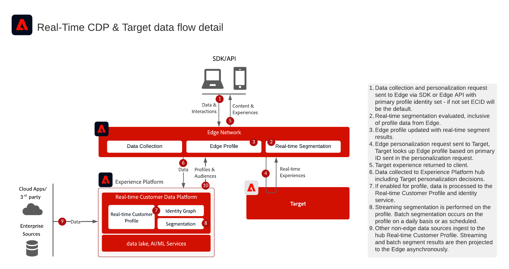

# Adobe Real-Time CDP與Adobe Target整合

此架構顯示[!DNL Real-Time Customer Data Platform]與[!DNL Adobe Target]如何透過Edge Network整合。 它可協助您在邊緣的即時受眾評估與使用Target共用串流或批次受眾之間選擇。

## 應用程式

* [!DNL Real-Time Customer Data Platform]
* [!DNL Adobe Target]
* [!DNL Experience Platform] Edge Network
* Experience Platform Web SDK或Edge Network伺服器API

## 選擇整合方法

### 邊緣的即時受眾評估

當[!DNL Adobe Target]需要邊緣評估對象和設定檔屬性以進行相同頁面或下一頁個人化時，請使用此方法。 實作Web SDK或Edge Network伺服器API，並設定啟用[!DNL Adobe Target]和[!DNL Experience Platform]服務的資料流。

### 串流和批次對象分享至Target

當在[!DNL Real-Time Customer Data Platform]中評估的對象需要在[!DNL Adobe Target]中可用而沒有即時邊緣評估時，請使用此方法。 在預設的生產沙箱中設定[!DNL Adobe Target]目的地。 只有在即時邊緣評估或自訂身分名稱空間查詢時，才需要實作網頁SDK或Edge Network伺服器API。

## 架構圖

此圖表顯示資料收集、 Edge Network、[!DNL Real-Time Customer Data Platform]和[!DNL Adobe Target]之間的主要整合點。

{zoomable="yes"}

## 資料流程圖

此序列顯示使用者端要求到達Edge Network、評估對象和設定檔內容、傳送個人化要求給[!DNL Adobe Target]，以及將產生的體驗傳回使用者端的方式。

{zoomable="yes"}

## 實施考量

* [!DNL Adobe Target]和[!DNL Real-Time Customer Data Platform]必須使用相同的IMS組織。
* [!DNL Adobe Target]目的地支援[!DNL Real-Time Customer Data Platform]中的預設生產沙箱。
* 若要在邊緣進行自訂身分名稱空間查閱，請使用網頁SDK或Edge Network伺服器API ，並在身分對應中包含每個身分。
* 如果使用at.js，設定檔整合僅支援ECID身分名稱空間。

## 相關文件

### 設定整合

* [適用於即時客戶資料平台的Adobe Target連線](https://experienceleague.adobe.com/docs/experience-platform/destinations/catalog/personalization/adobe-target-connection.html?lang=zh-Hant)
* [Edge資料流設定](https://experienceleague.adobe.com/docs/experience-platform/edge/datastreams/overview.html?lang=zh-Hant)

### 在邊緣實作

* [Experience Platform Web SDK檔案](https://experienceleague.adobe.com/docs/experience-platform/edge/home.html?lang=zh-Hant)
* [Experience Platform標籤檔案](https://experienceleague.adobe.com/docs/experience-platform/tags/home.html?lang=zh-Hant)
* [Experience Cloud ID服務檔案](https://experienceleague.adobe.com/docs/id-service/using/home.html?lang=zh-Hant)

### 評估客群

* [Experience Platform區段概觀](https://experienceleague.adobe.com/docs/experience-platform/segmentation/home.html?lang=zh-Hant)
* [即時分段](https://experienceleague.adobe.com/docs/experience-platform/segmentation/ui/edge-segmentation.html?lang=zh-Hant)
* [串流區段](https://experienceleague.adobe.com/docs/experience-platform/segmentation/api/streaming-segmentation.html?lang=zh-Hant)
* [合併原則設定](https://experienceleague.adobe.com/docs/experience-platform/profile/merge-policies/ui-guide.html?lang=zh-Hant#create-a-merge-policy)
