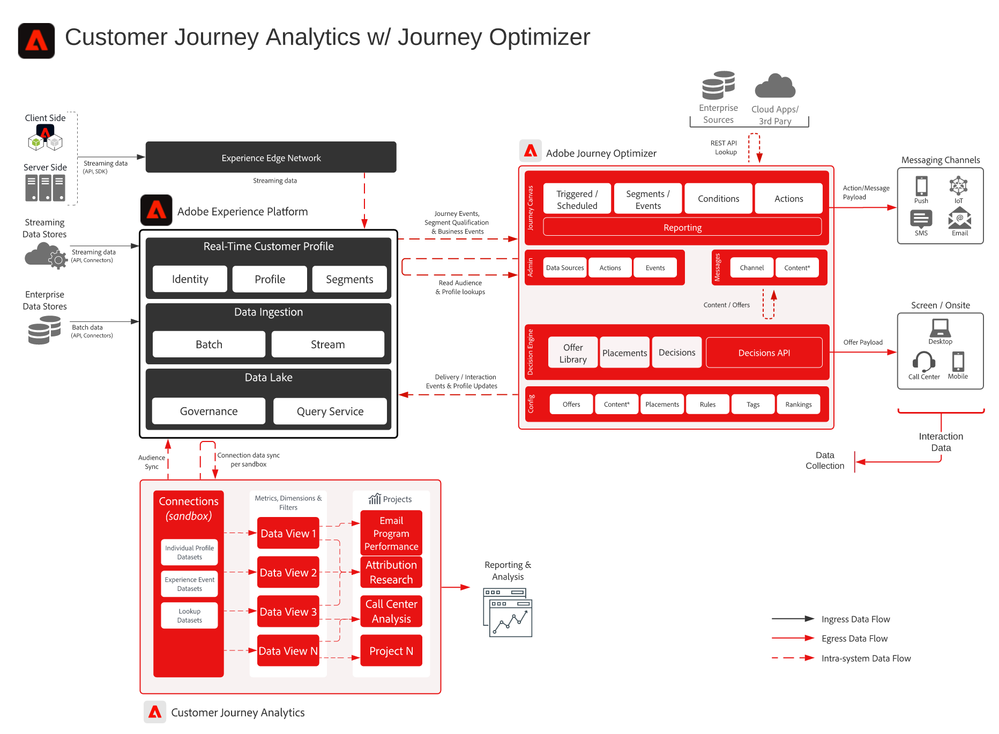

# Adobe Customer Journey Analytics與Adobe Journey Optimizer整合

此架構顯示Adobe Journey Optimizer傳送和互動資料如何透過Adobe Experience Platform傳輸至Customer Journey Analytics，以進行行銷活動和歷程深入分析。 在Customer Journey Analytics中建立的對象可透過Real-Time CDP發佈，以用於Journey Optimizer執行。

## Campaign和歷程深入分析架構

此架構將Journey Optimizer傳遞和互動資料與Experience Platform和Customer Journey Analytics連線，以便報告、分析和建立受眾。

{width="1000" zoomable="yes"}

## 主要資料流程和整合點

- Journey Optimizer傳遞、互動和有效性資料會分享至Experience Platform資料服務。
- Experience Platform資料會透過CJA連線擷取到Customer Journey Analytics中。
- Customer Journey Analytics資料檢視和分析提供campaign和journey insight。
- 在Customer Journey Analytics中編寫的對象會發佈至Real-Time CDP。
- Real-Time CDP受眾可用於Journey Optimizer歷程執行和個人化。

## 支援的使用案例模式

- [Customer Analytics和insight產生](/help/blueprints/use-case-patterns/analysis/customer-analytics-insight-generation.md) — 分析跨管道的行銷活動和歷程行為。
- [事件觸發訊息](/help/blueprints/use-case-patterns/campaign-management-orchestration/event-triggered-messaging.md) — 使用客戶和歷程訊號支援協調的訊息。

## 進一步閱讀

- [Journey Optimizer報告](https://experienceleague.adobe.com/en/docs/journey-optimizer/using/reporting/reports/sharing-overview)
- [Customer Journey Analytics概觀](https://experienceleague.adobe.com/en/docs/analytics-platform/using/cja-overview/cja-overview)
- [發佈Customer Journey Analytics對象](https://experienceleague.adobe.com/en/docs/analytics-platform/using/cja-components/audiences/publish)
