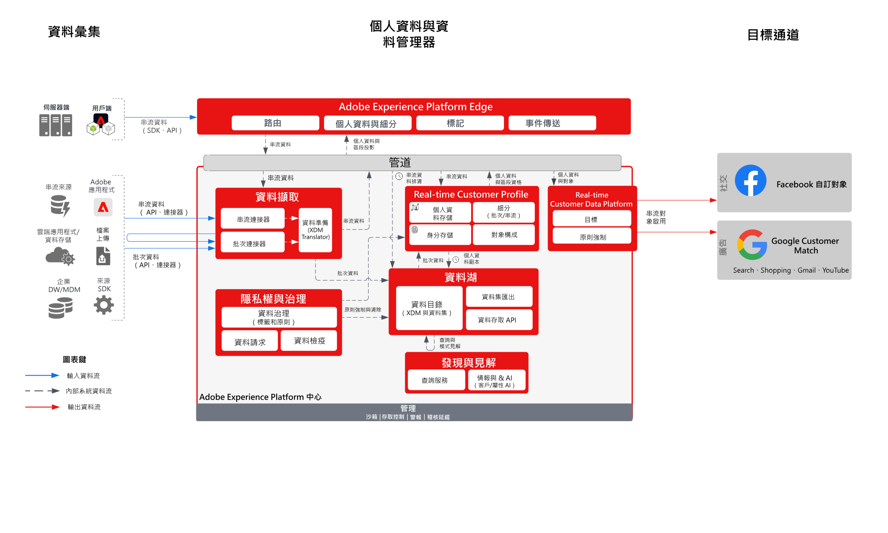

# Audience Activation至Social和Advertising目的地

從多個來源擷取客戶資料，以建立客戶的單一設定檔檢視。 您可以將這些設定檔細分為用於行銷和個人化的建立對象，並將這些對象分享到Facebook和Google等廣告網路，以針對這些對象定位和個人化行銷活動。

## 使用案例

* 對社交及廣告目標上已知對象的對象目標定位。
* 使用線上和離線屬性的線上個人化。

## 應用程式

* Real-time Customer Data Platform

## 架構

## 實施步驟

1. 設定要在個人資料來源中使用的身分命名空間。
   * 使用現成可用的命名空間，例如電子郵件、電子郵件 SHA256 雜湊（若有）。
   * Facebook 提供受支援身分的清單。若要啟用至 Facebook 自訂對象，其中一個受支援身分必須出現在要啟用的個人資料中。
   * Facebook 目前支援下列身分：GAID、IDFA、phone_sha256、email_lc_sha256、extern_id。
   * 如需其他詳細資訊，請參閱 [Facebook 目標指南](https://experienceleague.adobe.com/docs/experience-platform/destinations/catalog/social/facebook.html?lang=zh-Hant)。
   * Google Customer Match 提供支援的身分清單。若要啟用至 Google Customer Match，其中一個受支援身分必須出現在要啟用的個人資料中。
   * Google Customer Match 目前支援下列身分：GAID、IDFA、phone_sha256_e.164、email_lc_sha256、user_id。
   * 如需其他詳細資訊，請參閱 [Google Customer Match 目標指南](https://experienceleague.adobe.com/docs/experience-platform/destinations/catalog/advertising/google-customer-match.html?lang=zh-Hant)。
   * 當現成的命名空間無法用於適用的身分時，建立自訂命名空間。
1. 設定個人資料資料來源方案和資料集。
   * 為所有個人資料記錄來源資料建立個人資料記錄方案。
      * 指定每個方案的主要身分和次要身分。
      * 啟用個人資料擷取方案。
   * 為所有個人資料記錄來源資料建立個人資料記錄資料集，並指派相關的方案。
      * 啟用個人資料擷取資料集。
   * 為所有以個人資料時間序列為基礎的來源資料建立個人資料體驗事件方案。
      * 指定方案的主要身分和次要身分。
   * 啟用個人資料擷取方案。
   * 為所有個人資料記錄來源資料建立個人資料體驗事件資料集，並指派相關的方案。
      * 啟用個人資料擷取資料集。
1. 使用來源連接器將來源資料擷取至上述設定的相關資料集。
   * 使用憑證設定來源連接器帳戶。
   * 設定資料流，將源檔案或資料夾位置的資料以指定排程擷取到指定的資料集。
   * 將來源資料中的任何欄位對應到目標方案。
   * 將任何欄位轉換為正確格式，以便擷取至 Experience Platform。
      * 日期轉換
      * 適當情況下轉換為小寫 — 例如電子郵件地址
      * 模式轉換（例如電話號碼）
      * 如果來源資料中未出現，請為體驗事件記錄新增唯一記錄 ID。
      * 轉換陣列和對應類型欄位，以確保陣列和地圖正確對應和建模，以便在 Experience Platform 中進行分段。
1. 設定個人資料合併原則，以確保正確設定身分圖表，以及在合併個人資料時應納入哪些資料集。
1. 執行資料流後，請確保個人資料資料擷取成功，沒有錯誤。
   * 檢查多個個人資料的身分圖，以確保正確處理身分關係。
   * 檢查數個個人資料的屬性和事件，以確保將屬性和事件正確擷取至個人資料。
1. 製作區段以建立個人資料對象
   * 針對屬性和事件使用規則，在區段產生器中建立區段。
   * 儲存區段以供評估。區段每天會在指定的排程中評估一次。
      * 如果區段規則符合串流分段條件，當擷取設定檔的新串流資料時會評估區段。在排程的批次分段期間，每天也會評估一次串流區段。
1. 確保區段結果與預期一致。
   * 審核指定區段的區段結果計數。
   * 調查應包含在區段中的個人資料，以確認區段成員資格包含在個人資料的區段成員資格部分中。
1. 在「目標」設定中設定對象至目標的傳送。
   * 請參閱 [Facebook 目標指南](https://experienceleague.adobe.com/docs/experience-platform/destinations/catalog/social/facebook.html?lang=zh-Hant)以取得設定 Facebook 目標的詳細資訊。
   * 請參閱 [Google Customer Match 目標指南](https://experienceleague.adobe.com/docs/experience-platform/destinations/catalog/advertising/google-customer-match.html?lang=zh-Hant)以取得設定 Google 目標的詳細資訊。
   * 設定目標時，請選取您要啟用至目標的對象。
   * 確定您希望目標資料流開始將對象傳送到目標的預定開始日期。
   * 每個目標都有要傳送的必要和選用屬性。
      * 針對 Facebook，必須包含其中一個必要身分，以便將 Experience Platform 內對象中的設個人資料與 Facebook 可鎖定的個人資料進行比對。
      * 對於 Google Customer Match，必須包含其中一個必要的身分，用來將 Experience Platform 中對象的個人資料與 Google Customer Match 中可鎖定的個人資料向匹配。
   * 每個目標也有指定的傳送類型，不論是串流或批次、檔案或 JSON 承載。
      * 對於 Facebook，對象成員資格以串流方式和 JSON 格式傳送至 Facebook 端點。
      * 對於 Google Customer Match，對象成員資格會以串流方式和 JSON 格式傳送至 Google Customer Match 端點。
      * 在 Experience Platform 中進行串流或批次分段評估後，將以串流方式傳送對象成員資格。
1. 確定目標流程已如預期般將對象傳送至目標。
   * 檢查監控介面，確認對象已以預期的個人資料數傳送。對象大小應反映已啟用的個人資料預期數量，指出特定目標（例如 Facebook 和 Google）將需要特定欄位，例如電子郵件雜湊身分識別，若未出現在屬於對象的個人資料中，則不會啟動至目標。
   * 檢查是否有任何已略過的個人資料身分遺失或屬性遺失（這些是強制的）。
   * 檢查是否有任何其他需要解決的錯誤。
1. 驗證是否已使用預期的對象成員資格數量將對象啟用到最終目標。
   * 登入 Facebook Custom Audience 入口網站，驗證 Real-time Customer Data Platform 的對象已傳送，且 Facebook 中對象中個人資料的符合率是否與 Real-time Customer Data Platform 中對象的個人資料數量合理相符。
   * 完成啟動流程後，切換至您的 Google Ads 帳戶。已啟動的區段會在您的 Google 帳戶中顯示為客戶清單。請注意，除非有超過 100 個使用中使用者提供服務，否則不會填入部分對象（視您的區段大小而定）。

## 護欄

[個人資料與分段護欄](https://experienceleague.adobe.com/docs/experience-platform/profile/guardrails.html?lang=zh-Hant)

## 相關文件

啟動至 Facebook 自訂對象 — [目標配置](https://experienceleague.adobe.com/docs/experience-platform/destinations/catalog/social/facebook.html?lang=zh-Hant)

啟動至 Google Customer Match — [目標配置](https://experienceleague.adobe.com/docs/experience-platform/destinations/catalog/advertising/google-customer-match.html?lang=zh-Hant)