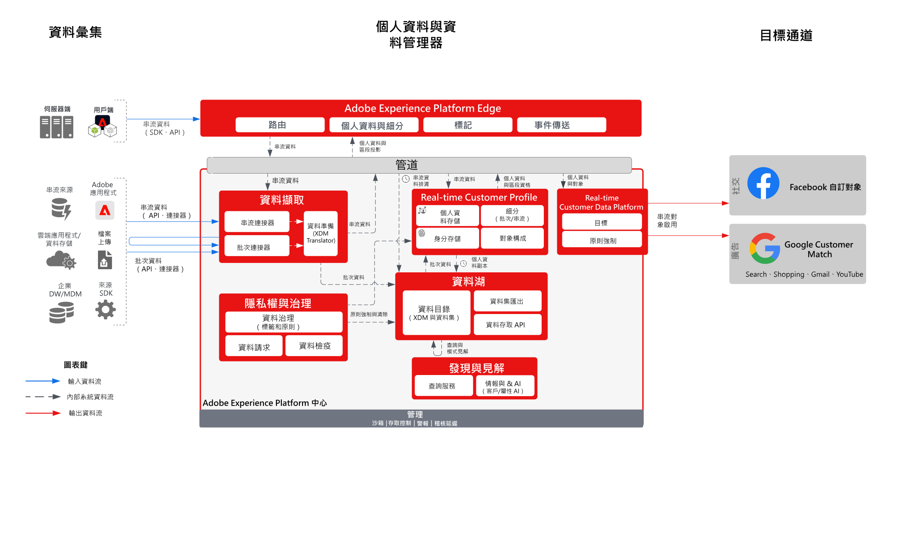

# Audience Activation至Social和Advertising目的地

>[!TIP]
>此Blueprint也可作為Audience Building &amp; Activation下的[使用案例模式](/help/blueprints/use-case-patterns/audience-building-activation/audience-activation-to-destinations.md)。

從多個來源擷取客戶資料，以建立客戶的單一設定檔檢視。 您可以將這些設定檔細分為用於行銷和個人化的建立對象，並將這些對象分享到Facebook和Google等廣告網路，以針對這些對象定位和個人化行銷活動。

## 使用案例

* 對社交及廣告目標上已知對象的對象目標定位。
* 使用線上和離線屬性的線上個人化。

## 應用程式

* Real-time Customer Data Platform

## 架構

## 護欄

[設定檔和分段護欄](https://experienceleague.adobe.com/docs/experience-platform/profile/guardrails.html?lang=zh-Hant)

## 相關文件

啟動至 Facebook 自訂對象 — [目標配置](https://experienceleague.adobe.com/docs/experience-platform/destinations/catalog/social/facebook.html?lang=zh-Hant)

啟動至 Google Customer Match — [目標配置](https://experienceleague.adobe.com/docs/experience-platform/destinations/catalog/advertising/google-customer-match.html?lang=zh-Hant)