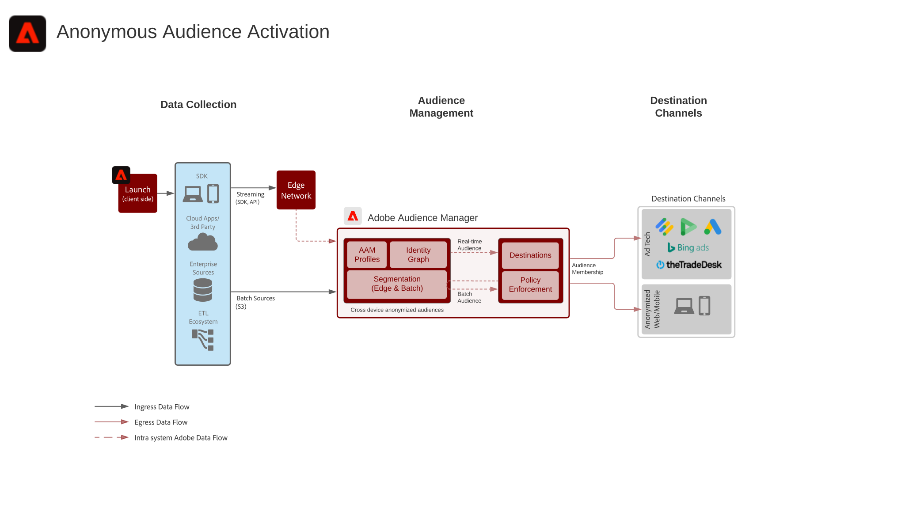

# 匿名Audience Activation藍圖

您可以根據匿名和行為客戶資料，跨網路和廣告通道鎖定受眾。 此功能可跨裝置提供個人化且一致的即時客戶體驗。

## 使用案例

* 執行匿名數位受眾鎖定和個人化。
* 建立受支援廣告網路的受眾，以鎖定目標受眾。

## 應用程式

* Adobe Audience Manager

## 建築

## 實施步驟

<!-- These steps should link to help. -->

1. [實施Audience Manager](https://experienceleague.corp.adobe.com/docs/audience-manager/user-guide/implementation-integration-guides/implement-audience-manager.html?lang=en#implementation-integration-guides)。
1. 收集資料以Audience Manager。
1. 設定用於區段定義的信號和特徵。
1. 在Audience Manager中建立區段。
1. 設定Audience Manager中的目標以共用觀眾。

## 相關檔案

* [Audience Manager](https://experienceleague.adobe.com/docs/audience-manager.html?lang=en)
* [Experience Cloud觀眾](https://experienceleague.adobe.com/docs/core-services/interface/audiences/audience-library.html)
* [將Audience Manager與Target整合](https://experienceleague.adobe.com/docs/audience-manager/user-guide/implementation-integration-guides/integration-other-solutions/aam-target-integration.html)
* [透過Audience Manager分析區段共用](https://experienceleague.adobe.com/docs/analytics/components/segmentation/segmentation-workflow/seg-publish.html)
