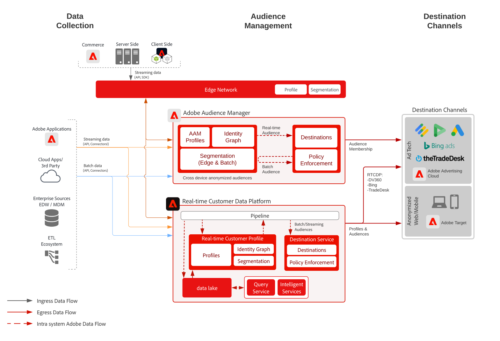

# 匿名對象啟用 Blueprint

匿名用戶激活是指基於匿名設備和行為資料，通過Web、移動和廣告渠道針對受眾進行目標和個性化設定的能力。

## 使用案例

* 在網站、移動應用或支援的廣告渠道上執行匿名數字受眾目標和個性化設定。
* 根據已知設備和行為特徵優化登錄頁和預驗證體驗。
* 利用Audience Manager第三方資料網路進一步優化和擴展您的受眾，以實現目標。

## 應用程式

* Audience Manager
* 即時客戶資料平台

Audience Manager和Real-time Customer Data Platform都可以利用匿名Audience Activation為現場和廣告目的地提供支援。 請注意，Real-time Customer Data Platform僅支援包含匿名設備標識符的廣告目標的子集，這些標識符在 [目標文檔](https://experienceleague.adobe.com/docs/experience-platform/destinations/catalog/advertising/overview.html?lang=en)。

Microsoft必應、GoogleDV360和TradeDesk是Real-time Customer Data Platform基於匿名設備目標的主要支援廣告目的地。 除此之外，Real-time Customer Data Platform還支援在 [目標文檔](https://experienceleague.adobe.com/docs/experience-platform/destinations/catalog/advertising/overview.html?lang=en) 如 [已知客戶激活藍圖](https://experienceleague.adobe.com/docs/blueprints-learn/architecture/audience-activation/known-customer-audience-activation/known.html)。

## 架構

 

## 實施步驟

1. [實施 Audience Manager](https://experienceleague.adobe.com/docs/audience-manager/user-guide/implementation-integration-guides/implement-audience-manager.html?lang=zh-Hant#implementation-integration-guides)。
1. 收集資料至 Audience Manager。
1. 設定訊號與特性以用於區段定義。
1. 在 Audience Manager 中建立區段。
1. 在 Audience Manager 中設定目標以分享對象。

有關Real-time Customer Data Platform的實施步驟，請參閱 [已知客戶激活藍圖](https://experienceleague.adobe.com/docs/blueprints-learn/architecture/audience-activation/known-customer-audience-activation/known.html)。

## 相關文件

* [Audience Manager](https://experienceleague.adobe.com/docs/audience-manager.html?lang=zh-Hant)
* [Experience Cloud [!UICONTROL 受眾]](https://experienceleague.adobe.com/docs/core-services/interface/audiences/audience-library.html?lang=zh-Hant)
* [整合 Audience Manager 與 Target](https://experienceleague.adobe.com/docs/audience-manager/user-guide/implementation-integration-guides/integration-other-solutions/aam-target-integration.html?lang=zh-Hant)
* [透過 Audience Manager 分享 Adobe Analytics 區段](https://experienceleague.adobe.com/docs/analytics/components/segmentation/segmentation-workflow/seg-publish.html?lang=zh-Hant)
* [已知客戶激活藍圖](https://experienceleague.adobe.com/docs/blueprints-learn/architecture/audience-activation/known-customer-audience-activation/known.html)。
* [即時客戶資料平台](https://experienceleague.adobe.com/docs/experience-platform/rtcdp/overview.html)
