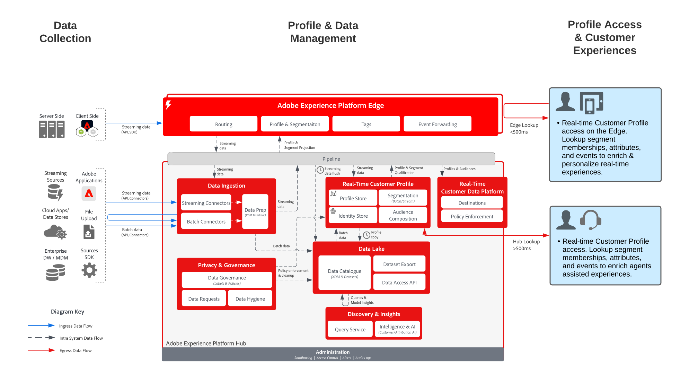

# 支援與銷售案例的即時設定檔存取

>[!TIP]
>此Blueprint也可作為Audience Building &amp; Activation下的[使用案例模式](/help/blueprints/use-case-patterns/audience-building-activation/real-time-profile-lookup.md)。

支援和銷售案例藍圖的即時設定檔存取顯示外部應用程式如何存取Adobe Experience Platform的[!UICONTROL 即時客戶設定檔]。

外部應用程式可以透過 API GET 請求存取個人資料。 儲存在個人資料中的屬性、事件、區段會籍及模型驅動的功能然後可用於這些外部非 Adobe 應用程式。

有了此功能，您可以在客戶呼叫您的呼叫中心時顯示豐富的內容。 例如，支援代理可以看見客戶的期限值、反感或接觸行銷活動的傾向性。 銷售代理亦會受益，因為他們可以知道客戶的更多背景或洞察其客戶。

>[!NOTE]
>
>中樞上的設定檔查詢不適用於高輸送量、低延遲的使用案例，例如網頁/行動傳入個人化。 中樞上的設定檔查詢是針對低延遲情境，例如代理程式輔助支援或銷售互動。 若是低延遲、高輸送量的案例，例如網頁/行動個人化或即時優惠方案決策，則應運用Edge設定檔。 Edge設定檔可讓您透過Real-time Customer Data Platform的[自訂Personalization連線](https://experienceleague.adobe.com/zh-hant/docs/experience-platform/destinations/catalog/personalization/custom-personalization)進行即時存取。

## 使用案例

* 為代理支援的互動提供更深入的消費者背景，例如支援和銷售經驗。 使用對 Experience Platform 的個人資料查詢，代理可以獲得關於消費者的更多背景，例如最近的購買、行銷活動互動、傾向性、對象會籍，以及即時客戶輪廓中儲存的其他屬性和洞察。

## 架構

## 護欄

* [[!UICONTROL 即時客戶設定檔]資料的護欄](https://experienceleague.adobe.com/docs/experience-platform/profile/guardrails.html?lang=zh-Hant)

## 相關文件

* [Adobe Experience Platform Activation產品說明](https://helpx.adobe.com/tw/legal/product-descriptions/adobe-experience-platform0.html)
* [[!UICONTROL 即時客戶個人檔案]檔案](https://experienceleague.adobe.com/docs/experience-platform/profile/home.html?lang=zh-Hant)
* [設定檔護欄](https://experienceleague.adobe.com/docs/experience-platform/profile/guardrails.html?lang=zh-Hant)
* [設定檔查詢API](https://www.adobe.io/apis/experienceplatform/home/api-reference.html)
