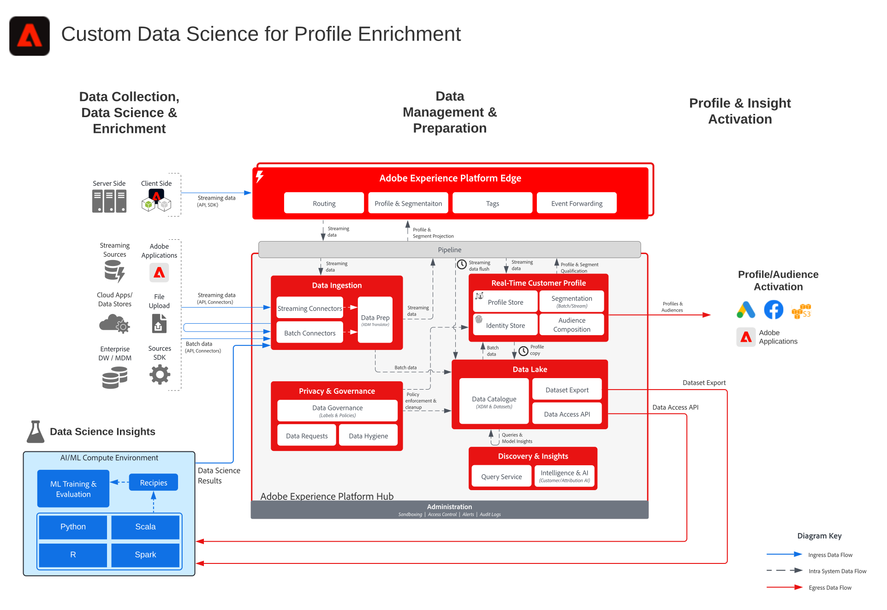

# 個人檔案擴充藍圖的自訂資料科學

個人資料擴充藍圖的自訂資料科學說明如何使用資料來訓練、部署和評分模型，從資料科學和機器學習工具提供機器學習對[!DNL Experience Platform]和[!DNL Real-Time Customer Data Platform]的深入分析。

模型化見解可內嵌至[!DNL Experience Platform]，以擴充即時客戶設定檔。 機器學習洞察的範例包括期限值評分、產品和類別親和性、轉換傾向性或退訂傾向性。

## 使用案例

* 從客戶資料中擷取見解並探索模式，從這些資料中訓練模型並對模型評分。
* 使用模型驅動的洞察和屬性豐富[!UICONTROL 即時客戶輪廓]，以進行更細緻的個人化和最佳的歷程。
* 對模型訓練和評分以確定客戶洞察，例如客戶期限值、轉換或流失傾向性、產品和內容相似性及參與分數。

## 架構

## 護欄

* 如需將資料科學結果擷取到[!DNL Experience Platform]的詳細護欄和端對端延遲，以及即時客戶設定檔，請參閱[部署護欄檔案](../experience-platform/guardrails.md)中參考的資料擷取護欄和延遲圖表。

## 實施考量

* 在大多數情況下，模型結果應擷取為個人資料屬性，而非體驗事件。 模型結果可以是簡單的屬性字串。 如果要擷取多個模型結果，建議使用陣列或對應類型欄位。
* 每日個人資料快照資料集是統一個人資料屬性資料的每日匯出，可用來訓練個人資料屬性資料的模型。 可存取[此處](https://experienceleague.adobe.com/docs/experience-platform/dashboards/query.html?lang=zh-Hant#profile-attribute-datasets)的個人資料快照資料集文檔。

## 相關文件

* [Adobe [!DNL Experience Platform] Intelligence產品說明](https://helpx.adobe.com/tw/legal/product-descriptions/adobe-experience-platform-intelligence---product-description.html)
* [Adobe [!DNL Experience Platform] 查詢服務](https://experienceleague.adobe.com/docs/experience-platform/query/home.html?lang=zh-Hant)

## 相關部落格貼文

* [內容與Commerce AI：透過內容智慧，個人化您與客戶的互動](https://medium.com/adobetech/content-and-commerce-ai-personalizing-your-interactions-with-customers-through-content-intelligence-dc182601deab)
* [在Adobe [!DNL Experience Platform]上探索資料分析的簡介](https://medium.com/adobetech/an-introductory-look-at-exploratory-data-analysis-on-adobe-experience-platform-1bfce7501d9a)
* [將具有機器學習的Adobe體驗產品切割為提升的使用者體驗](https://medium.com/adobetech/cutting-across-adobe-experience-products-with-machine-learning-to-elevated-user-experience-7c85000510d1)
* [Segmentation.AI： Adobe [!DNL Experience Platform]中的自動化受眾叢集即服務](https://medium.com/adobetech/segmentation-ai-automated-audience-clustering-as-a-service-in-adobe-experience-platform-261f4099462c)