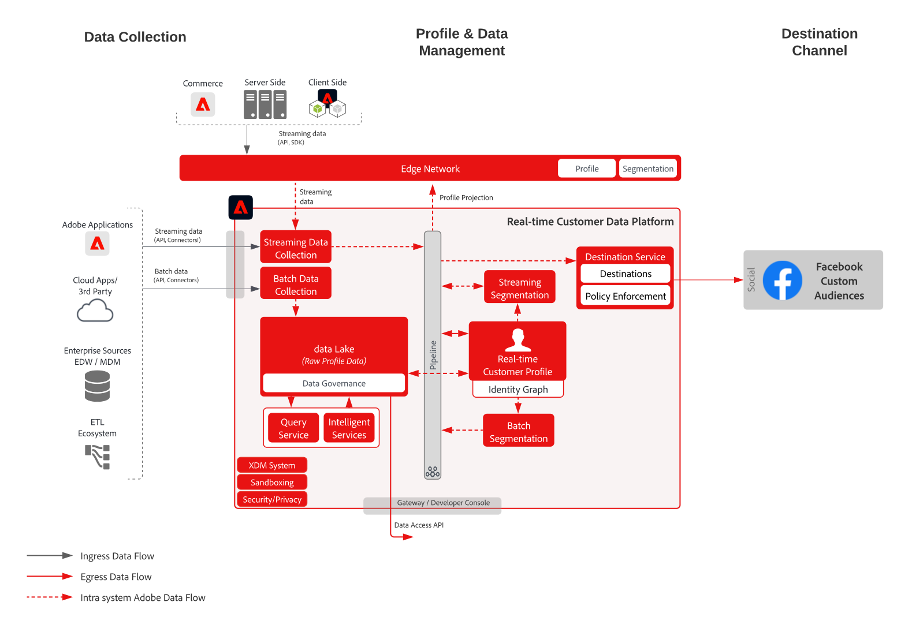

# 啟動Facebook自訂對象

從多個來源擷取客戶資料以建立客戶的單一設定檔檢視、將這些設定檔分段為建立行銷和個人化的對象、將這些對象共用至社交廣告網路(例如Facebook)，以針對這些對象鎖定和個人化行銷活動。

## 使用案例

* 對社交及廣告目標上已知對象的對象目標定位。
* 使用線上和離線屬性的線上個人化。

## 應用程式

* 即時客戶資料平台

## 架構

## 實作步驟

1. 設定要在設定檔資料來源中使用的身分識別命名空間。
   * 使用現成可用的命名空間，例如電子郵件、電子郵件SHA256雜湊（若有）。
   * Facebook提供支援身分的清單。 若要啟用至Facebook自訂對象，其中一個支援的身分必須出現在要啟用的設定檔中。
   * facebook目前支援下列身分：GAID、IDFA、phone_sha256、email_lc_sha256、extern_id。
   * 如需其他詳細資訊，請參閱 [Facebook目的地指南](https://experienceleague.adobe.com/docs/experience-platform/destinations/catalog/social/facebook.html).
   * 建立自訂命名空間，讓現成可用的命名空間無法用於適用的身分。
1. 設定設定檔資料來源結構和資料集。
   * 為所有設定檔記錄來源資料建立設定檔記錄結構。
      * 指定每個架構的主要身分和次要身分。
      * 啟用設定檔擷取的結構。
   * 為所有設定檔記錄來源資料建立設定檔記錄資料集，並指派相關的結構。
      * 啟用資料集以擷取設定檔。
   * 為所有以設定檔時間序列為基礎的來源資料建立設定檔體驗事件結構。
      * 指定架構的主要身分和次要身分。
   * 啟用設定檔擷取的結構。
   * 為所有設定檔體驗事件來源資料建立設定檔體驗事件資料集，並指派相關的結構。
      * 啟用資料集以擷取設定檔。
1. 使用來源連接器將來源資料內嵌至上述設定的相關資料集。
   * 使用憑證設定來源連接器帳戶。
   * 配置資料流，將指定調度的源檔案或資料夾位置的資料內嵌到指定的資料集。
   * 將源資料中的任何欄位映射到目標架構。
   * 將任何欄位轉換為正確格式，以便擷取至Experience Platform。
      * 日期轉換
      * 在適當時轉換為小寫 — 例如電子郵件地址
      * 模式轉換（例如電話號碼）
      * 如果來源資料中未出現，請為體驗事件記錄新增唯一記錄ID。
      * 轉換陣列和映射類型欄位，以確保陣列和映射的映射和建模正確，以便在Experience Platform中進行細分。
1. 設定設定檔合併原則，以確保正確設定身分圖表，以及在合併設定檔時應納入哪些資料集。
1. 執行資料流後，請確保設定檔資料擷取成功，且沒有錯誤。
   * Inspect多個設定檔的身分圖，以確保正確處理身分關係。
   * Inspect數個設定檔的屬性和事件，以確保將屬性和事件正確擷取至設定檔。
1. 製作區段以建立設定檔對象
   * 針對屬性和事件使用規則，在區段產生器中建立區段。
   * 儲存區段以供評估。 區段每天會在指定的排程中評估一次。
      * 如果區段規則符合串流分段的資格，當擷取設定檔的新串流資料時，會評估區段。 在排程的批次分段期間，每天也會評估一次串流區段。
1. 確保分類結果如預期般。
   * 檢閱指定區段的區段結果計數。
   * 調查應包含在區段中的設定檔，以確認設定檔的區段成員資格是否包含在設定檔的區段成員資格部分中。
1. 在「目的地」設定中設定對象傳送至目的地。
   * 請參閱 [Facebook目的地指南](https://experienceleague.adobe.com/docs/experience-platform/destinations/catalog/social/facebook.html) 以取得設定Facebook目的地的詳細資訊。
   * 設定目的地時，請選取您要啟用至目的地的對象。
   * 確定您希望目標資料流開始將對象傳送到目標的預定開始日期。
   * 每個目的地都有要傳送的必要和選用屬性。
      * 針對Facebook，必須包含其中一個必要身分，以便將Experience Platform內對象中的設定檔與Facebook可鎖定的設定檔進行比對。
   * 每個目的地也有指定的傳送類型，不論是串流或批次、檔案或JSON裝載。
      * 若為Facebook，受眾會以串流方式以JSON格式傳送至Facebook端點。
      * 在Experience Platform中進行串流或批次分段評估後，將以串流方式提供對象成員資格。
1. 確定目的地流程已如預期般將對象傳送至目的地。
   * 檢查監控介面，確認對象已以預期的設定檔數傳送。 對象大小應反映已啟動的設定檔預期數量，並指出特定目的地(例如Facebook)將需要特定欄位，例如電子郵件雜湊身分識別，若未出現在屬於對象的設定檔中，則不會啟動至目的地。
   * 檢查是否有任何已略過的設定檔識別遺失或屬性遺失，這些是必要的。
   * 檢查是否有其他需要解決的錯誤。
1. 驗證已使用預期的對象成員資格數量將對象激活到最終目標。
   * 登入Facebook自訂對象入口網站，驗證Real-time Customer Data Platform的對象已傳送，且Facebook中對象中設定檔的符合率是否與Real-time Customer Data Platform中對象的設定檔數量合理相符。

## 護欄

[設定檔與分段護欄](https://experienceleague.adobe.com/docs/experience-platform/profile/guardrails.html?lang=zh-Hant)

## 相關檔案

啟動Facebook自訂對象 —  [目標配置](https://experienceleague.adobe.com/docs/experience-platform/destinations/catalog/social/facebook.html)