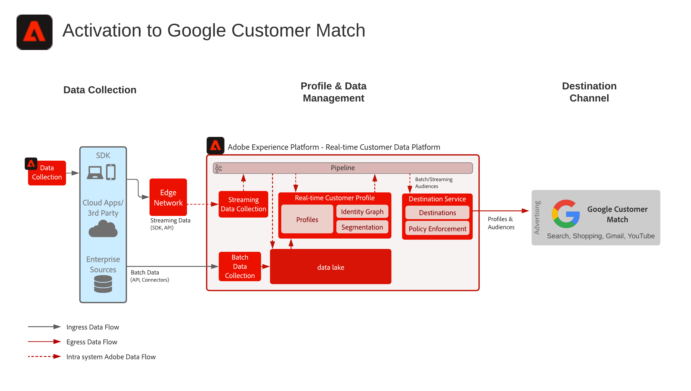

# 激活到FGoogle客戶匹配

從多個來源接收客戶資料以構建客戶的單個配置檔案視圖，將這些配置檔案細分為構建的受眾以進行營銷和個性化，將這些受眾共用到社交廣告網路，如Google客戶匹配以針對這些受眾進行目標和個性化活動。 Google客戶匹配允許您使用線上和離線資料，跨Google自有和運營的物業與客戶聯繫和重新接觸，例如：搜索、購物、Gmail和YouTube。

## 使用案例

* 對社交及廣告目標上已知對象的對象目標定位。
* 使用線上和離線屬性的線上個人化。

## 應用程式

* 即時客戶資料平台

## 架構

## 實施步驟

1. 配置要在配置檔案資料源中使用的標識命名空間。
   * 使用現成的命名空間（如電子郵件、電子郵件SHA256哈希）（可用）。
   * Google客戶匹配包含支援的身份清單。 要激活到Google客戶匹配，必須在要激活的配置檔案中顯示支援的身份之一。
   * Google客戶匹配當前支援以下標識：GAID、IDFA、phone_sha256_e.164、email_lc_sha256、user_id。
   * 有關其他詳細資訊，請參閱 [Google客戶匹配目標指南](https://experienceleague.adobe.com/docs/experience-platform/destinations/catalog/advertising/google-customer-match.html)。
   * 建立自定義命名空間，其中非現成命名空間對於適用的標識不可用。
1. 配置配置檔案資料源架構和資料集。
   * 為所有配置檔案記錄源資料建立配置檔案記錄方案。
      * 指定每個架構的主標識和次標識。
      * 啟用架構以接收配置檔案。
   * 為所有配置檔案記錄源資料建立配置檔案記錄資料集，分配關聯的架構。
      * 啟用資料集以接收配置檔案。
   * 為所有基於配置檔案時間序列的源資料建立配置檔案體驗事件方案。
      * 指定架構的主標識和次標識。
   * 啟用架構以接收配置檔案。
   * 為所有配置檔案體驗事件源資料建立配置檔案體驗事件資料集，並分配關聯的架構。
      * 啟用資料集以接收配置檔案。
1. 使用源連接器將源資料接收到上面配置的關聯資料集。
   * 使用憑據配置源連接器帳戶。
   * 配置資料流，將指定時間表的源檔案或資料夾位置的資料接收到指定的資料集。
   * 將源資料中的任何欄位映射到目標架構。
   * 將任何欄位轉換為正確的格式以接收為Experience Platform。
      * 日期轉換
      * 在適當時轉換為小寫 — 例如電子郵件地址
      * 模式轉換（例如電話號碼）
      * 如果源資料中不存在，則為體驗事件記錄添加唯一記錄ID。
      * 轉換陣列和映射類型欄位以確保正確映射和建模陣列和映射以在Experience Platform中分段。
1. 配置配置檔案合併策略以確保正確配置標識圖以及在合併配置檔案時應包括哪些資料集。
1. 執行資料流後，確保配置檔案資料接收成功且無錯誤。
   * Inspect幾個配置檔案的身份圖以確保正確處理身份關係。
   * Inspect多個配置檔案的屬性和事件，以確保正確接收配置檔案的屬性和事件。
1. 創作段以建立配置檔案受眾
   * 使用屬性和事件規則在段生成器中生成段。
   * 保存段以進行評估。 段將按指定的計畫每天計算一次。
      * 如果段規則適合流分段，則當為配置檔案接收新的流資料時，將評估段。 在計畫的批處理分段期間，流段也將每天評估一次。
1. 確保分部業績符合預期。
   * 複查給定段的段結果計數。
   * 調查應包括在段中的配置檔案，以驗證段成員資格是否包括在配置檔案的段成員資格部分中。
1. 在「目標」配置中配置訪問群體到目標的傳遞。
   * 查看 [Google客戶匹配目標指南](https://experienceleague.adobe.com/docs/experience-platform/destinations/catalog/advertising/google-customer-match.html) 有關配置Facebook目標的詳細資訊。
   * 配置目標時，選擇要激活到目標的受眾。
   * 確定希望目標資料流開始將訪問群體傳送到目標的預定開始日期。
   * 每個目標都具有要發送的必需屬性和可選屬性。
      * 對於Google客戶匹配，必須包括其中一個必需標識，並用於將Experience Platform內受眾中的配置檔案與Google客戶匹配可瞄準的配置檔案進行匹配。
   * 每個目標還具有指定的傳遞類型，無論是流傳輸還是批處理、基於檔案或JSON負載。
      * 對於Google客戶匹配，以流式方式將受眾成員身份以JSON格式交付給Google客戶匹配終結點。
      * 在流式處理或Experience Platform中的批分段評估之後，將以流式方式交付受眾成員。
1. 確保目標流已按預期將受眾傳遞到目標。
   * 檢查監視介面，確認已將受眾與預期的配置檔案數量一起交付。 受眾大小應反映激活的配置檔案的預期數量，並指出特定目標(如Google客戶匹配)將需要某些欄位，如電子郵件哈希標識，如果不存在於作為受眾成員的配置檔案中，則不會將其激活到目標。
   * 檢查是否有任何跳過的配置檔案標識缺失或屬性缺失（必需）。
   * 檢查是否有其他需要解決的錯誤。
1. 驗證受眾是否已使用預期的受眾成員數激活到最終目標。
   * 完成激活流程後，切換到您的Google廣告帳戶。 激活的段在您的Google帳戶中顯示為客戶清單。 請注意，根據您的網段大小，除非有100多個活動用戶提供服務，否則不會填充某些受眾。

## 護欄

[輪廓和分段護欄](https://experienceleague.adobe.com/docs/experience-platform/profile/guardrails.html?lang=zh-Hant)

## 相關文件

激活到Google客戶匹配 —  [目標配置](https://experienceleague.adobe.com/docs/experience-platform/destinations/catalog/advertising/google-customer-match.html)