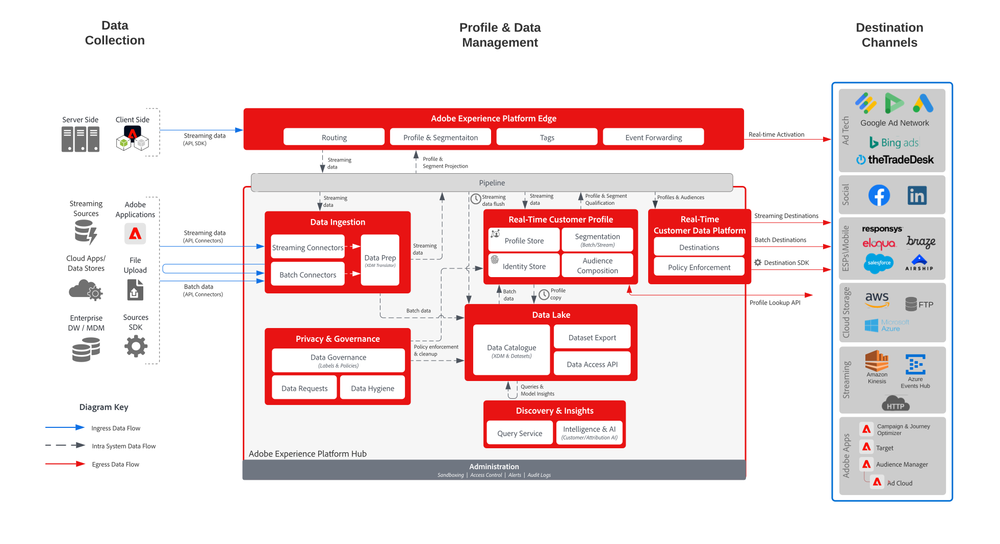

# 客群與設定檔啟用至企業目標

>[!TIP]
>此Blueprint也可作為Audience Building &amp; Activation下的[使用案例模式](/help/blueprints/use-case-patterns/audience-building-activation/audience-activation-to-destinations.md)。

以串流或批次方式從[!UICONTROL Real-time Customer Data Platform]分享個人資料及對象變更與事件至企業資料儲存空間和應用程式。 這些個人資料和對象事件可用於啟動對客戶的銷售或支援行動，例如跟進放棄的應用程式程序或網路研討會註冊，或者用[!UICONTROL Real-time Customer Data Platform]中的最新客戶屬性和情報更新企業應用程式。

## 使用案例

* 針對雲端儲存目標或串流目標的輪廓和客群啟用，以進行客戶資料和洞察的企業追蹤、儲存、分析和啟用。

## 應用程式

* Real-time Customer Data Platform

## 架構

## 相關文件

在[目的地檔案](https://experienceleague.adobe.com/en/docs/experience-platform/destinations/catalog/cloud-storage/overview)中可找到雲端儲存空間與企業目的地的設定其他詳細資料。

## 護欄

[請參閱護欄頁面上概述的護欄。](../experience-platform/guardrails.md)