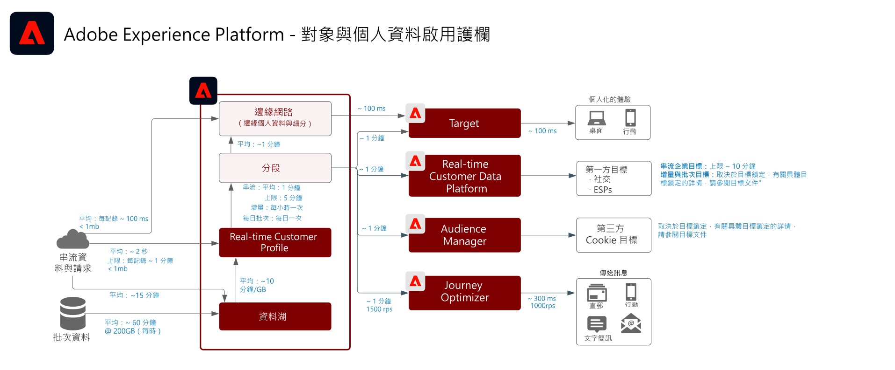

# 受眾與個人檔案啟動

在資料導向式行銷世界中，受眾和個人檔案啟動是成功的關鍵。 但許多品牌仍將精力集中於以通道優先的啟用，這通常會導致不一致的觸及和個人化。

採用以通道為優先的方法時，每個通道皆是孤島，個人化工作僅強調在該通道上與品牌互動的客戶。此方法無法反映客戶透過很多不同的接觸點與品牌互動的現實情況。受眾和個人檔案啟動可讓品牌跨多個通道連接客戶互動，以便提供集中的個人檔案和受眾，並可以啟動至所有通道。

| Blueprint | 說明 | Experience Cloud 應用程式 |
|---|---|---|
| **[匿名 Audience Activation](anonymous.md)** | <ul><li>為匿名和行為客戶資料定位網路及廣告通道上的對象。</li><li>整合協力廠商對象資料以增強個人化。</li></ul> | <ul><li>Adobe Audience Manager</li></ul> |
| **[線上/離線 Audience Activation](online-offline.md)** | <ul><li>啟動至已知的基於個人檔案的目的地，例如電子郵件提供者、社交網路和廣告目的地。 </li><li>使用離線屬性和事件，例如離線訂單、交易、CRM或忠誠度資料，以及線上行為，以進行線上鎖定和個人化。</li></ul> | <ul><li>Adobe Experience Platform</li><li> [!UICONTROL 即時客戶資料平台]</li><li>Adobe Audience Manager (可選)</li></ul> |
| **[受眾和個人檔案啟動至企業目標](enterprise-destinations.md)** | <ul><li>複製和更新企業資料儲存區的個人檔案和讀者變更，以利啟動和報告使用案例。 </li></ul><ul><li>通過從[!UICONTROL 即時客戶資料平台]到企業系統和應用程式的客戶操作通知，向客戶發起銷售或支援操作。</li></ul> | <ul><li>Adobe Experience Platform</li><li>[!UICONTROL 即時客戶資料平台]</li><li>Experience Platform啟動</li><li>Adobe Audience Manager (可選)</li></ul> |
| **[客戶活動中樞](customer-activity.md)** | <ul><li>為代理支援的互動提供更深入的消費者背景，例如支援和銷售經驗。使用Experience Platform的描述檔查閱，工程師可以接收更多有關消費者的內容，例如最近購買、促銷活動互動、傾向、受眾會籍，以及儲存在即時客戶描述檔中的其他屬性和見解。</li></ul> | <ul><li>Adobe Experience Platform</li></ul> |

## 受眾和個人檔案啟動藍圖的保障

* [個人資料與細分準則](https://experienceleague.adobe.com/docs/experience-platform/profile/guardrails.html?lang=zh-Hant)

### 護欄圖

### 區段評估與啟用的護欄

| 區段類型 | 使用案例 | 頻率 | 吞吐量 | 延遲（區段評估） | 延遲（區段啟動） | 啟動裝載 |
|--------------------------|------------------------------------------------------------|------------------------------------------------------------------------------------------------------------------------------------------------------------------------------------------------------------------------------------------------------------------------------------------------------------------------------------------------------------------------------|-------------------------------|------------------------------------------------------------------------------------------------------------------------------------------------------------------------------------------------------------------------------|------------------------------------------------------------------------------------------------------------------------------------------------------------------------------------------------------------------------------------------------------------------------------------------------------------------|-----------------------------------------------------------------------------------------------------------------------------------------------------------------------------------------------------|
| 邊緣分段 | 網頁／行動個人化（相同頁面／下一頁） | 邊緣區段目前為測試版，目前尚未正式提供。 | - | 大約100毫秒 | 目標和Journey Optimizer:<ul><li>可立即在相同的個人化要求中取得。</li></ul>Cookie型目標：<ul><li>適用於下一頁的決策。</li></ul> | 邊緣描述檔查閱(Target和Journey Optimizer):<ul><li>觀眾會籍</li><li>描述檔屬性</li></ul>Cookie型目標：<ul><li>觀眾會籍</li></ul> |
| 串流細分 | 觸發式行銷（串流） | 每當新的串流事件或記錄被收錄到即時客戶個人檔案中，且區段定義是有效的串流區段。  如需串流區段標準區段檔案的指引，請參 [閱區段檔案](https://experienceleague.adobe.com/docs/experience-platform/segmentation/api/streaming-segmentation.html?lang=zh-Hant) | 每秒最多1500個事件。 | 約5分鐘，p95 | 串流目標：<ul><li>距離Audience Manager和目標大約1分鐘</li><li>大約10分鐘到外部目的地或依目的地而微批。</li></ul>計畫目標：<ul><li>根據排程的目的地傳送時間，以批次方式啟動至外部目的地。</li></ul> | 串流目標： <ul><li>受眾會籍變更</li><li>身分值</li><li>描述檔屬性</li></ul>計畫目標：<ul><li>受眾會籍變更</li><li>身分值</li><li>描述檔屬性</li></ul> |
| 增量分段 | <li>批次傳訊<li>定位促銷活動和體驗 | 針對自上次增量或批次區段評估以來已納入即時客戶個人檔案的新資料，每小時一次。 | 不適用 | 取決於描述檔數量、描述檔大小和評估的區段數。 | 串流目標：<ul><li>距離Audience Manager和目標大約1分鐘</li><li>大約10分鐘到外部目的地或依目的地而微批。</li></ul>計畫目標：<ul><li>根據排程的目的地傳送時間，以批次方式啟動至外部目的地。</li></ul> | 串流目標： <ul><li>受眾會籍變更</li><li>身分值</li></ul>計畫目標：<ul><li>受眾會籍變更</li><li>身分值</li><li>描述檔屬性</li></ul> |
| 批次分段 | <ul><li>批次傳訊</li><li>定位促銷活動和體驗</li></ul> | 每天根據預定的系統集排程一次，或透過API手動啟動臨機。 | 不適用 | 取決於描述檔數量、描述檔大小和評估的區段數。<ul><li>每個工作大約一小時，最多10 TB配置檔案儲存大小</li><li>每份工作2小時，10 TB到100 TB配置檔案儲存大小。</li></ul> | 串流目標：<ul><li>距離Audience Manager和目標大約1分鐘</li><li>大約10分鐘到外部目的地或依目的地而微批。</li></ul>計畫目標：<ul><li>根據排程的目的地傳送時間，以批次方式啟動至外部目的地。</li></ul> | 串流目標： <ul><li>受眾會籍變更</li><li>身分值</li></ul>計畫目標：<ul><li>受眾會籍變更</li><li>身分值</li><li>描述檔屬性</li></ul> |

### 跨應用程式觀眾分享的護欄

|觀眾應用程式整合 |使用案例 |頻率 |吞吐量／卷 |延遲（區段評估） |延遲（區段啟動） |
|-|-|-|-|-|-|
|即時客戶資料平台以進行Audience Manager |讓擁有已知個人檔案受眾的第三方廣告更加豐富 |視區段類型而定——請參閱上述區段護欄表格。 |視區段類型而定——請參閱上述區段護欄表格。 |視區段類型而定——請參閱上述區段護欄表格。 | <ul><li>分部評估完成後幾分鐘內完成。</li><li>RTCDP之間的初始對象設定同步AAM大約需要4小時。</li><li>在4小時期間實現的任何觀眾會籍，都會寫入後續AAM的批次分段工作，成為「現有」觀眾會籍。</li></ul> |
|Adobe Analytics到Audience Manager |讓第三方廣告更加豐富，包含精細的行為導向受眾 |  |依預設，每個Adobe Analytics報表套裝最多可共用75個觀眾。 如果使用Audience Manager授權，則無限制。 |  |  |
|Adobe Analytics到即時客戶資料平台 |目前不提供。 |目前不提供 |目前不提供 |目前不提供 |目前不提供 |

### 啟用屬性和身分

* [!UICONTROL 即時客戶資料平台可啟] 用觀眾會籍，以及針對選取要啟動之區段成員的個人檔案所發生的屬性和身分變更。如果您的目標是啟用屬性或身分識別，您必須定義全域區段，其中包含所有要傳送屬性和身分更新的描述檔。 此時，您可以選取要在目標設定中啟動的區段和所需屬性。
* 請注意，批次目標不支援啟動僅限屬性的變更事件。 完整或增加的觀眾會籍可隨選取的屬性一起傳送，以進行啟動，但您無法透過批次目的地啟用僅限屬性的變更事件。

### 將批次區段啟用至串流目的地

* 支援「串流目的地的批次區段啟動」。 當區段工作完成以進行串流啟動時，批次區段工作會將訊息置於管道上

### 啟動串流區段至批次目的地

* 支援將串流區段啟動至批次目的地。 批目標計畫根據批目標計畫導出配置檔案段成員資格。 這包括透過串流和批次方法所決定的區段成員資格。

### 啟動體驗事件

* 不支援啟動原始體驗事件。 若要針對體驗事件啟動，必須使用包含或排除體驗事件邏輯的必要規則來建立區段。 這會建立根據體驗事件定義的區段，而且區段成員資格可以啟動為原始體驗事件的代理。 另請考慮使用[!UICONTROL 啟動伺服器端]來啟動透過SDK收集的原始體驗事件。

## 相關部落格貼文

* [[!DNL Blueprints for Audience Activation in Adobe Experience Platform]](https://medium.com/adobetech/a-blueprint-for-audience-activation-in-adobe-experience-platform-b2b30fae90fd)
* [[!DNL How Adobe Experience Platform Predictive Audiences improves Personalized Experiences]](https://medium.com/adobetech/how-adobe-experience-platform-predictive-audiences-improves-personalized-experiences-1f75a60cb7a3)
* [[!DNL Adobe Experience Platform Web SDK for Audience Management]](https://medium.com/adobetech/adobe-experience-platform-web-sdk-for-audience-management-751fa6d063bc)
