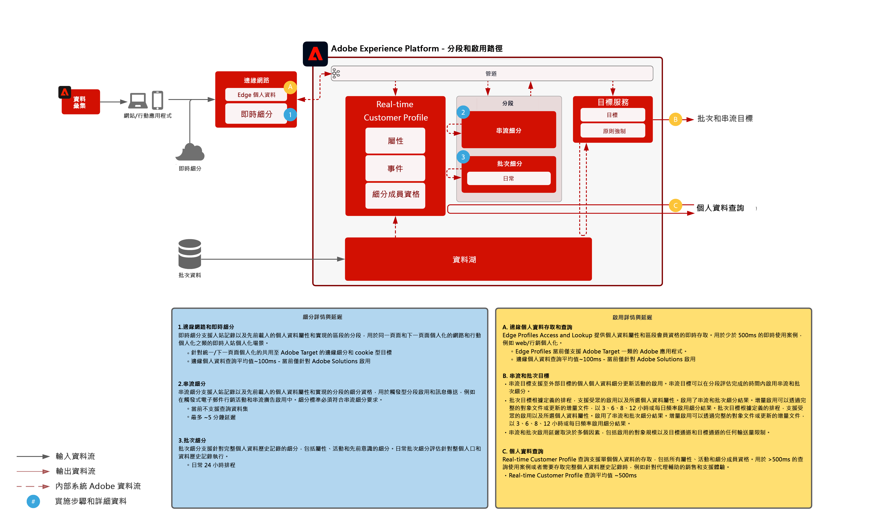

# 對象和個人資料啟用藍圖

以對象與個人資料啟用是資料驅動行銷領域成功的關鍵。但許多品牌仍將精力集中於以通道優先的啟用，這通常會導致不一致的觸及和個人化。

採用以通道為優先的方法時，每個通道皆是孤島，個人化工作僅強調在該通道上與品牌互動的客戶。此方法無法反映客戶透過很多不同的接觸點與品牌互動的現實情況。對象與個人資料啟用允許品牌連接多個通道中的客戶互動，以提供可向所有通道啟用的集中化個人資料與對象。

| Blueprint | 說明 | Experience Cloud 應用程式 |
|---|---|---|
| **[匿名對象啟用](anonymous.md)** | <ul><li>為匿名和行為客戶資料定位網路及廣告通道上的對象。</li><li>整合協力廠商對象資料以增強個人化。</li></ul> | <ul><li>Adobe Audience Manager</li></ul> |
| **[已知客戶啟用](known.md)** | <ul><li>啟用至基於已知個人資料的目標，例如電子郵件供應商、社交網路及廣告目標。 </li><li>使用離線屬性和事件，例如離線訂單、事務、CRM 或忠誠度資料，與線上行為一起進行線上目標定位和個人化。</li></ul> | <ul><li>Adobe Experience Platform</li><li> [!UICONTROL Real-time Customer Data Platform]</li><li>Adobe Audience Manager (可選)</li></ul> |
| **[使用 Experience Cloud 應用程式的對象與個人資料啟用](platform-and-applications.md)** | <ul><li>在 Experience Platform 中管理個人資料和對象，以及與 Experience Cloud 應用程式分享它們</li><li>在 Experience Platform 中建立並分享豐富的客戶區段和客戶分析，並且在 Experience Cloud 應用程式中分享它們</li></ul> | <ul><li>Adobe Experience Platform</li><li>[!UICONTROL Real-time Customer Data Platform]</li><li>Experience Platform 啟用</li><li>Experience Cloud 應用程式</li></ul> |
| **[區段比對](segment-match.md)** | <ul><li>透過更佳的控管、權限和偏好管理系統，行銷人員可進一步增強其與主要合作夥伴的第一方驗證對象。</li></ul> | <ul><li>Adobe Experience Platform </li></ul> |

## Real-time Customer Profile 架構

下圖概述了 Experience Platform 的即時客戶個人資料的核心元件。

先將資料來源擷取到 Experience Platform。如果資料來源已設定為進行個人資料處理，則會饋入至即時客戶個人資料。為每個資料來源以及設定用於每個資料來源的每個主要 ID 記錄建立單一個人資料片段或文件。此外，資料被擷取至個人資料時，亦會受到身分服務的處理。若資料來源中有多個標示於架構中的身分，且來自資料來源的任何記錄中填入了對應值，則記錄會處理為身分服務中的身分關係。

請注意，身分服務不會處理只有一個身分的記錄，因為此類記錄沒有可進一步填入圖表的身分連結。請注意，身分服務不會區分主要身分與次要身分。它只是跨身分處理身分關係。

在身分圖提供已關聯之各種來源個人資料片段間的關係時，會發生個人資料片段合併。合併策略確定要合併哪些來源片段以及將哪些身分圖用作這些片段。任何時候只要存取個人資料，就會合併個人資料片段，以確保個人資料的最新組合檢視。管理和原則規則可確保只有已授權的區段和屬性才能啟動至指定的目的地。

## 分段與目標概覽

下圖概述了各種分段方法，以及各種個人資料和對象啟用模式。

## 對象與個人資料啟用護欄藍圖

* 有關詳細的護欄和端對端延遲，請參閱[部署護欄文檔](../experience-platform/deployment/guardrails.md)和[個人資料和分段護欄](https://experienceleague.adobe.com/docs/experience-platform/profile/guardrails.html?lang=zh-Hant)

### 啟用屬性和身分

* [!UICONTROL Real-time Customer Data Platform]可啟用對象會籍，以及針對選取要啟用之區段成員的個人資料所發生的屬性和身分變更。如果您的目標是啟用屬性或身分識別，您必須定義全域區段，其中包含所有要向其傳送屬性和身分更新的個人資料。此時，您可以選取要作為目標設定一部分啟用的區段和所需屬性。
* 請注意，批次目標不支援啟用僅限屬性的變更事件。完整或增量對象成員資格可與選取的屬性一起傳送以進行啟用。

### 啟用批次區段至串流目標

* 支援批次區段啟用至串流目標。由於個人資料符合批次區段工作的對象成員資格，因此這些實現可透過串流啟動來啟動。

### 啟用串流區段至批次目標

* 支援串流區段啟用至批次目標。批次目標排程根據批次目標排程匯出個人資料區段會籍。這包括透過串流和批次方法確定的區段會籍。

### 體驗事件的啟用

* 不支援啟用原始體驗事件。若要對體驗事件啟用，必須使用包含或排除體驗事件邏輯的必要規則來建立區段。這會建立根據體驗事件定義的區段，而且區段會籍可以啟用為原始體驗事件的代理。另請考慮使用 [!UICONTROL Launch Server Side] 來啟用透過 SDK 收集的原始體驗事件。

## 相關部落格貼文

* [[!DNL Blueprints for Audience Activation in Adobe Experience Platform]](https://medium.com/adobetech/a-blueprint-for-audience-activation-in-adobe-experience-platform-b2b30fae90fd)
* [[!DNL Adobe Experience Platform Web SDK for Audience Management]](https://medium.com/adobetech/adobe-experience-platform-web-sdk-for-audience-management-751fa6d063bc)
