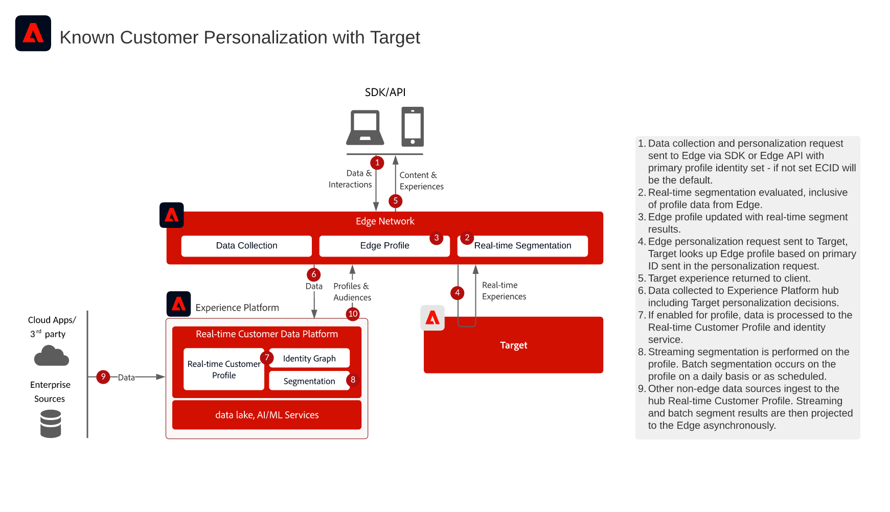

# 已知客戶Personalization與Target

>[!TIP]
>此Blueprint也可作為Personalization下的[使用案例模式](/help/blueprints/use-case-patterns/personalization/audience-sharing-with-target.md)。

## 使用案例

* 使用已知客戶資料進行線上個人化
* 登陸頁面最佳化
* 除離線資料 (如異動、忠誠度與 CRM 資料及建模的見解) 外，基於之前產品/內容視圖、產品/內容相似性、環境屬性及人口統計資料的個人化
* 使用Adobe Target在網站和行動應用程式上分享和鎖定Real-time Customer Data Platform中定義的對象

## 應用程式

* [!UICONTROL Real-time Customer Data Platform]
* Adobe Target

### 參考文件

* [適用於即時客戶資料平台的Adobe Target連線](https://experienceleague.adobe.com/docs/experience-platform/destinations/catalog/personalization/adobe-target-connection.html)
* [Edge資料流設定](https://experienceleague.adobe.com/docs/experience-platform/edge/datastreams/overview.html?lang=zh-Hant)

## 整合模式

| 整合模式 | 功能 | 先決條件 |
|--------------------|------------|---------------|
| **從Real-time Customer Data Platform共用至Target的Edge即時區段評估** |  — 即時評估對象，以瞭解Edge上的相同或下一頁個人化。   — 任何以串流或批次方式評估的區段也將投影到Edge Network，以包含在邊緣區段評估和個人化中。 |  — 必須實作Web/Mobile SDK或Edge Network伺服器API。   — 必須在Experience Edge中設定資料串流，並啟用Target和Experience Platform擴充功能。   — 目標目的地必須在Real-time Customer Data Platform目的地中設定。   — 與Target整合需要與Experience Platform執行個體相同的IMS組織。 |
| **透過Edge方法從Real-time Customer Data Platform串流及批次對象共用至Target** |  — 透過Edge Network從Real-time Customer Data Platform分享串流和批次對象至Target。   — 即時評估的對象需要Web SDK和Edge Network實作。 |  — 將串流和批次RTCDP對象共用至Target不需要Web/Mobile SDK或Edge API實作Target，但需要啟用即時邊緣區段評估。   — 如果使用AT.js，則僅支援對ECID身分名稱空間進行設定檔整合。   — 若要在Edge上進行自訂身分名稱空間查閱，需要Web SDK/Edge API部署，而且每個身分都必須在身分對應中設定為身分。   — 目標目的地必須在Real-time Customer Data Platform目的地中設定，僅支援RTCDP中的預設生產沙箱。   — 與Target整合需要與Experience Platform執行個體相同的IMS組織。 |
| **透過對象共用服務方法，從Real-time Customer Data Platform串流和批次對象共用至Target和Audience Manager** |  — 當需要從Audience Manager中的第三方資料和對象進行額外擴充時，可運用此整合模式。 |  — 將串流和批次對象共用至Target不需要Web/Mobile SDK，但需要啟用即時邊緣區段評估。   — 如果使用AT.js，則僅支援對ECID身分名稱空間進行設定檔整合。   — 若要在Edge上進行自訂身分名稱空間查閱，需要Web SDK/Edge API部署，而且每個身分都必須在身分對應中設定為身分。   — 必須布建透過對象共用服務的對象投影。   — 與Target整合需要與Experience Platform執行個體相同的IMS組織。   — 只有來自預設生產沙箱的對象支援對象共用核心服務。 |

## 將即時、串流和批次對象分享至 Adobe Target

架構

序列詳細資訊

概述架構

## 相關文件

### SDK 檔案

* [Experience Platform Web SDK檔案](https://experienceleague.adobe.com/docs/experience-platform/edge/home.html?lang=zh-Hant)
* [Experience Platform標籤檔案](https://experienceleague.adobe.com/docs/experience-platform/tags/home.html?lang=zh-Hant)
* [Experience Cloud ID服務檔案](https://experienceleague.adobe.com/docs/id-service/using/home.html?lang=zh-Hant)

### 細分文件

* [Experience Platform區段概觀](https://experienceleague.adobe.com/docs/experience-platform/segmentation/home.html?lang=zh-Hant)
* [即時分段](https://experienceleague.adobe.com/docs/experience-platform/segmentation/ui/edge-segmentation.html?lang=zh-Hant)
* [串流區段](https://experienceleague.adobe.com/docs/experience-platform/segmentation/api/streaming-segmentation.html?lang=zh-Hant)
* [透過Adobe Audience Manager進行Adobe Analytics區段共用](https://experienceleague.adobe.com/docs/analytics/components/segmentation/segmentation-workflow/seg-publish.html?lang=zh-Hant)
* [合併原則設定](https://experienceleague.adobe.com/docs/experience-platform/profile/merge-policies/ui-guide.html?lang=zh-Hant#create-a-merge-policy)

### 教學課程

* [使用Real-Time CDP和Adobe Target進行下一次點選個人化](https://experienceleague.adobe.com/docs/platform-learn/tutorials/experience-cloud/next-hit-personalization.html?lang=zh-Hant)
