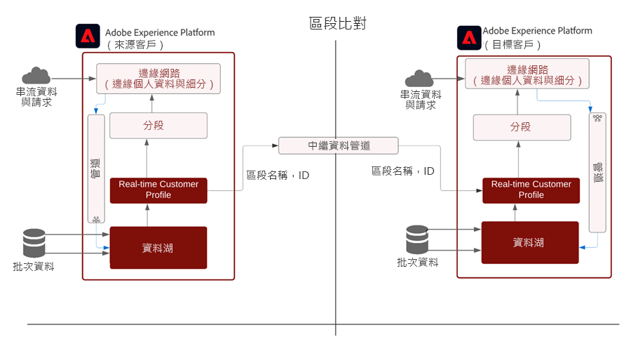
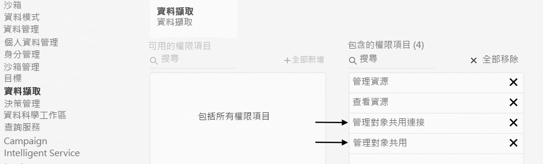
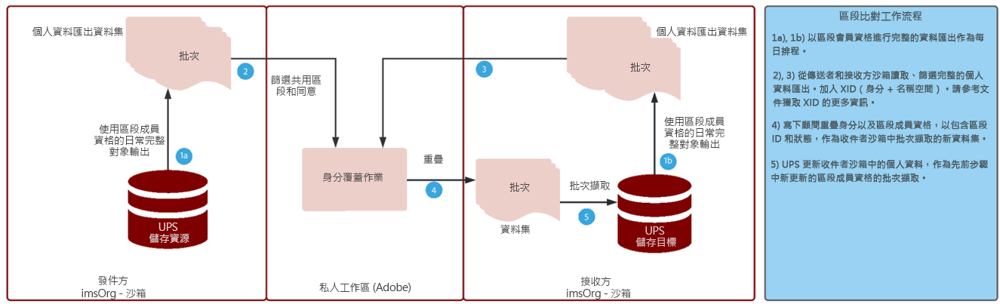

# 區段比對Blueprint

區段比對可讓合作夥伴品牌在其各自的Experience Platform環境中共用受眾。 品牌的關鍵是根據客戶與消費者直接關係中收集的資料與客戶建立聯繫。 透過更佳的控管、權限和偏好管理系統，行銷人員可進一步增強其與主要合作夥伴的第一方驗證受眾。

[!UICONTROL 區段符合] 是資料共同作業服務，可讓Experience Platform(AEP)客戶(以 _合作夥伴_)，以安全、受控且有利於隱私權的方式，根據通用產業識別碼來交換區段資料。

此服務可讓客戶以安全、中立的方式安全地識別相符的ID，而不需披露其整個資料庫。 合作夥伴只會收到重疊ID的指定屬性（區段名稱），以可控、同意控管的方式讓共用更快更輕鬆。

[!UICONTROL 區段符合] 以AEP資料控管與同意架構為骨幹。 可供所有B2C和B2P Real-time Customer Data Platform客戶使用。 的主要功能 [!UICONTROL [!UICONTROL 區段符合]] 包括：

* 重疊同意客戶的區段共用
* 共用前重疊報表，以取得預估匹配量的深入分析
* 完全整合的DULE政策和許可執行
* 資料共用同意框架骨幹
* 組織區段和合作夥伴的資料摘要

## 應用程式

品牌對發佈商：

第三方Cookie和行動廣告ID資料淘汰後，「發佈商使用案例」的影響最大。 此使用案例對注重以廣告作為商業模式銷售廣告的媒體和娛樂業有重大影響。 [!UICONTROL 區段符合] 對於具有大型第一方對象、且想要與其廣告商直接合作的發佈商而言，這是一條途徑。 廣告商可直接與發佈商合作，針對發佈商屬性上相符的對象進行廣告宣傳，以便精細鎖定目標或進行勘察促銷活動。

### 品牌對品牌

消費者歷程從來不是線性的。 例如，客戶可能忠於航空公司及其信用卡公司。 使用 [!UICONTROL 區段符合]，航空公司和信用卡公司可以建立資料合作關係來了解重疊的受眾，然後量身打造個人化體驗給每家公司的忠實消費者。

### BU到BU

全球跨國公司在獨立運營業務部門之間進行資料協作方面面臨挑戰。 由於不同的隱私權政策、贏取或跨BU管理權限，將資料合併至單一沙箱可能是不可能的。

[!UICONTROL 區段符合] 有助於跨大型組織的分散行銷團隊更有效率地協作，同時繼續獨立運作

## 架構

{zoomable=&quot;yes&quot;}

[!UICONTROL 區段符合] 不是可購買資料的資料市集。 這是AEP功能，可搭配特定合作夥伴使用第一方資料，透過隱私權和同意控制協助進行協作。 [!UICONTROL 區段符合] 有助於專注於改善客戶關係和提升品牌。 如果存在預先存在的品牌或合作夥伴關係，則這是有益的。 [!UICONTROL 區段符合] 體驗易於管理、可擴充，且可讓管理員以選擇加入、可控的方式共用區段。

[!UICONTROL 區段符合] 啟用：

* 使用標準人員層級識別碼（例如雜湊電子郵件或電話號碼），在組織之間安全地移植區段成員資料
* 受眾共用UI和含有通知的工作流程
* 預先共用的重疊估計數
* 自助式合作夥伴設定
* 選取標準化命名空間（雜湊電子郵件、雜湊電話、ECID、IDFA、GAID）重疊
* 強制執行資料共用同意
* 共用受眾生命週期管理
* 共用工作流程中的DULE實施
* 每日批更新

[!UICONTROL 區段符合] 可建立互連的客戶體驗。 支援的持久識別碼為雜湊電子郵件、雜湊電話號碼，以及ECID、IDFA和GAID等識別碼。 客戶可以建立動態消息，在品牌沙箱之間比對和移動受眾資料，具備強大的控管、透明度和撤銷功能，以用於廣告和行銷活動

## 先決條件

先決條件 [!UICONTROL 區段符合] 為：

* RT-CDP活動許可
* 支援的標準雜湊識別碼為SHA256雜湊電子郵件、雜湊電話、ECID、Apple IDFA和GAID
* 隱私權架構與同意策略
* 客戶之間已簽訂資料共用協定

## 安全性

### RBAC

此 [!UICONTROL 區段符合] 管理合作夥伴的流量由RBAC保護。 只有具有適當權限的個人才能啟動、接受或管理合作夥伴。 這可在產品設定檔的資料擷取區段中完成。 需要下列權限：

{zoomable=&quot;yes&quot;}

| 權限 | 說明 |
|---|---|
| **管理對象共用連線** | 此權限可讓您完成合作夥伴交握程式，此程式會連接兩個IMS組織以啟用 [!UICONTROL 區段符合] 流量。 |
| **管理受眾分享** | 此權限可讓您建立、編輯和發佈摘要（用於的資料套件） [!UICONTROL 區段符合])與活躍合作夥伴(管理員使用者已與 **對象共用連線** 存取)。 |

請參閱 [官方檔案](https://experienceleague.adobe.com/docs/experience-platform/segmentation/ui/segment-match/overview.html?lang=en#understanding-segment-match-permissions) 以進一步了解權限。

### 連接ID

合作夥伴連接過程由 **[!UICONTROL 連接ID],** 這是隨機產生的識別碼，會對應至特定AEP沙箱。 起始和管理合作夥伴沙箱時需要此Connect ID。 此外，還可以重新產生Connect ID以視需要重新設定合作夥伴連線。

### 治理

任何資料集或資料屬性， *C11* 合同標籤為 [!UICONTROL 區段符合] 服務。 使用這些屬性的區段無法用於 [!UICONTROL 區段符合]. 這可提供可用於或無法用於的區段的控制 [!UICONTROL 區段符合]. 此外，建立的自訂原則和行銷動作也會強制執行。 依預設，會停用原則，且必須啟用以執行。 共用區段時選擇的電子郵件行銷和站上廣告等限制也會傳播並與合作夥伴共用。

### 同意

的同意設定 [!UICONTROL 區段符合] 可透過下列方式管理：

* 在組織層級，在上線期間，使用同意檢查的退出或加入設定。

   此設定決定是否可共用使用者資料。 預設值設為選擇退出，指出使用者資料可在AEP客戶已具備資料共用使用所需同意協定的假設下共用。 您可以聯絡Adobe客戶經理，並額外勾選「 」，強制AEP客戶明確追蹤同意，將此設定變更為選擇加入。

* 使用 [同意和首選項欄位組](https://experienceleague.adobe.com/docs/experience-platform/xdm/field-groups/profile/consents.html?lang=en).

   此欄位組提供單個對象類型欄位（同意），以捕獲同意和首選項資訊。 [!UICONTROL 區段符合]，依預設會包含所有未明確選擇退出的身分，例如：

   ```
   "share": {
   `                `"val": "n"
   `     `}
   ```

   您可以聯絡Adobe帳戶管理員以變更此設定，僅包含具有明確選擇加入的身分識別，例如：

   ```
   "share": {
   `                `"val": "y"
   `     `}
   ```

### 警報

當合作夥伴連線啟動或區段摘要與合作夥伴共用時，會產生警報。

## 設定工作流程

如上所述，設定合作夥伴連線的工作流程是透過RBAC管理。 擁有正確權限後，若要連線至合作夥伴沙箱，必須共用該合作夥伴組織內該沙箱/例項的連線ID。

向發送夥伴請求連接後，必須在接收方批准該連接，以確保安全、安全的合作夥伴設定。 合作夥伴連接握手可確保兩個組織之間存在協定，並允許Adobe為 [!UICONTROL 區段符合] 代表組織處理。 如果連接已批准且處於活動狀態，則可從任一方啟動段共用進程。

### 區段共用

只有在所選識別碼上存在相符項目時，才會與合作夥伴共用區段。 可以是一對多合作夥伴關係，這表示區段可以與多個合作夥伴共用。

若要在合作夥伴連線設定後啟動區段共用，傳送合作夥伴應建立摘要。 接著，選取應排除區段資料的行銷使用案例或動作，以及耐久識別碼。 接著，相關區段便可新增至摘要以供共用。

在此區段共用工作流程中，傳送合作夥伴可在移動任何資料前，透過預估的重疊發現潛在的高價值區段。

整體流程為：

{zoomable=&quot;yes&quot;}

這些重疊估計提供關鍵的深入分析、合作夥伴發現和資料，以推動資料協作協定。 不會跨沙箱移動任何客戶或區段資料，以取得這些重疊的估計量度。 任何指定沙箱中，由Adobe選取且經過預先雜湊處理的適用身分會新增至可能性資料結構，讓客戶能執行兩者之間的聯合和交集作業。 這些操作有助於 [!UICONTROL 區段符合] 從兩個不同的沙箱中獲取由身份組成的兩個資料結構的估計交集，而無需比較實際值

身分重疊程式取決於 **每日完整設定檔匯出** 來自傳送者和接收者沙箱的資料集，以識別屬於共用區段的常見設定檔。 重疊流程的詳細流程如下所示：

{zoomable=&quot;yes&quot;}

從傳送合作夥伴完成區段共用後，接收者會收到共用區段摘要的相關通知。 必須啟用此區段摘要，接收者的設定檔才能起始區段成員資格資料流。 只有區段成員資格會擷取至接收者IMS組織的重疊設定檔片段，且不會從傳送者傳送其他身分給接收者。

共用區段位於 `AEPSegmentMatch` 區段 **[!UICONTROL 對象]** 標籤 **[!UICONTROL 區段產生器]** 和可在接收者沙箱中建立區段時，用來包含或隱藏對象。

每日重疊程式可讓傳送者與接收者之間保持同步的區段成員資格。 接收者可停用收到之區段摘要的設定檔，以暫停區段共用程式。

#### 區段退出/登入

在完整設定檔匯出中，設定檔區段成員資格下的共用區段ID狀態會有其中一個對應值 —  _實現_, _退出_，或 _現有_ 來反映當前狀態。

在每日身分重疊程式中，如果接收者沙箱中存在對應身分，共用區段的這些區段成員資格狀態會傳送至接收者以進行擷取。

#### 區段撤銷

從發件者取消/刪除區段是隨選程式，從接收者取得具有撤銷區段ID之所有設定檔的清單。 區段ID會從這些身分的區段成員資格中移除，並在接收者擷取。 此動作會覆寫現有的區段成員資格片段，而刪除該區段的成員資格。

## 更多資訊

* [區段符合](https://experienceleague.adobe.com/docs/experience-platform/segmentation/ui/segment-match/overview.html?lang=en#)
* [權限](https://experienceleague.adobe.com/docs/experience-platform/access-control/home.html?lang=en)
* [疑難排解](https://experienceleague.adobe.com/docs/experience-platform/segmentation/ui/segment-match/troubleshooting.html?lang=en)
* [XID](https://experienceleague.adobe.com/docs/experience-platform/identity/api/list-native-id.html?lang=en)
