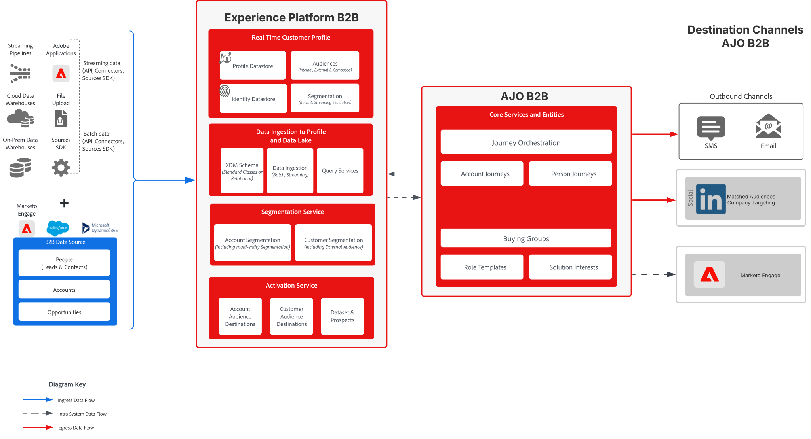
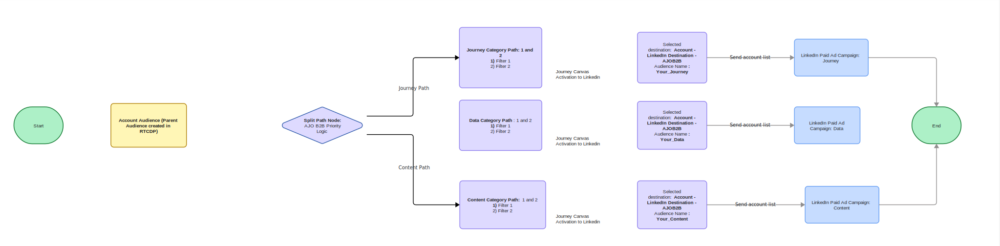

# 概觀

大規模執行B2B付費媒體的行銷團隊面臨循環的問題：**帳戶一次結束多個行銷活動** （角色、類別意識、解決方案導向、追蹤），這會稀釋訊息、造成對象疲勞，並強制手動清單工作 — 上傳、排除和抑制 — 跨LinkedIn帳戶相符（帳戶目的地）。 如果沒有&#x200B;**瀑布式優先順序**&#x200B;和&#x200B;**自動行銷活動指派**，就沒有單一位置可決定哪個帳戶取得哪個訊息，且操作不會縮放。

**付費媒體控制器**&#x200B;是解決此問題的完美解決方案。 它同時使用&#x200B;**Adobe Journey Optimizer B2B edition (AJO B2B)**&#x200B;和&#x200B;**Adobe Experience Platform (AEP)**：一個&#x200B;**帳戶歷程**&#x200B;會從Real-Time CDP讀取合格的帳戶對象、套用&#x200B;**分割路徑（瀑布）邏輯**&#x200B;以將每個帳戶指派給正好一個行銷活動層級，以及&#x200B;**將每個路徑直接**&#x200B;啟用到付費媒體目的地（**例如，LinkedIn相符對象**），沒有手動清單移交。 結果就是精確控制、較少的重疊，以及多頻道B2B付費媒體協調的可重複模式。

## 使用案例：行銷人員的故事：為什麼控制者重要

*Maya領導付費媒體取得全球B2B品牌。 她的團隊執行數十項行銷活動 — 基礎意識、類別意圖（歷程、資料、內容）、解決方案導向的計畫、角色行銷活動，以及必勝追求。 她發生問題。*

**問題：**&#x200B;相同的帳戶會出現在多個行銷活動中。 高意圖歷程帳戶也出現在廣泛的認知清單中；追蹤帳戶仍會獲得個人廣告。 清單上傳和排除是手動操作。 每當銷售人員更新「必勝」清單或推出新角色促銷活動時，她的團隊就會重新匯出受眾、協調試算表中的重疊專案，並重新上傳至LinkedIn和其他平台。 速度緩慢、容易出錯，而且無法擴展。

**她想要的：**&#x200B;每個合格帳戶都會評估一次，使用明確的優先順序規則（瀑布圖）指派給&#x200B;*最相關的*&#x200B;行銷活動，並自動傳送到正確的付費媒體目的地。 沒有手動清單移交。 當資料或策略變更時，系統會重新評估並在行銷活動之間移動帳戶，而她的團隊不會接觸清單。

**Adobe的答案：**&#x200B;透過&#x200B;**AJO B2B與AEP的搭配運作**，Maya可以執行單一&#x200B;**付費媒體控制者**&#x200B;歷程：AEP與Real-Time CDP持有資料及一個主要「合格帳戶」對象；AJO B2B執行使用&#x200B;**分割路徑邏輯** （瀑布）將每個帳戶路由到正確的層級 — 例如，目標追求→解決方案導向的→角色→類別感知→基礎感知 — 以及&#x200B;**啟用到目的地**&#x200B;將每個路徑傳送到正確的LinkedIn （或其他）行銷活動。 一個歷程、一個信任來源、無手動清單匯出。 這就是付費媒體控制器模式，也是Adobe啟用B2B付費媒體精確度和規模的方式。

## 為何這對B2B企業很重要：

採用此模式的組織可以完全消除手動隱藏和排除邏輯（例如，在歷程中處理100%的重疊解析度）、透過單一控制器擴充至&#x200B;**成千上萬個帳戶**，以及維護帳戶用於哪個行銷活動的&#x200B;**單一信任來源**。 系統&#x200B;**會自動調整**&#x200B;以因應行銷活動焦點、目標對象和銷售目標變更，而不需重新匯出清單或重新上傳至每個平台。 對於執行多個付費媒體行銷活動的任何B2B企業，付費媒體控制器模式可提供手動清單工作流程無法提供的清晰度、控制度和自動化功能。

以下KPI與測量成功相符：

- **意識：** Target帳戶是否以較高的頻率看到正確的廣告並移至正確的行銷活動？
- **參與：**&#x200B;移除重疊時，參與和轉換是否更好？
- **效率：**&#x200B;手動清單工作（上傳、排除、隱藏）減少多少？
- **成本：**&#x200B;每個已取得的帳戶或商機成本如何隨著自動協調而改變？

## 付費媒體歷程協調

此藍圖的一個常見使用案例和焦點是&#x200B;**B2B付費媒體歷程協調**：確保每個合格帳戶都指派給正好一個行銷活動層級，並啟動到正確的付費媒體目的地，沒有重疊或手動移交。

→控制者歷程&#x200B;**讀取**&#x200B;合格帳戶對象(內建於Real-Time CDP的AEP資料)，**透過分割路徑（瀑布圖）條件(例如，追求解決方案導向的→角色→類別意圖→基礎)評估**&#x200B;每個帳戶，並&#x200B;**啟用**&#x200B;指向對應目的地的每個路徑（例如，每個促銷活動的LinkedIn相符對象）。

**以帳戶為中心的解決方案：**&#x200B;付費媒體控制者的焦點是&#x200B;**帳戶**&#x200B;以及其&#x200B;**行銷活動指派**。 技術設定支援代表合格帳戶及其屬性（例如意圖、區段、角色）的資料和對象，這些是成功帳戶層級細分和歷程型協調的必要條件。

## 需求

以帳戶為中心的解決方案需要下列應用程式和服務：

- **Adobe Journey Optimizer B2B edition** — 帳戶歷程、分割路徑（瀑布）邏輯、啟用至目的地。
- **Adobe Real-time Customer Data Platform (RTCDP) B2B edition** — 帳戶設定檔、帳戶對象（例如付費媒體的合格帳戶）。

## 架構

高階流量：

1. **資料與對象** — AEP擁有設定檔和事件；Real-Time CDP B2B會建立帳戶對象（例如「符合付費媒體資格的帳戶」），以作為歷程登入對象。
2. **協調流程** — AJO B2B帳戶歷程： **讀取對象** （合格帳戶） → **分割路徑** (瀑布：例如，Purchase →解決方案導向的→ Persona → Category → Foundation) → **啟用到目的地** （每個指向LinkedIn或其他付費媒體的路徑）。
3. **目的地** — 付費媒體管道（例如LinkedIn相符的對象）會從每個歷程路徑接收帳戶層級的啟用；不會手動上傳清單。

## 架構圖

## B2B AEP中的資料模型

在任何資料導向式協調流程中，架構設計都非常重要。 AEP/RTCDP中的帳戶和人員設定檔必須包含用於&#x200B;**分割路徑條件**&#x200B;的屬性（例如，追蹤旗標、解決方案興趣、角色、意圖類別、參與分數）。 B2B結構描述（XDM商業帳戶、XDM個人設定檔、關聯式）應該代表您的階層和資料來源。 如需詳細資訊，請參閱[RTCDP B2B結構描述](https://experienceleague.adobe.com/en/docs/experience-platform/rtcdp/b2b-overview)和[AJO B2B檔案](https://experienceleague.adobe.com/en/docs/journey-optimizer-b2b/user/home)。

**注意：**&#x200B;歷程中的分割路徑邏輯會使用設定檔，並在支援的情況下使用關聯式資料；請確定瀑布式邏輯所需的欄位可在歷程中使用。

### 護欄

- **Journey Optimizer B2B edition** — 如需歷程限制、節點限制和目的地支援，請參閱[產品說明](https://helpx.adobe.com/legal/product-descriptions/adobe-journey-optimizer-b2b.html)。
- **Real-Time CDP** — 如需細分與啟用限制，請參閱[RTCDP護欄](https://experienceleague.adobe.com/en/docs/experience-platform/rtcdp/guardrails/overview)。

## 實作

下列步驟提供透過AJO B2B和AEP實作付費媒體控制器的指引。

### 必要步驟

1. **在Real-Time CDP B2B中定義帳戶對象和資料模型。**

   建立將進入控制者歷程的&#x200B;**合格帳戶對象** （例如「付費媒體合格帳戶」）。 使用「區段產生器」與定義適用性的科目/個人屬性（例如地理位置、區段、MQA狀態）。 此對象是歷程的單一進入點。

2. **定義行銷活動階層與分割邏輯。**

   記錄瀑布順序(例如Purchase → Solution-Led → Persona → Category → Foundation)和每個路徑的條件（哪些屬性或受眾符合帳戶的資格）。 確定條件依順序&#x200B;**（由上而下）為**&#x200B;互斥：帳戶最多只能比對一個路徑，第一個路徑會評估true。

3. **設定目的地。**

   在AEP/RTCDP中設定付費媒體目的地（例如LinkedIn相符的對象），並確定這些對象可從AJO B2B啟用。 對應每個目的地的帳戶識別碼和任何必要屬性。

### 付費媒體控制器設定

1. **在AJO B2B中建立控制器歷程。**

   - **讀取對象：**&#x200B;從Real-Time CDP中選取合格的帳戶對象。
   - **分割路徑：**&#x200B;以瀑布圖順序新增節點。 每個節點都會評估條件（例如「在追求的對象中」、「解決方案興趣= X」、「角色= Y」、「意圖類別= Z」）。 符合退出的帳戶與對應的啟用相符；其他帳戶會繼續下一個拆分。
   - **啟用至目的地：**&#x200B;針對每個路徑，將「啟用至目的地」節點新增至正確的LinkedIn （或其他）行銷活動/目的地。

2. **驗證相互排他性。**

   - 確認每個帳戶僅輸入一個路徑（第一個相符條件）。
   - 驗證啟用：帳戶會顯示在正確的目的地，並如預期從優先順序較低的行銷活動中排除。

## 實作圖

### 4.2.3.對象啟用

1. **啟用至LinkedIn （和其他目的地）。**

   在歷程中使用「啟用至目的地」，將每個路徑傳送至正確的付費媒體對象。 沒有手動清單匯出或上傳；歷程會隨著帳戶流經路徑而推動啟用。

2. **監視和調整。**

   使用歷程報告來監視每個路徑的磁碟區。

## 摘要

**付費媒體控制方**&#x200B;藍圖顯示&#x200B;**AJO B2B和AEP**&#x200B;如何搭配運作，為B2B行銷人員提供單一、自動化的方式，將帳戶指派給行銷活動並啟用給付費媒體：一個主要對象、一個歷程、Waterfall分割邏輯，以及直接啟用給目的地 — 沒有手動清單移交。 它為多頻道B2B付費媒體協調建立了可重複的模式，並幫助減少重疊、改善關聯性和擴展操作。

## 相關文件

- [購買群組式行銷和歷程管理Blueprint](https://experienceleague.adobe.com/en/docs/blueprints-learn/architecture/b2b-activation/b2b-buying-group-journeys) — 在AJO B2B中帳戶和購買群組歷程。
- [Adobe Journey Optimizer B2B edition](https://experienceleague.adobe.com/en/docs/journey-optimizer-b2b) — 產品檔案。
- [Real-time Customer Data Platform B2B edition](https://experienceleague.adobe.com/en/docs/experience-platform/rtcdp/b2b-overview) — 帳戶對象與啟用。
