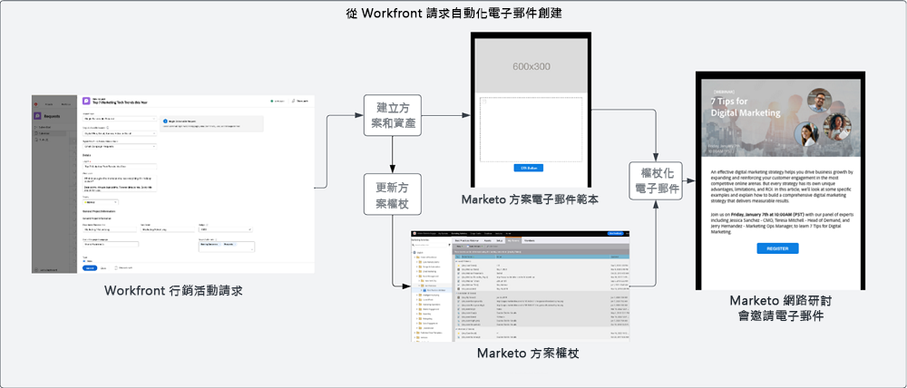
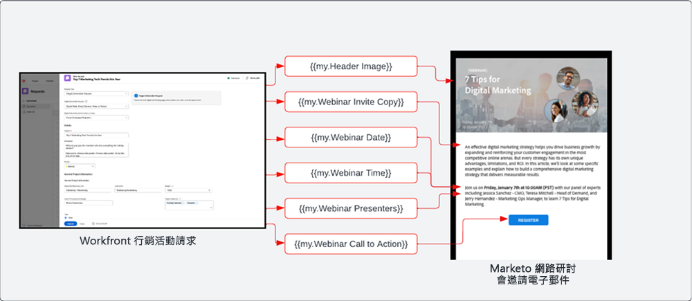
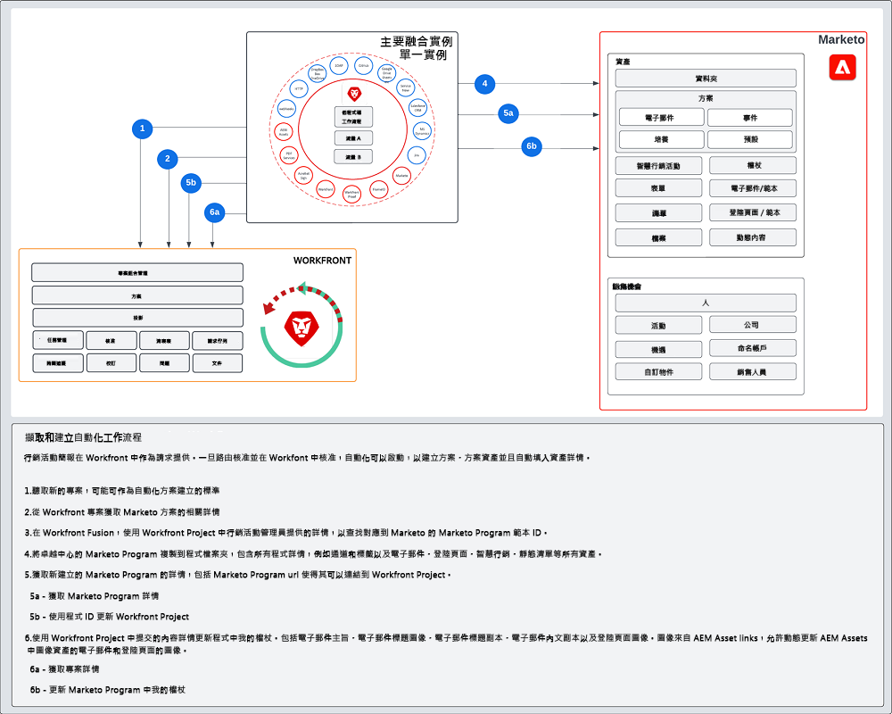

# Intang and Create {#intake-and-create}

進入營銷運營團隊發起新活動的營銷請求數量，可以將一個高效運轉的團隊轉變為重複性任務的循環門，導致倦怠和創新停滯。

建立提交行銷活動請求的程式並自動建立經常請求的行銷活動，您可以：提高行銷活動的速度、減少錯誤、將請求路由至行銷作業的適當成員、平衡並改善資源利用率，以及將更多行銷作業集中於更具策略性的任務。

透過Workfront和Marketo Engage，系統對系統連線可讓 [Workfront申請表](https://experienceleague.adobe.com/docs/workfront/using/administration-and-setup/customize/custom-forms/create-or-edit-a-custom-form.html){target=&quot;_blank&quot;}建立Marketo Engage程式，然後填入關鍵變數，例如：主旨行、電子郵件副本、影像、日期、時間、事件資訊等。

要實現此整合，您將使用Workfront Fusion ，這是一個工作自動化層，可讓您自動化Workfront與其他系統之間的工作流程。

以下工作流程顯示行銷活動管理員使用Workfront請求表單進行網路研討會的請求。 請求中提交的詳細資訊會觸發要在網路研討會中以Marketo Engage建立的方案和電子郵件。 此外，請求表單會提供詳細資訊，以填入電子郵件的內容。

>[!TIP]
>
>若要進一步了解Workfront中用於組織行銷活動工作的不同類型物件，以及其如何對應至Marketo Engage方案，請查看 [Marketo和Workfront概述](/help/blueprints/b2b/campaign-supply-chain/overview.md){target=&quot;_blank&quot;}。

## 為自動化準備您的Campaign開發流程 {#prepare-your-campaign-development-process-for-automation}

每一個偉大的工作流程自動化背後都是一個定義的流程，可確保團隊和利害關係人從自動化中獲得最大價值。

**您將收到哪些類型的行銷請求？**

請思考您將採用的行銷策略類型，例如電子郵件、培養、第一方網路研討會和活動。 您是否也會執行第三方網路研討會或顯示廣告？ 應將每個請求視為請求表單中可能需要特定輸入欄位，並將對應至Marketo Engage中將複製的不同程式範本。

您也會想要了解您是否在多個地區執行行銷活動。 如果是這種情況，您會想要說明Workfront中一個專案在Marketo Engage中建立多個方案，每個方案代表不同的語言支援。

請務必事先了解您預期會收到的行銷請求類型，以確保能以自動化方式協助您提出請求。

**促銷活動請求中應擷取哪些資訊？**

請思考您針對每種不同的策略，在請求表單中需要擷取的關鍵資訊片段。 以下是您可以在Workfront表單中擷取的資訊範例，以協助您自動化行銷活動開發。

<table> 
  <tr> 
   <td><b>行銷策略</b></td>
   <td><b>要捕獲的資訊</b></td>
  </tr>
  <tr> 
   <td>電子郵件爆炸</td>
   <td>·電子郵件主旨 
·排程日期 
·電子郵件副本 
·行動呼籲 
·影像 — 可直接參考AEM Assets URL，以便在Marketo中使用 
·受眾資格標準</td>
  </tr>
  <tr>
   <td>網路研討會/活動</td>
   <td>·事件名稱 
·事件日期 
·事件時間 
·活動城市 
·事件說明 
·網路研討會錄制頁面 — PageURL OnDemand 
·揚聲器姓名 
·演講者稱號 
·揚聲器影像 
·需要的電子郵件（邀請、確認、提醒、跟進） 
·電子郵件標題影像 
·受眾資格標準</td>
  </tr>
  <tr>
   <td>培養</td>
   <td>·電子郵件數量 
·電子郵件副本 
·電子郵件標題 
·行動呼籲 
·受眾資格標準</td>
  </tr>
  </tbody>
</table>

>[!NOTE]
>
>目前，由於智慧清單不支援代號，因此Marketo Engage受限於以程式設計方式透過自動化建立對象。 這表示閱聽眾需要由使用者以Marketo Engage建立，或如果您有預定的閱聽眾需持續通訊，您可以在程式範本中加入已設定的智慧清單，此範本會在自動化程式期間複製。

### 建立卓越中心 {#establish-your-center-of-excellence}

如果您想要自動建立方案，則需要Marketo Engage的卓越中心。 英才中心包括模板化方案和資產，以幫助加快和標準化宣傳發展進程。 例如，您可能有符合不同行銷活動需求的方案範本：電子郵件、培養、面對面活動和網路研討會。 此外，您可能有多個電子郵件方案範本，可用於不同地區或不同類型的電子郵件公告。

在Marketo Engage中使用方案範本建立您的卓越中心，是讓行銷活動以更具程式化的方式執行的第一步，並將作為自動化行銷活動要求的基礎。

一旦您擁有一組可重複使用的方案範本，您就可以使用此藍圖中概述的自動化功能，進一步擴展您的工作量，以提升行銷活動開發的速度。

若要進一步了解如何建立自己的卓越中心，請查看 [Marketo社群](https://nation.marketo.com/t5/product-blogs/marketo-master-class-center-of-excellence-with-chelsea-kiko/ba-p/243221){target=&quot;_blank&quot;}以取得最佳實務。

### 使用代號來填入內容 {#use-tokens-to-populate-content}

透過Marketo Engage，代號可用來將內容填入您的促銷活動資產中。 例如，從您的卓越中心複製電子郵件範本後，Workfront Fusion可從Workfront中的促銷活動請求取得詳細資訊，並傳遞至Marketo Engage方案中的我的代號。 接著，代號值可直接繼承至電子郵件中，以建置電子郵件。

### 從AEM Assets填入影像 {#populate-images-from-aem-assets}

您可以利用Marketo Engage代號搭配AEM Assets中資產的連結，進一步自動化電子郵件和登錄頁面開發。 Campaign請求者可在請求程式中從AEM Assets提交已發佈的影像連結。 Workfront Fusion接著可取得這些連結，並使用Marketo Engage代號將其內嵌至電子郵件的HTML中。

請記住，您需要在Marketo Engage中建立程式和程式模板，以利用我的令牌，以便Fusion可以使用Workfront中提交的資訊更新令牌值。

>[!NOTE]
>
>AEM Assets不需要支援此工作流程，但可讓管理整個行銷活動開發供應鏈中行銷活動資產的流程更簡化。

### 為所有程式請求類型組合查找庫 {#assemble-a-lookup-library-for-all-program-request-types}

從Workfront要求自動建立新Marketo Engage程式時，請務必在Workfront Fusion自動化中加入一個步驟，從Workfront要求中取得資訊，並查閱應在Marketo Engage中複製的正確程式範本。

若要這麼做，您可以在Workfront Fusion中匯入資料集，其中包含您Marketo Engage卓越中心中所有不同方案範本的清單。

程式範本查閱程式庫中應包含的一些基本資訊包括：

<table> 
  <tr> 
   <td><b>欄</b></td>
   <td><b>說明</b></td>
  </tr>
  <tr> 
   <td>促銷活動類型</td>
   <td>這可能是電子郵件、網路研討會、培養、活動、第三方網路研討會、清單匯入等。促銷活動類型將作為要求內容的可讀說明。</td>
  </tr>
  <tr> 
   <td>Workfront請求類型</td>
   <td>這是在Workfront表單中選取的請求類型，可能與行銷活動類型相同，例如電子郵件、網路研討會、培養或活動。 這可用來將Workfront表單中選取的輸入對應至Marketo的方案範本。</td>
  </tr>
  <tr> 
   <td>Workfront表單ID</td>
   <td>用於驗證寫入請求的Workfront請求表單的唯一ID已映射到Marketo Engage程式模板。</td>
  </tr>
  <tr> 
   <td>Marketo計畫ID</td>
   <td>這是Marketo Engage中對應至所提出請求的方案範本ID。 Workfront Fusion中隨時都能提供這些資訊，Fusion便能向Marketo Engage者提出請求，並確切知道要克隆的程式。</td>
  </tr>
  </tbody>
</table>

## 進氣和建立自動化流 {#intake-and-create-automation-flow}

以下範例說明如何透過預先建置，在Fusion中組合工作流程邏輯 [Workfront](https://experienceleague.adobe.com/docs/workfront/using/adobe-workfront-fusion/fusion-apps-and-modules/workfront-modules.html){target=&quot;_blank&quot;}和 [Marketo Engage](https://experienceleague.adobe.com/docs/workfront/using/adobe-workfront-fusion/fusion-apps-and-modules/marketo-modules.html){target=&quot;_blank&quot;}模組，讓您更快地提供自動化。

## 資源 {#resources}

* [Adobe Marketo Engage模組](https://experienceleague.adobe.com/docs/workfront/using/adobe-workfront-fusion/fusion-apps-and-modules/marketo-modules.html){target=&quot;_blank&quot;}

* [Adobe Workfront模組](https://experienceleague.adobe.com/docs/workfront/using/adobe-workfront-fusion/fusion-apps-and-modules/workfront-modules.html){target=&quot;_blank&quot;}

* [Marketo和Workfront概述](/help/blueprints/b2b/campaign-supply-chain/overview.md){target=&quot;_blank&quot;}
