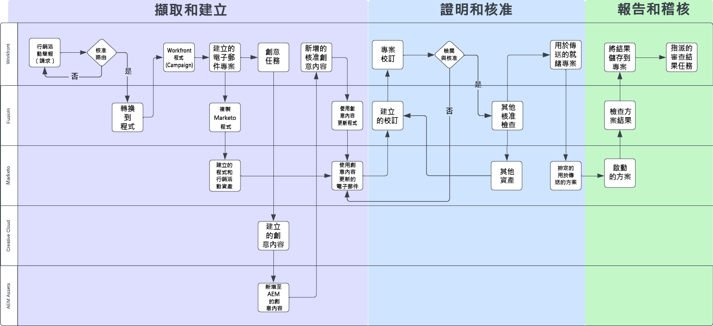
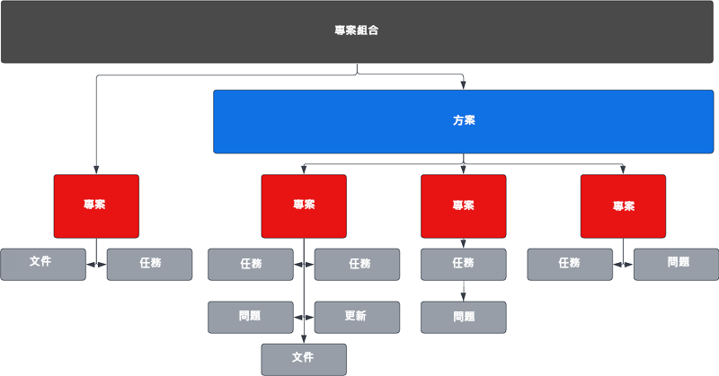
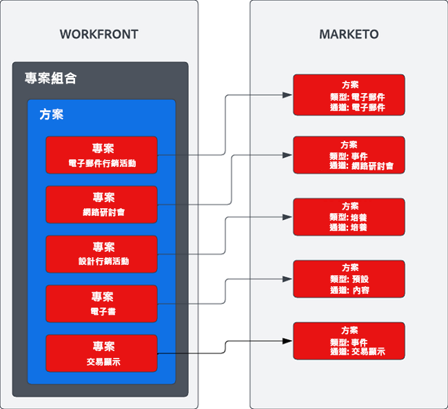

# 概覽 {#overview}

## 利用優化的促銷活動供應鏈實現更快的上市時間 {#achieving-faster-time-to-market-with-optimized-campaign-supply-chain}

行銷工作持續成長，每天都有新的管道，以更多方式個人化通訊。 行銷團隊需要持續自動化和演變的方法，以支援世界各地不斷變化的行銷需求。

**「投資回報率一直是真正的目標。 收入是不錯的，但不會以任何代價來實現 — 尤其是在今天。」 - CMO，商業服務行業**

在增加收入的同時實現更高ROI的組織正通過簡化其促銷活動開發流程、優化其促銷活動執行速度以及改進整個行銷職能的監督來實現這一目標。

如果貴組織想要達成下列所述的類似目標，本檔案將對您有所幫助：

* 擴充行銷活動作業，以支援跨職能部門的行銷團隊
* 透過簡化的行銷活動要求程式，加快上市時間
* 建立記錄系統，以提高行銷活動利害關係人的可見度
* 檢閱及核准促銷活動資產（影像、電子郵件副本）

行銷活動營運團隊需要能讓他們有效規劃及執行行銷活動的系統。 無論是電子郵件、網路研討會、活動、付費媒體、培養或內容整合，行銷團隊都需要一個中央解決方案來組織行銷活動貢獻者、交付項目和執行。

將多管道行銷啟動系統(Marketo Engage)與行銷規劃和記錄系統(Workfront)整合後，您就能提升行銷活動速度，並為相關人士提供更佳的可見度。

有了Workfront Fusion，行銷營運團隊基本上可以消除將行銷簡報轉譯為行銷活動時容易出現錯誤的手動步驟。 Workfront Fusion提供Workfront與Marketo Engage之間的立即可用整合層，在系統之間開發工作流程時可提供彈性和效率。 您可以進一步了解如何設定整合，以及可以採取哪些動作來自動化工作流程 [此處](https://experienceleague.adobe.com/docs/workfront/using/adobe-workfront-fusion/fusion-apps-and-modules/marketo-modules.html){target=&quot;_blank&quot;}。

## 行銷活動規劃至執行 — 自動化使用案例 {#campaign-planning-to-execution-automation-use-cases}

* 透過Workfront中的接受請求，自動建立Marketo Engage中的促銷活動，以支援行銷營運團隊
* 將以Marketo Engage建立的電子郵件和登錄頁面草稿分享至Workfront，以取得跨職能部門的利害關係人的最終審核和核准
* 將促銷活動結果從Marketo Engage分享至Workfront，將促銷活動量度的存取大眾化

在下方，若是電子郵件爆炸請求，您可以看到促銷活動開發程式的工作流程圖表。 此外，您還可以了解Workfront Fusion如何在Workfront和Marketo Engage之間發揮作用，推動整個行銷活動開發週期的工作流程和流程自動化。

請注意促銷活動開發程式中的不同階段。

1. 進入和建立：會提出campaign請求，並以程式設計方式組合campaign資產。

1. 證明並核准：行銷活動一經組建，利害相關者就可以檢閱並簽核行銷活動資產，例如電子郵件和登錄頁面。

1. 報告和審計：將行銷活動結果分享至Workfront，讓跨職能部門的利害關係人更能看見。

>[!NOTE]
>
>在上例中，Workfront在Marketo Engage計畫的整個生命週期中管理和規劃工作。 話雖如此，Workfront的彈性可延伸至管理您行銷團隊的所有努力。 這包括以帳戶為基礎的行銷、行銷內容供應鏈、代理管理、數位和社交行銷活動管理，以及銷售支援計畫。

## 了解行銷活動在Workfront中的呈現方式 {#understanding-how-marketing-initiatives-are-represented-in-workfront}

Adobe Workfront可讓組織管理工作，以促進更有效率的執行。 Workfront內有物件階層，為不同團隊的規劃、資源管理和協作提供框架。

了解如何將業務流程對應到這些物件，對於了解Workfront與Marketo Engage之間的關係非常重要。

### Portfolio層次定義 {#portfolio-hierarchy-defined}

<table> 
  <tr> 
   <td><b>物件</b></td>
   <td><b>定義</b></td>
  </tr>
  <tr> 
   <td>Portfolio</td>
   <td>您可以使用Workfront中的Portfolio和方案來組織專案。 透過組織專案，您可以比較類似的專案，並決定最佳的花費資源。  
   (例如，為專注於銷售服務和/或產品的公司內的業務單位建立Portfolio。)</td>
  </tr>
  <tr>
   <td>方案</td>
   <td>您可以使用Workfront方案來組織專案。 透過組織專案，您可以比較類似的專案，並決定最佳的花費資源。  
   （例如，具有高階目標的行銷策略，例如提高知名度並推動新產品推出的需求。）</td>
  </tr>
  <tr>
   <td>專案</td>
   <td>Workfront專案是需要完成以達成特定目標、交付項目、產品等的工作項目集合。  
   (例如，行銷策略，例如電子郵件爆炸、培養行銷活動、網路研討會或面對面活動。 單一專案也可能更複雜，包含多種策略，例如電子郵件、顯示廣告、登陸頁面和可下載的白皮書，這些都是為了促成相同的結果。)</td>
  </tr>
  <tr>
   <td>任務</td>
   <td>Workfront任務是可能屬於項目或計畫的計畫工作項目。 任務被分配給用戶或團隊以完成。  
   (例如，建立受眾區段或建立電子郵件草稿的任務可能與開發Marketo Engage電子郵件方案的專案相關聯。)</td>
  </tr>
  <tr>
   <td>問題</td>
   <td>問題是Workfront中的計畫外工作項目。 這些可能是專案期間發生的問題，也可能是透過請求佇列提交的請求。  
   （例如，由於電子郵件橫幅影像的維度錯誤，因此會提交問題。）</td>
  </tr>
  <tr>
   <td>檔案</td>
   <td>文檔可以是傳統文檔，如Word文檔或演示文稿。 它們也可以是影像檔案。 Workfront可透過檔案和影像的註解和註解進行資產校對，以啟用團隊間的協作。  
   （例如，需要審核的電子郵件標題影像。）</td>
  </tr>
  <tr>
   <td>更新</td>
   <td>包括註解和稽核記錄，以追蹤工作並促進Workfront中的協作。  
   （例如，新映像版本的審核日誌。）</td>
  </tr>
  </tbody>
</table>

## 市場營銷計畫工作管理示例 {#marketing-initiative-work-management-example}

讓我們看看Workfront產品組合階層在真實世界中的表現。

Zeplin公司正在發佈一種更新版本的Z11小型實用拖拉機附件，該附件比之前的Z10型號更耐用、更定制。 因此，他們需要規劃、制定和執行其營銷策略，以推動需求，並提高對其業務拖拉機部門新發佈的認識。 此營銷策略需要包括不同的營銷策略，以提高新客戶意識和現有Z10客戶意識。

以下階層顯示策略、策略、任務和資產如何對應至此行銷活動的Workfront。

## 將Workfront對應至Marketo {#mapping-workfront-to-marketo}

有了Workfront作為行銷規劃和專案組織的上游系統，請務必了解Marketo Engage和Workfront之間如何共用資訊。

為了讓這些系統在開發新的行銷計畫時同步運作，請務必了解Workfront中不同記錄類型如何對應至Marketo Engage中的記錄類型。

### 將Workfront專案對應至Marketo Engage方案 {#mapping-workfront-projects-to-marketo-engage-programs}

使用Workfront Fusion做為整合層，您可以將Workfront中的專案對應至Marketo Engage中的方案。 例如，在上述案例中，澤普林希望提高對新澤普林模式的認識。 透過此功能，他們在Workfront中建立了新方案，內含多個以「專案」表示的行銷策略。 一種策略是，向Z10機型的現有客戶發送一封宣傳電子郵件，讓他們了解新的Z11機型。 在Workfront中，會建立專案來呈現此電子郵件策略，並提供一組與其相關的工作，以建立對象、為電子郵件影像創作創意，以及將電子郵件組合成Marketo Engage。 Workfront中的專案可對應至Marketo Engage中的電子郵件方案，以便在系統之間同步資訊。

以下範例說明方案如何包含多個專案，以及這些Workfront專案如何對應至Marketo Engage中的方案。

您可能想要啟動大型行銷計畫，該計畫需要將多個Workfront專案存放在Workfront計畫中，或是只需要建立單一Workfront專案，即可一次性要求網路研討會或電子郵件。 無論您有何需求，透過Workfront、Workfront Fusion和Marketo Engage，您的團隊都能靈活地將您的行銷活動開發流程從規劃到執行無縫整合。

### 將Workfront任務對應至Marketo Engage資產 {#mapping-workfront-tasks-to-marketo-engage-assets}

當您開始在Workfront中對應促銷活動開發流程時，您也可以思考要在Marketo Engage中執行哪些對應工作，以及如何在Workfront中擷取資訊，以協助促銷活動開發供應鏈中提高一致性、效率和準確性。

Workfront專案可經過範本化，以便在每次執行特定行銷策略時，都能清楚定義您的程式。 例如，在電子郵件行銷活動上執行時，將會有一組需要為貴組織完成的標準工作。 這些工作可能包括與利害關係人舉行開始會議、取得創意資產、核准創意內容、建立目標對象、建立電子郵件、電子郵件翻譯、核准電子郵件，以及與利害關係人分享電子郵件行銷活動結果。

其中有些工作可直接對應至要在Marketo Engage中完成的工作。 例如，Workfront中的建置電子郵件任務可自訂為包含欄位，這些欄位會將資訊傳遞至Marketo Engage，以自動組裝電子郵件。 其中可能包括電子郵件中的主旨行、復本和影像。

## 後續步驟 {#next-steps}

現在您已基本了解Workfront和Marketo Engage如何在您的行銷活動開發供應鏈中提升效率，請查看下列檔案和資源，了解如何使用Workfront Fusion來自動化Marketo Engage和Workfront之間的工作流程和流程。

### 開始使用Workfront Fusion、Workfront和Marketo Engage整合 {#getting-started-with-workfront-fusion}

* [Intang and Create](/help/blueprints/b2b/campaign-supply-chain/intake-and-create.md){target=&quot;_blank&quot;} — 促銷活動開發自動化與Marketo Engage及Workfront

* 證明並核准（即將推出）

* 報告與稽核（即將推出）

### 管理Marketo Engage促銷活動名稱及其相關聯的URL {#managing-marketo-engage-campaign-names}

標準化促銷活動和URL的命名慣例，是在Marketo Engage中準確管理方案的關鍵基礎，有助於在整個促銷活動供應鏈中推動更一致的流程。 若您想尋找相關工具，建議您查看一些免費開放原始碼工具，來自 [Adobe成功服務](https://main--marketo-campaign-tools--dr-adobe.hlx.live/){target=&quot;_blank&quot;}，可讓您建立一致的方法來建立和管理Marketo Engage促銷活動及其相關的URL。

### 資源 {#resources}

* [Workfront Fusion for Marketo Engage](https://experienceleague.adobe.com/docs/workfront/using/adobe-workfront-fusion/fusion-apps-and-modules/marketo-modules.html){target=&quot;_blank&quot;}

* [Workfront Fusion for Workfront](https://experienceleague.adobe.com/docs/workfront/using/adobe-workfront-fusion/fusion-apps-and-modules/workfront-modules.html){target=&quot;_blank&quot;}
