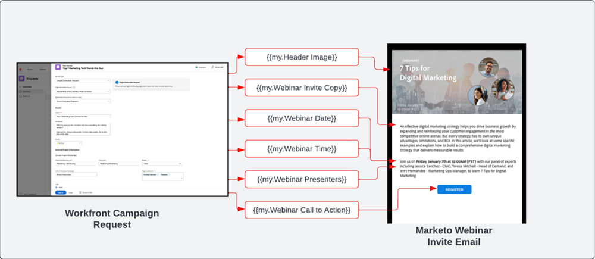

# 擷取並建立藍圖 {#intake-and-create}

進入行銷運營團隊發起新行銷活動的行銷請求數量，可以將一個高效運轉的團隊轉變為重複性任務的循環門，導致倦怠和創新停滯。

建立提交行銷活動請求的流程並自動建立經常請求的行銷活動，這樣您可以提高行銷活動的速率，減少錯誤，將請求路由至行銷作業的適當成員，平衡並改善資源利用率，以及將更多行銷作業集中於更具策略性的任務。

透過 Workfront 和 Marketo Engage，系統對系統連線允許您使用 [Workfront 申請表](https://experienceleague.adobe.com/docs/workfront/using/administration-and-setup/customize/custom-forms/custom-form-builder/use-the-custom-form-builder/create-or-edit-a-custom-form.html?lang=zh-Hant){target="_blank"} 的詳情建立 Marketo Engage 程式，然後填入關鍵變數，例如：主旨行、電子郵件副本、影像、日期、時間、事件資訊等。

要實現此整合，您將使用 Workfront Fusion ，這是一個工作自動化層，可讓您自動化 Workfront 與其他系統之間的工作流程。

以下工作流程顯示行銷活動管理員使用 Workfront 請求表單發出的網路研討會請求。然後請求中提交的詳細資訊會觸發在 Marketo Engage 中為網路研討會建立的方案和電子郵件。此外，請求表單會提供詳細資訊，以作為內容填入電子郵件。

{zoomable=&quot;yes&quot;}

>[!TIP]
>
>若要進一步了解 Workfront 中用於組織行銷活動工作的不同類型物件，以及其如何對應至 Marketo Engage 方案，請查看 [Marketo 和 Workfront 概述](/help/blueprints/b2b/marketo-engage-and-workfront-integration-blueprint/overview.md){target="_blank"}。

## 為自動化準備您的行銷活動開發流程 {#prepare-your-campaign-development-process-for-automation}

每一個偉大的工作流程自動化背後都是一個定義的流程，可確保團隊和利害關係人從自動化中獲得最大價值。

**您將收到哪些類型的行銷請求？**

請思考您將採用的行銷策略類型，例如電子郵件、培養、第一方網路研討會和活動。您是否也會執行第三方網路研討會或展示廣告？需要考慮其中的每一個請求，因為他們需要請求表單中的具體收入欄位，並且將對應到將複製的 Marketo Engage 中不同程式範本。

您也會想要了解您是否在多個地區執行行銷活動。如果是這種情況，您會想要說明 Workfront 中一個專案在Marketo Engage中建立多個方案，每個方案代表不同的語言支援。

請務必事先了解您預期會收到的行銷請求類型，以確保能以自動化方式協助您提出請求。

**促銷活動請求中應擷取哪些資訊？**

請思考您針對每種不同的策略，在請求表單中需要擷取的關鍵資訊片段。以下是您可以在 Workfront 表單中擷取的資訊範例，以協助您自動化行銷活動開發。

<table> 
  <tr> 
   <td><b>行銷策略</b></td>
   <td><b>要擷取的資訊</b></td>
  </tr>
  <tr> 
   <td>電子郵件爆炸</td>
   <td>·電子郵件主旨 
·排程日期 
·電子郵件副本 
·召喚行動 
·影像 — 可直接參考 AEM Assets URL，以便在 Marketo 中使用 
·對象資格標準</td>
  </tr>
  <tr>
   <td>網路研討會/事件</td>
   <td>·事件名稱 
·事件日期 
·事件時間 
·事件城市 
·事件說明 
·網路研討會錄制頁面 — PageURL OnDemand 
·講者姓名 
·講者職位 
·講者影像 
·需要的電子郵件（邀請、確認、提醒、跟進） 
·電子郵件標題影像 
·對象資格標準</td>
  </tr>
  <tr>
   <td>培養</td>
   <td>·電子郵件數量 
·電子郵件副本 
·電子郵件標題 
·召喚行動 
·對象資格標準</td>
  </tr>
  </tbody>
</table>

>[!NOTE]
>
>目前，由於智慧清單不支援代號，因此以程式方式透過自動化建立對象的方式在 Marketo Engage 受一定限制。這表示對象需要由使用者在 Marketo Engage 建立，或如果您有預先確定的對象需持續通訊，您可以在方案範本中包含已設定的智慧清單，此範本會在自動化程式期間複製。

### 建立您的卓越中心 {#establish-your-center-of-excellence}

如果您想要自動建立方案，那麼您需要 Marketo Engage 的卓越中心。卓越中心包括模板化方案和資產，以幫助加快和標準化行銷活動開發進程。例如，您可能有符合不同行銷活動需求的方案範本：電子郵件、培養、面對面活動和網路研討會。此外，您可能有多個電子郵件方案範本，可用於不同地區或不同類型的電子郵件公告。

在 Marketo Engage 中使用方案範本建立您的卓越中心，是讓行銷活動以更具程式化的方式執行的第一步，並將作為自動化行銷活動請求的基礎。

一旦您擁有一組可重複使用的方案範本，您就可以使用此藍圖中概述的自動化功能，進一步調整您的工作量，以提升行銷活動開發的速度。

若要進一步了解如何建立自己的卓越中心，請查看 [Marketo 社群](https://nation.marketo.com/t5/product-blogs/marketo-master-class-center-of-excellence-with-chelsea-kiko/ba-p/243221){target="_blank"}獲取最佳實務。

### 使用語彙基元來填入內容 {#use-tokens-to-populate-content}

透過 Marketo Engage，語彙基元可用來將內容填入您的行銷活動資產中。例如，從您的卓越中心複製電子郵件範本後，Workfront Fusion 可從 Workfront 中的行銷活動請求取得詳細資訊，並傳遞至 Marketo Engage 方案中的「我的語彙基元」。接著，語彙基元值可直接繼承至電子郵件中，以建置電子郵件。

{zoomable=&quot;yes&quot;}

### 從 AEM Assets 填入影像 {#populate-images-from-aem-assets}

您可以利用 Marketo Engage 語彙基元搭配 AEM Assets 中資產的連結，進一步自動化電子郵件和登陸頁面開發。行銷活動請求者可在請求過程中從 AEM Assets 提交已發佈的影像連結。Workfront Fusion 接著可取得這些連結，並使用 Marketo Engage 語彙基元將其內嵌至電子郵件的 HTML 中。

請記住，您需要在 Marketo Engage 中建立程式和程式模板，以利用我的語彙基元，以便 Fusion 可以使用 Workfront 中提交的資訊更新語彙基元值。

>[!NOTE]
>
>AEM Assets 不需要支援此工作流程，但可讓管理整個行銷活動開發供應鏈中行銷活動資產的流程更簡化。

### 為所有程式請求類型組合查詢庫 {#assemble-a-lookup-library-for-all-program-request-types}

根據 Workfront 請求自動建立新 Marketo Engage 方案時，請務必在 Workfront Fusion 自動化中加入一個步驟，從 Workfront 請求中取得資訊，並查閱應在 Marketo Engage 中複製的正確方案範本。

若要這麼做，您可以在 Workfront Fusion 中匯入資料集，其中包含您 Marketo Engage 卓越中心中所有不同方案範本的清單。

方案範本查閱程式庫中應包含的一些基本資訊：

<table> 
  <tr> 
   <td><b>欄</b></td>
   <td><b>說明</b></td>
  </tr>
  <tr> 
   <td>行銷活動類型</td>
   <td>這可能是電子郵件、網路研討會、培養、活動、第三方網路研討會、清單匯入等。促銷活動類型將作為請求內容的可讀說明。</td>
  </tr>
  <tr> 
   <td>Workfront 請求類型</td>
   <td>這是在 Workfront 表單中選取的請求類型，可能與行銷活動類型相同，例如電子郵件、網路研討會、培養或活動。這可用來將 Workfront 表單中選取的輸入對應至 Marketo 的方案範本。</td>
  </tr>
  <tr> 
   <td>Workfront 表單 ID</td>
   <td>用於驗證寫入請求的 Workfront 請求表單的唯一 ID 已對應到 Marketo Engage 方案模板。</td>
  </tr>
  <tr> 
   <td>Marketo 方案 ID</td>
   <td>這是 Marketo Engage 中對應至所提出請求的方案範本 ID。Workfront Fusion 中隨時都能提供這些資訊，Fusion 便能向 Marketo Engage 者提出請求，並確切知道要克隆的方案。</td>
  </tr>
  </tbody>
</table>

## 擷取與建立自動化流程 {#intake-and-create-automation-flow}

以下範例說明如何透過預先建置 [Workfront](https://experienceleague.adobe.com/docs/workfront/using/adobe-workfront-fusion/fusion-apps-and-modules/workfront-modules.html?lang=zh-Hant){target="_blank"} and [Marketo Engage](https://experienceleague.adobe.com/docs/workfront/using/adobe-workfront-fusion/fusion-apps-and-modules/marketo-modules.html?lang=zh-Hant){target="_blank"} 模組，在 Fusion 中組合工作流程邏輯，讓您更快實現自動化。

使用語彙基元來填入內容

## 資源 {#resources}

* [Adobe Marketo Engage 模組](https://experienceleague.adobe.com/docs/workfront/using/adobe-workfront-fusion/fusion-apps-and-modules/marketo-modules.html?lang=zh-Hant){target="_blank"}

* [Adobe Workfront 模組](https://experienceleague.adobe.com/docs/workfront/using/adobe-workfront-fusion/fusion-apps-and-modules/workfront-modules.html?lang=zh-Hant){target="_blank"}

* [Marketo 和 Workfront 概述](/help/blueprints/b2b/marketo-engage-and-workfront-integration-blueprint/overview.md){target="_blank"}
