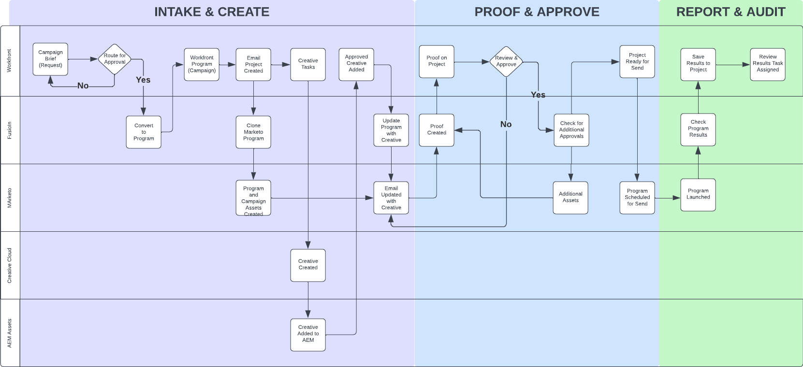
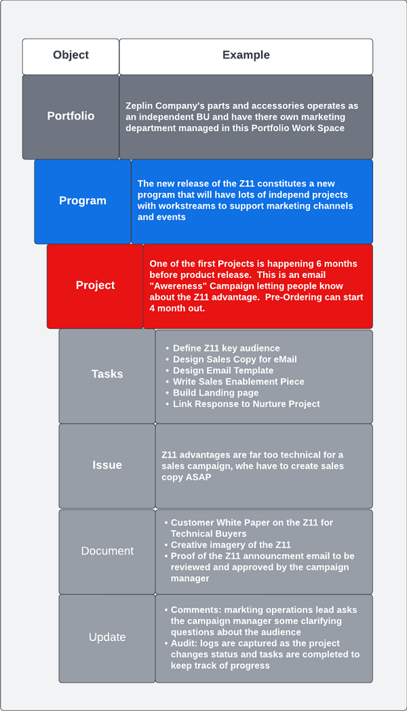

# Marketo Engage和Workfront整合Blueprint概觀 {#overview}

## 使用Marketo Engage和Workfront加快上市時間 {#achieve-faster-time-to-market-with-marketo-engage-and-workfront}

行銷工作持續增多，每天都有新的通道，以更多方式個人化通訊。行銷團隊需要方法來不斷地自動化和改進，以支援世界各地不斷變化的行銷需求。

**「投資回報率一直是真正的目標。收入是不錯的，但不會以任何代價來實現 — 尤其是在今天。」- CMO，商業服務行業**

在增加收入的同時實現更高 ROI 的組織正透過簡化其行銷活動開發流程、優化其行銷活動執行速度以及改進整個行銷職能的監督來實現這一目標。

如果貴組織想要達成下列所述的類似目標，本檔案將對您有所幫助：

* 調整行銷活動運營，以支援跨職能部門的行銷團隊
* 透過簡化行銷活動請求流程，加快上市時間
* 建立記錄系統，以提高行銷活動利害關係人的可見度
* 審核及核准行銷活動資產（影像、電子郵件副本）

行銷活動運營團隊需要能讓他們有效規劃及執行行銷活動的系統。無論是電子郵件、網路研討會、活動、付費媒體、培養或內容整合，行銷團隊都需要一個中央解決方案來組織行銷活動參與者、交付項目和執行。

將多通道行銷啟動系統 (Marketo Engage) 行銷規劃和記錄系統 (Workfront) 整合後，您就能提升行銷活動速度，並為相關人士提供更佳的可見度。

有了 Workfront Fusion，行銷營運團隊基本上可以消除將行銷簡報轉譯為行銷活動時容易出現錯誤的手動步驟。Workfront Fusion 提供 Workfront 與 Marketo Engage 之間的立即可用整合層，其為系統之間開發工作流程提供彈性和效率。您可以在[此處](https://experienceleague.adobe.com/docs/workfront/using/adobe-workfront-fusion/fusion-apps-and-modules/marketo-modules.html?lang=zh-Hant){target="_blank"}進一步了解如何設定整合，以及可以採取哪些動作來自動化工作流程。

## 行銷活動計畫到執行 — 自動化使用案例 {#campaign-planning-to-execution-automation-use-cases}

* 透過 Workfront 中的接受請求，自動在 Marketo Engage 中建立行銷活動，以支援行銷營運團隊
* 將以 Marketo Engage 建立的電子郵件和登陸頁面草稿分享至 Workfront，以取得跨職能部門的利害關係人的最終審核和核准
* 將行銷活動結果從 Marketo Engage 分享至 Workfront，將行銷活動量度的存取大眾化

在下方，若是電子郵件爆炸請求，您可以看到行銷活動開發程式的工作流程圖表。此外，您還可以了解 Workfront Fusion 如何在 Workfront 和 Marketo Engage 之間發揮作用，推動整個行銷活動開發週期的工作流程和流程自動化。

{zoomable=&quot;yes&quot;}

請注意促銷活動開發程式中的不同階段。

1. 擷取與建立：會提出行銷活動請求，並以程式設計方式組合行銷活動資產。

1. 證明並核准：行銷活動一經組建，利害相關者就可以審核並簽核行銷活動資產，例如電子郵件和登陸頁面。

1. 報告和審計：將行銷活動結果分享至 Workfront，讓跨職能部門的利害關係人更能看見。

>[!NOTE]
>
>在上例中，Workfront 在 Marketo Engage 計畫的整個生命週期中管理和規劃工作。據說 Workfront 的彈性可延伸至管理您行銷團隊的所有努力。這包括以公司客戶為基礎的行銷、行銷內容供應鏈、代理管理、數位和社交行銷活動管理，以及銷售支援計畫。

## 了解行銷活動在 Workfront 中的呈現方式 {#understanding-how-marketing-initiatives-are-represented-in-workfront}

Adobe Workfront 可讓組織管理工作，以促進更有效率的執行。Workfront 內有物件階層，為不同團隊的規劃、資源管理和協作提供框架。

了解如何將業務流程對應到這些物件，對於了解 Workfront 與 Marketo Engage 之間的關係非常重要。

{zoomable=&quot;yes&quot;}

### 定義的組合層次 {#portfolio-hierarchy-defined}

<table> 
  <tr> 
   <td><b>物件</b></td>
   <td><b>定義</b></td>
  </tr>
  <tr> 
   <td>組合</td>
   <td>您可以使用 Workfront 中的組合和方案來組織專案。透過組織專案，您可以比較類似的專案，並決定最佳的資源利用方式。  
   (例如，為專注於銷售服務和/或產品的公司內業務單位建立組合。)</td>
  </tr>
  <tr>
   <td>方案</td>
   <td>您可以使用 Workfront 方案來組織專案。透過組織專案，您可以比較類似的專案，並決定最佳的資源利用方式。  
   （例如，具有高階目標的行銷策略，例如提高知名度並推動新產品推出的需求。）</td>
  </tr>
  <tr>
   <td>專案</td>
   <td>Workfront 專案是需要完成以達成特定目標、交付項目、產品等的工作項目集合。  
   (例如，行銷策略，例如電子郵件爆炸、培養行銷活動、網路研討會或面對面活動。單一專案也可能更複雜，包含多種策略，例如電子郵件、展示廣告、登陸頁面和可下載的白皮書，這些都是為了促成相同的結果。)</td>
  </tr>
  <tr>
   <td>任務</td>
   <td>Workfront 任務是可能屬於專案或計畫的計畫工作項目。任務被分配給用戶或團隊以完成。  
   (例如，建立受眾區段或建立電子郵件草稿的任務可能與開發Marketo Engage 電子郵件方案的專案相關聯。)</td>
  </tr>
  <tr>
   <td>問題</td>
   <td>問題是 Workfront 中的計畫外工作項目。這些可能是專案期間發生的問題，也可能是透過請求佇列提交的請求。  
   （例如，由於電子郵件橫幅影像的維度錯誤，因此會提交問題。）</td>
  </tr>
  <tr>
   <td>文件</td>
   <td>文件可以是傳統文檔，如 Word 文檔或演示文稿。它們也可以是影像檔案。Workfront 可透過檔案和影像的評論和註解進行資產校對，以啟用團隊間的協作。  
   （例如，需要審核的電子郵件標題影像。）</td>
  </tr>
  <tr>
   <td>更新</td>
   <td>包括註解和審核日誌，以追蹤工作並促進 Workfront 中的協作。  
   （例如，新影像版本的審核日誌。）</td>
  </tr>
  </tbody>
</table>

## 市場行銷計畫工作管理示例 {#marketing-initiative-work-management-example}

讓我們看看 Workfront 產品組合階層在真實世界中的表現。

Zeplin 公司正在發佈一種更新版本的 Z11 小型實用拖拉機附件，該附件比之前的 Z10 型號更耐用，定制項目更多。因此，他們需要規劃、制定和執行其行銷策略，以推動需求，並推廣其企業拖拉機部門新發佈的版本。此行銷策略需要包括不同的行銷策略，以提高新客戶認知和現有 Z10 客戶認知。

以下階層顯示策略、技巧、任務和資產如何對應至此行銷活動的 Workfront。

{zoomable=&quot;yes&quot;}

## 將 Workfront 對應至 Marketo {#mapping-workfront-to-marketo}

有了 Workfront 作為行銷規劃和專案組織的上游系統，請務必了解 Marketo Engage 和 Workfront 之間如何共用資訊。

為了讓這些系統在開發新的行銷計畫時同步運作，請務必了解 Workfront 中不同記錄類型如何對應至 Marketo Engage 中的記錄類型。

### 將 Workfront 專案對應至 Marketo Engage 方案 {#mapping-workfront-projects-to-marketo-engage-programs}

使用 Workfront Fusion 做為整合層，您可以將 Workfront 中的專案對應至 Marketo Engage 中的方案。例如，在上述案例中，澤普林希望提高對新澤普林模式的認知。透過此功能，他們在 Workfront 中建立了新方案，內含多個以「專案」表示的行銷策略。一種策略是，向 Z10 機型的現有客戶發送一封行銷電子郵件，讓他們了解新的 Z11 機型。在 Workfront 中，會建立專案來呈現此電子郵件策略，並提供一組與其相關的工作，以建立對象、為電子郵件影像創作創意，以及將電子郵件組合成 Marketo Engage。Workfront 中的專案可對應至 Marketo Engage 中的電子郵件方案，以便在系統之間同步資訊。

以下範例說明方案如何包含多個專案，以及這些 Workfront 專案如何對應至 Marketo Engage 中的方案。

{zoomable=&quot;yes&quot;}

您可能想要啟動大型行銷計畫，該計畫需要將多個 Workfront 專案存放在 Workfront 方案中，或是只需要建立單一 Workfront 專案，即可一次性請求網路研討會或電子郵件。無論您有何需求，透過 Workfront、Workfront Fusion 和 Marketo Engage，您的團隊都能靈活地將您的行銷活動開發流程無縫整合，從規劃到執行。

### 將 Workfront 任務對應至 Marketo Engage 資產 {#mapping-workfront-tasks-to-marketo-engage-assets}

當您開始在 Workfront 中對應行銷活動開發流程時，您也可以思考要在 Marketo Engage 中執行哪些對應工作，以及如何在 Workfront 中擷取資訊，以在行銷活動開發供應鏈中提高一致性、效率和準確性。

Workfront 專案可經過範本化，以便在每次執行特定行銷策略時，都能清楚定義您的流程。例如，在電子郵件行銷活動上執行時，將會有一組需要為貴組織完成的標準工作。這些工作可能包括與利害關係人舉行開始會議、取得創意資產、核准創意內容、建立目標對象、建立電子郵件、電子郵件翻譯、核准電子郵件，以及與利害關係人分享電子郵件行銷活動結果。

其中有些工作可直接對應至要在 Marketo Engage 中完成的工作。例如，Workfront 中的建置電子郵件任務可自訂為包含欄位，這些欄位會將資訊傳遞至 Marketo Engage，以自動組裝電子郵件。其中可能包括電子郵件中的主旨行、復本和影像。

## 後續步驟 {#next-steps}

現在您已基本了解 Workfront 和 Marketo Engage 如何提高您的行銷活動開發供應鏈中的效率，請查看下列檔案和資源，了解如何使用 Workfront Fusion 來自動化 Marketo Engage 和 Workfront 之間的工作流程和流程。

### 開始使用 Workfront Fusion、Workfront 和 Marketo Engage 整合 {#getting-started-with-workfront-fusion}

* [擷取與建立](/help/blueprints/b2b/marketo-engage-and-workfront-integration-blueprint/intake-and-create.md){target="_blank"} — 透過 Marketo Engage 和 Workfront 實現行銷活動開發自動化

* 證明並核准（即將推出）

### 管理 Marketo Engage 行銷活動名稱及其相關聯的 URL {#managing-marketo-engage-campaign-names}

將行銷活動和URL的命名慣例標準化，是精確管理Marketo Engage方案的關鍵基礎，並有助於在整個行銷活動開發生命週期中推動程式更加一致。 若您想尋找相關工具，建議您查看一些免費開放原始碼工具（來自 [Adobe 成功服務](https://main--marketo-campaign-tools--dr-adobe.hlx.live/){target="_blank"}），可讓您建立一致的方法來建立和管理 Marketo Engage 促銷活動及其相關的 URL。

### 資源 {#resources}

* [Workfront Fusion for Marketo Engage](https://experienceleague.adobe.com/docs/workfront/using/adobe-workfront-fusion/fusion-apps-and-modules/marketo-modules.html?lang=zh-Hant){target="_blank"}

* [Workfront Fusion for Workfront](https://experienceleague.adobe.com/docs/workfront/using/adobe-workfront-fusion/fusion-apps-and-modules/workfront-modules.html?lang=zh-Hant){target="_blank"}
