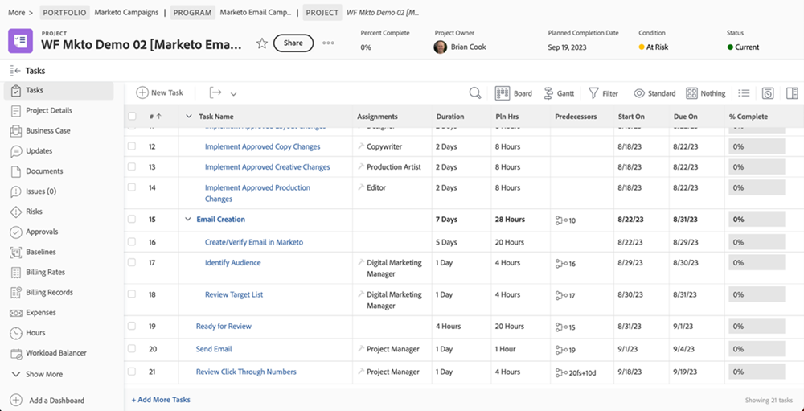

# 檢閱和核准Blueprint {#review-and-approve-blueprint}

確保行銷資產和行銷活動符合企業的期望和標準，不僅是為正確的受眾提供正確的內容和訊息。 在展開新的行銷計畫時，組織也應負責維護內部政策、產業法規，甚至法律上的先決條件。 行銷團隊可以在行銷活動開發程式中納入稽核和核准步驟，以確保內容和訊息準確無誤，並符合業界標準，尤其是金融、醫療和製藥等行業。

透過Workfront和Marketo Engage，行銷團隊有機會擁有緊密連結的行銷系統，其訊息傳送正確且符合規範。

## 使用Workfront解除鎖定Marketo Engage的校訂和進階核准 {#unlock-proofing-and-advanced-approvals}

在考慮建立行銷活動時，我們必須考慮多個系統支援所涉及的不同步驟，包括：規劃、建立、檢閱、意見回饋、核准和執行。 透過Workfront和Marketo Engage，團隊擁有一切必要工具，能協助他們完成端對端流程，以規劃及啟動新的行銷活動。 此外，團隊可以進一步簡化其稽核和核准流程，以提高行銷活動開發速度，同時確保準確性和合規性遵循最高標準。

### 檢閱和核准使用Marketo Engage和Workfront解鎖的使用案例 {#review-and-approve-use-cases-unlocked-with-marketo-engage-and-workfront}

* 利用Workfront的註解和Marketo Engage資產的註解功能，消除完全不同的意見回饋，並提升在集中地點的共同作業。

* 在Workfront核准工作流程的Marketo Engage中觸發核准，以集中處理您的核准。

* 運用Workfront對行銷資產的進階核准功能，支援並簡化行銷資產的複雜核准Marketo Engage工作流程。

* 以程式設計方式將Marketo資產提取至Workfront，供多個利害關係人檢閱，藉此開放存取行銷草稿。

* 在Workfront中集中處理Marketo Engage資產的所有檢閱和校訂工作，以追蹤變更並建立書面記錄。

## 規劃您的校訂和核准工作流程 {#planning-your-proof-and-approval-workflow}

在設定Marketo Engage和Workfront之間的校訂和核准整合之前，請考慮以下方面：

* 哪些資產需要檢閱和核准？
* 誰需要成為核准者？
* 行銷資產可以上線前，是否需要多個核准者？
* 行銷活動開發程式中的哪個時間點會組裝行銷資產，並準備好審查？

回答這些問題將幫助您獲得核准流程外觀的基準，以及開始考慮設定Workfront執行個體的方式。

## 在Marketo Engage和Workfront之間建立校訂和核准工作流程 {#building-a-proof-and-approval-workflow}

為了簡化Workfront和Marketo Engage之間的校訂和核准流程，您可以使用Workfront Fusion整合這兩個解決方案。 Workfront Fusion提供工作流程介面，用於在Workfront和Marketo Engage執行個體之間觸發動作和傳遞資訊。

若要這麼做，請將下列步驟視為整合式稽核及核准體驗程式的一部分。

1. 使用準備好檢閱任務設定您的Workfront專案。
1. 觸發您的Marketo Engage電子郵件，以隨著任務狀態變更同步至Workfront。
1. 將您的Marketo Engage電子郵件檔案轉換為Workfront中的可檢視校訂。
1. 使用Workfront校訂透過評論和註解進行共同作業。
1. 核准Workfront校訂以在Marketo Engage中觸發資產核准，然後將任務標示為完成。

### 使用準備好檢閱任務設定Workfront專案 {#configure-a-workfront-project-with-a-ready-for-review-task}

使用 [專案範本](https://experienceleague.adobe.com/docs/workfront/using/manage-work/projects/create-and-manage-project-templates/project-template-overview.html){target="_blank"} 以擷取與組織中專案相關的大部分可重複流程、資訊和設定。 您可以在範本中定義任務、佇列主題、建立自訂表格及附加檔案。

在Workfront的專案範本中，納入檢閱行銷活動所含資產的任務。 此外，您可以新增核准流程以處理單一核准，或更複雜的多層級核准。

如果您想要啟動新的電子郵件行銷活動，您應該有專案範本，其中包括審閱電子郵件的任務，以及確保電子郵件在可以寄出之前獲得正確利害關係人核准的核准流程。

{zoomable=&quot;yes&quot;}

### 觸發您的Marketo Engage電子郵件，以隨著任務狀態變更同步至Workfront {#trigger-your-marketo-engage-email-to-sync-to-workfront}

在您的稽核流程中，當電子郵件準備好供行銷團隊稽核時，您會想要將電子郵件同步至您的Workfront專案。 為此，我們建議使用「 」設定「準備檢閱」任務 [任務狀態](https://experienceleague.adobe.com/docs/workfront/using/manage-work/projects/update-work-on-a-project/update-task-status.html){target="_blank"} 這表示電子郵件準備好進行檢閱的時間。 在我們的範例中，我們將「檢閱Marketo電子郵件」狀態新增至任務，可在電子郵件草稿準備好供利害關係人檢閱時選取。

在Workfront專案中設定此狀態後，您就可以設定Workfront Fusion情境，監聽準備好檢閱任務以更新為「檢閱Marketo電子郵件」。 更新後，您的情境可以將Marketo Engage電子郵件擷取為HTML檔案、壓縮它，並將其副本儲存在Workfront專案檔案中以供檢閱。

{zoomable=&quot;yes&quot;}

### 將您的Marketo Engage電子郵件轉換為Workfront中的可檢視校樣 {#convert-your-marketo-engage-email-to-reviewable-proof-in-workfront}

當您的準備好檢閱任務移至「檢閱Marketo電子郵件」狀態並將Marketo Engage電子郵件儲存到Workfront中後，您可以設定您的Workfront Fusion情境，將電子郵件轉換為Workfront校訂。

### 使用Workfront校訂透過評論和註解進行共同作業 {#use-workfront-proofing-to-collaborate}

[Workfront校訂](https://experienceleague.adobe.com/docs/workfront/using/review-and-approve-work/proofing/proofing-overview/proofing-basics.html){target="_blank"} 功能可讓您的行銷團隊取得新資產（例如影像或電子郵件），並透過評論和註解進行共同作業。 一旦校訂準備好上線，決策者就可以從校訂工具核准資產。

{zoomable=&quot;yes&quot;}

### 核准Workfront校訂並在Marketo Engage中觸發資產核准，將任務標籤為完成 {#approve-workfront-proof-and-trigger-asset-approval-in-marketo-engage}

Workfront Fusion可以偵測電子郵件何時獲得利害關係人的核准，並傳送請求給Marketo Engage以核准Marketo中的電子郵件。

經過合適團隊成員的稽核/核准電子郵件後，電子郵件即可在Marketo Engage中上線！

## Fusion案例範本 {#fusion-scenario-templates}

為了協助您簡化在自己的Workfront和Marketo Engage執行個體中開發檢閱和核准工作流程，我們已建置Fusion範本可幫助您開始整合。 您可以在Fusion的「公用範本」區段中搜尋「Marketo」，並將其下載至您的執行個體，以使用這些範本。

### 在Workfront中檢閱您Marketo Engage電子郵件草稿的電子郵件校訂 {#review-an-email-proof-of-your-marketo-engage-email-draft-in-workfront}

以下融合案例將帶您完成審閱和核准流程的上半期，在此過程中，可以從Marketo Engage中提取電子郵件草稿並儲存到Workfront作為校訂。 一旦將校訂儲存為Workfront專案檔案的校訂，就可以由行銷利害關係人稽核、加上註解作為稽核流程的一部分。

{zoomable=&quot;yes&quot;}

### 在Workfront中核准觸發核准Marketo Engage中資產的電子郵件 {#approve-an-email-in-workfront-that-triggers-approval}

以下融合案例可用於偵測Workfront中的校訂何時已核准，並將該核准路由到Marketo Engage以更新電子郵件草稿，使其上線並準備在Marketo Engage計畫中使用。

{zoomable=&quot;yes&quot;}

這兩種情況加在一起，可用來建立雙向路徑，將行銷資產從Marketo Engage提取到Workfront強大的稽核和核准工作流程，並將核准從Workfront推送回Marketo Engage。
