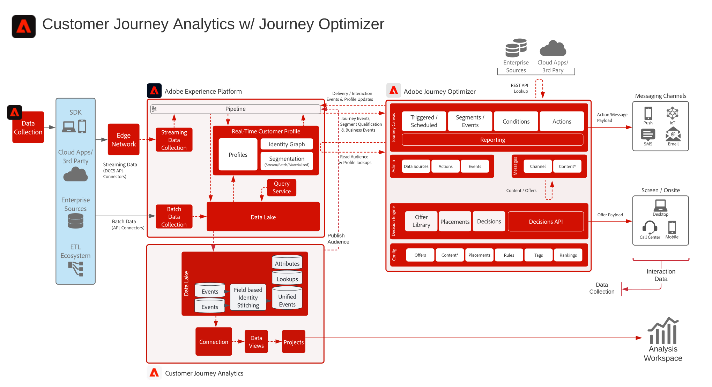

# Customer Journey Analytics 搭配 Journey Optimizer 藍圖

來自 Journey Optimizer 的資料會共用至 Experience Platform 的資料湖，並可在 Customer Journey Analytics 內擷取、分析和製作報表。 您可以在 Customer Journey Analytics 中分析及報告歷程傳送、互動和成效。

此外，在 Customer Journey Analytics 中撰寫的對象可發佈至 Experience Platform Real-time Customer Profile，並可用於 Journey Optimizer 中執行歷程。

## 實作指南

請參閱下列檔案，以取得在 Customer Journey Analytics 中實作和設定 Journey Optimizer 資料的指南。 [文件](https://experienceleague.adobe.com/docs/journey-optimizer/using/reporting/reports/sharing-overview.html?lang=zh-Hant)

## Customer Journey Analytics 搭配 Journey Optimizer 的架構

{zoomable="yes"}
