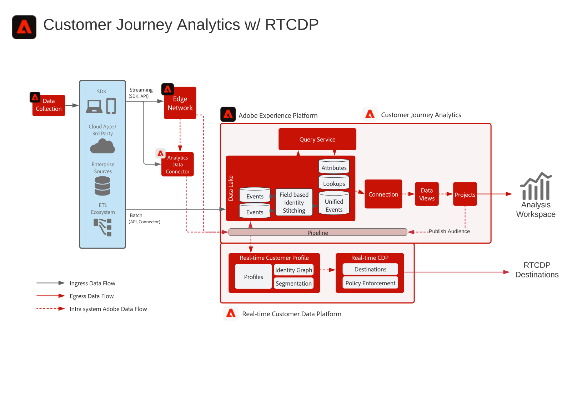

# Customer Journey AnalyticsReal-time Customer Data Platform Blueprint

建立Customer Journey Analytics(CJA)中識別的對象，並將其發佈至Adobe Experience Platform中的「即時客戶設定檔」，以便鎖定客戶並個人化。 非常適合使用歷史資料建立對象，或透過精細篩選和運算欄位建立更完善的對象(Customer Journey Analytics)。

## Customer Journey Analytics對象發佈指南

請參閱下列檔案，以取得從Customer Journey Analytics發佈至Real-time Customer Data Platform之對象的實作與設定指引。 [文件](https://experienceleague.adobe.com/docs/analytics-platform/using/cja-components/audiences/publish.html)

## Customer Journey Analytics藍圖體系結構

## Customer Journey Analytics藍圖的護欄圖

* 有關詳細的護欄和端到端延遲，請參閱 [部署護欄文檔](../experience-platform/deployment/guardrails.md)

## 常見問題

* 如果CJA傳送的RTCDP中不存在對應的設定檔，會建立新的設定檔，還是只有已存在設定檔的對象會從CJA記錄？ 是，將會建立新的設定檔。 因此，如果您的RTCDP實作僅針對已知客戶，則應編寫CJA對象規則，以僅篩選具有已知身分的設定檔。 如果不需要，這將確保RTCDP設定檔計數不會從匿名設定檔中增加。

* CJA會以管道事件或也會前往資料湖的一般檔案形式傳送對象資料嗎？ CJA受眾會透過管道串流至RTCDP設定檔服務，但資料也會以資料集的形式儲存在Data Lake中。

* CJA會傳送哪些身分識別？ CJA會在CJA設定期間傳送任何已設為「人員ID」的身分識別。

* 主要身分設定為什麼？ 將CJA設為主要「人員」ID時，使用者所選取的任何身分。

* Identity Service是否也會處理CJA訊息？ 亦即CJA可以透過受眾共用，將身分新增至設定檔身分圖表嗎？ 否，身分識別服務不會處理CJA訊息。

## 相關部落格貼文

* [[!DNL Blueprint for Multi-Channel Orchestration in Adobe Experience Platform]](https://medium.com/adobetech/blueprint-for-multi-channel-orchestration-in-adobe-experience-platform-c68317e94184)
* [[!DNL Leveraging External Data Platforms in Adobe Experience Platform Journey Orchestration]](https://medium.com/adobetech/leveraging-external-data-platforms-in-adobe-experience-platform-journey-orchestration-54fc6134fe17)
* [[!DNL Event-Based Triggering on Adobe Experience Platform Orchestration Service using Apache Airflow]](https://medium.com/adobetech/event-based-triggering-on-adobe-experience-platform-orchestration-service-using-apache-airflow-8607b28251f1)
* [[!DNL Adobe Campaign Classic Integration with Journey Orchestration]](https://medium.com/adobetech/adobe-campaign-classic-integration-with-journey-orchestration-ae577653281)
* [[!DNL Demonstrating the Power of Adobe's New Journey Orchestration Service to Build Personalized Omnichannel Experiences in Real-Time]](https://medium.com/adobetech/demonstrating-the-power-of-adobes-new-journey-orchestration-service-to-build-personalized-aa60d88cd34)
* [[!DNL Journey Orchestration in an Omnichannel World]](https://medium.com/adobetech/journey-orchestration-in-an-omnichannel-world-3a2d32d556d9)
