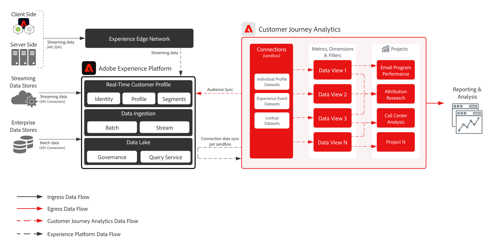

# Customer Journey Analytics 搭配 Real-time Customer Data Platform 藍圖

在 Customer Journey Analytics(CJA) 中建立識別的對象，並將其發佈至 Adobe Experience Platform 中的 Real-time Customer Profile，以便鎖定客戶並個人化。 非常適合使用歷史資料建立對象，或透過精細篩選和運算欄位建立更完善的對象(Customer Journey Analytics)。

## Customer Journey Analytics 對象發佈指南

請參閱下列檔案，以取得從 Customer Journey Analytics 向 Real-time Customer Data Platform 發佈對象的實作與設定指南。 [文件](https://experienceleague.adobe.com/docs/analytics-platform/using/cja-components/audiences/publish.html?lang=zh-Hant)

## Customer Journey Analytics 藍圖架構

{zoomable="yes"}

## Customer Journey Analytics 藍圖的護欄圖

* 有關詳細的護欄和端到端延遲，請參閱[部署護欄文件](../experience-platform/guardrails.md)