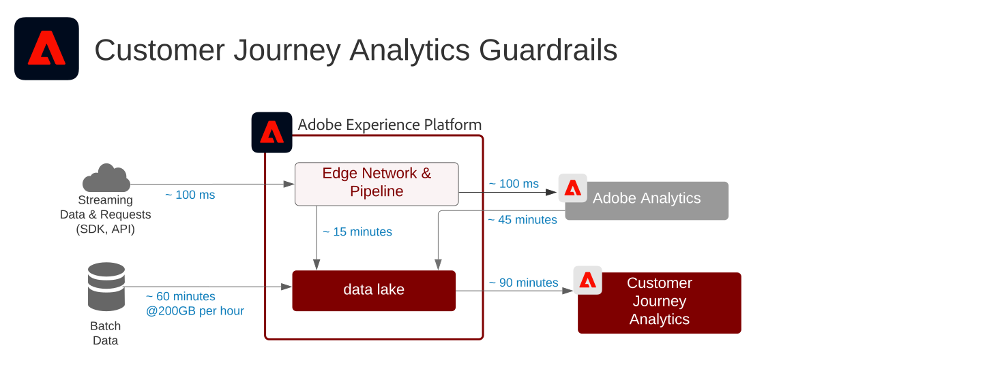

# Customer Journey Analytics

Customer Journey Analytics 顯示品牌如何統一各個互動通道及來源的客戶資料與行為，以為所有客戶互動建立基於歷程的視圖。可在 Customer Journey Analytics 應用程式服務中執行報告與分析，以評估和洞察客戶互動及行為模式。

常見分析包括：

* 頂端 / 底部轉換路徑
* 最熱門的內容
* 類別與產品
* 哪些行銷活動促成了轉換及參與度的提升
* 工具使用分析以最佳化自助服務體驗

| Blueprint | 說明 | Experience Cloud 應用程式 |
|---|---|---|
| **[跨通道歷程分析](digital-behavioral-data-consolidation.md)** | <ul><li>統一來自不同網路、行動裝置及線上內容的資料，為各個通道建立單一整合的客戶行為視圖。</li></ul> | <ul><li>Adobe Experience Platform</li><li>Customer Journey Analytics</li><li>Adobe Analytics (可選)</li></ul> |
| **[呼叫改向歷程分析](call-deflect.md)** | <ul><li>整合呼叫中心資料與網路、行動裝置及其他互動資料，確定哪些行為對產生代理協助的呼叫最有意義。</li><li>接著可將這些深入見解用於最佳化客戶體驗，透過最佳化的自助服務內容與工具縮短代理協助的互動路徑。  </li></ul> | <ul><li>Adobe Experience Platform</li><li>Customer Journey Analytics</li> |

## Customer Journey Analytics藍圖的護欄

### 護欄圖

## 相關部落格貼文

* [[!DNL Blueprint for Multi-Channel Orchestration in Adobe Experience Platform]](https://medium.com/adobetech/blueprint-for-multi-channel-orchestration-in-adobe-experience-platform-c68317e94184)
* [[!DNL Leveraging External Data Platforms in Adobe Experience Platform Journey Orchestration]](https://medium.com/adobetech/leveraging-external-data-platforms-in-adobe-experience-platform-journey-orchestration-54fc6134fe17)
* [[!DNL Event-Based Triggering on Adobe Experience Platform Orchestration Service using Apache Airflow]](https://medium.com/adobetech/event-based-triggering-on-adobe-experience-platform-orchestration-service-using-apache-airflow-8607b28251f1)
* [[!DNL Adobe Campaign Classic Integration with Journey Orchestration]](https://medium.com/adobetech/adobe-campaign-classic-integration-with-journey-orchestration-ae577653281)
* [[!DNL Demonstrating the Power of Adobe’s New Journey Orchestration Service to Build Personalized Omnichannel Experiences in Real-Time]](https://medium.com/adobetech/demonstrating-the-power-of-adobes-new-journey-orchestration-service-to-build-personalized-aa60d88cd34)
* [[!DNL Journey Orchestration in an Omnichannel World]](https://medium.com/adobetech/journey-orchestration-in-an-omnichannel-world-3a2d32d556d9)
