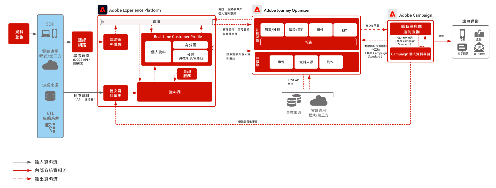

# Journey Optimizer與Adobe Campaign

演示Adobe Journey Optimizer如何與Adobe Campaign一起通過利用市場活動中的即時消息伺服器來本機發送消息。

 

## 架構

>[!IMPORTANT]
>使用Journey Optimizer和「活動」來相互獨立地發送消息是可能的，但有一些技術考慮因素需要考慮。 如果您希望採用此路線，請與售前企業架構師合作，以確保您瞭解支援實施所需的內容。

 

## 先決條件

### Adobe Experience Platform

* 必須先在系統中配置架構和資料集，然後才能配置Journey Optimizer資料源
* 對於基於經驗事件類的架構，當希望觸發的事件不是基於規則的事件時，添加「業務流程事件ID」欄位組
* 對於基於單個配置檔案類的架構，添加「配置檔案test詳細資訊」欄位組，以便能夠載入test配置檔案以與Journey Optimizer一起使用
* Journey Optimizer和營銷活動在同一IMS組織中提供

### 市場活動v7/v8或Campaign Standard

* 即時消息服務（即消息中心）的執行實例必須由Adobe托管Cloud Services托管
* 所有消息創作都在市場活動實例本身內完成

 

## 護欄

[Journey Optimizer護欄產品連結](https://experienceleague.adobe.com/docs/journeys/using/starting-with-journeys/limitations.html?lang=en)

### 其他Journey Optimizer護欄

* 現在可通過API提供封頂功能，以確保目標系統未飽和到故障點。 這意味著超過上限的消息將被完全刪除，並且永遠不會發送。 不支援限制。
   * 最大連接數 — 目標可處理的http/s連接的最大數
   * 最大呼叫計數 — 在periodInMs參數中要進行的最大呼叫數
   * periodInMs — 時間（毫秒）
* 由區段會籍發起的歷程可以兩種模式操作：
   * 批處理段（每24小時刷新一次）
   * 流段（&lt;5分鐘限定）
* 批次區段 — 需要確保您瞭解符合資格使用者的每日流量，並確保目標系統可以處理每個歷程以及所有歷程的高載輸送量
* 串流區段 — 需要確保個人資料資格的初始高載可隨每個歷程及所有歷程中符合資格的每日串流流量一起處理
* offer decisioning不受支援
* 不支援業務事件
* 與第三方系統的出站整合
   * 不支援單個靜態IP，因為我們的基礎架構是多租戶（必須允許列出所有資料中心IP）
   * 自定義操作僅支援POST和PUT方法
   * 身份驗證支援：標籤 |密碼 | OAuth2
* 無法將Adobe Experience Platform或Journey Optimizer的各個部件包裝和在各種沙箱之間移動。 必須在新環境中重新實施

 

### 市場活動(v7/v8)

* 消息中心的執行實例必須由Adobe托管Cloud Services承載
* 需要在v7版本>21.1或v8上
* 消息傳送吞吐量
   * 交流(v7)每小時50k
   * AC(v8)每小時最多1M（基於軟體包）
* AC(v7)僅支援活動啟動行程
   * 沒有段或段成員資格啟動「旅程」
   * 不支援閱讀受眾和基於業務事件的行程，因為它可以發送到執行實例的卷
* AC(v7)或AC(v8)都不支援消息Offer decisioning
* 未對市場活動進行的出站API調用進行限制
* 事務性消息日誌未本機同步到AEP。 需要咨詢工作。 最多每4小時導出日誌的建議

 

### Campaign Standard

* 吞吐量支援14 tp（每小時50k）
* 僅支援事件啟動的行程
   * 沒有段或段成員資格啟動「旅程」
   * 不支援閱讀受眾和基於業務事件的行程，因為它可以發送到執行實例的卷
* 從發送到Campaign Standard的事務性消息中開啟並按一下活動，在Journey Optimizer旅程畫布中以「重新操作事件」的形式本機顯示
* 事務性消息傳遞日誌不會本機同步回Experience Platform。 需要咨詢工作。 最多每4小時導出日誌的建議

 

## 實施步驟

### Adobe Experience Platform

#### 方案 / 資料集

1. 在 Experience Platform 中基於客戶提供的資料[設定個別個人資料、體驗事件及多實體方案。](https://experienceleague.adobe.com/?recommended=ExperiencePlatform-D-1-2021.1.xdm)
1. 為Adobe CampaignbroadLog、trackingLog和不可交付地址表建立基於經驗事件類的架構（可選）。
1. 在 Experience Platform 中為要擷取的資料[建立資料集](https://experienceleague.adobe.com/docs/platform-learn/tutorials/data-ingestion/create-datasets-and-ingest-data.html?lang=zh-Hant)。
1. [在 Experience Platform 中新增使用標籤](https://experienceleague.adobe.com/docs/platform-learn/tutorials/data-governance/classify-data-using-governance-labels.html?lang=zh-Hant)至資料集以便於治理。
1. [建立政策](https://experienceleague.adobe.com/docs/platform-learn/tutorials/data-governance/create-data-usage-policies.html?lang=zh-Hant)以在目標上執行治理。

#### 個人資料 / 身份

1. [建立任何客戶特定的命名空間。](https://experienceleague.adobe.com/docs/platform-learn/tutorials/identities/label-ingest-and-verify-identity-data.html?lang=zh-Hant)
1. [新增身份至方案](https://experienceleague.adobe.com/docs/platform-learn/tutorials/identities/label-ingest-and-verify-identity-data.html)。
1. [為個人資料啟用方案和資料集](https://experienceleague.adobe.com/docs/platform-learn/tutorials/profiles/bring-data-into-the-real-time-customer-profile.html?lang=zh-Hant)。
1. 為[!UICONTROL 即時客戶個人資料]的不同檢視[設定合併政策](https://experienceleague.adobe.com/docs/platform-learn/tutorials/profiles/create-merge-policies.html?lang=zh-Hant) (可選)。
1. 為行程使用建立段。

#### 來源 / 目標

1. 使用串流 API 和來源連接器[將資料擷取到 Experience Platform。](https://experienceleague.adobe.com/?recommended=ExperiencePlatform-D-1-2020.1.dataingestion&amp;lang=zh-Hant)

### Journey Optimizer

1. 配置Experience Platform資料源並確定哪些欄位應作為配置檔案的一部分快取用於啟動客戶行程的流資料必須首先在Journey Optimizer內配置以獲取業務流程ID。 此業務流程ID隨後將提供給開發人員以用於接收
1. 配置外部資料源
1. 配置市場活動實例的自定義操作

### 市場活動v7/v8或Campaign Standard

* 消息模板需要配置適當的個性化上下文
* 導出工作流需要配置為將事務性消息傳遞日誌導出回Experience Platform。 建議最多每4小時運行一次

### 移動推送配置（可選）

1. 實施Experience PlatformMobile SDK以收集推送令牌和登錄資訊，以將其與已知客戶配置檔案綁定
1. 利用Adobe標籤並建立具有以下副檔名的移動屬性：
   * Adobe Journey Optimizer |Adobe Campaign Classic |Adobe Campaign Standard
   * Adobe Experience Platform Edge Network
   * 身分 邊緣網路
   * 行動裝置核心
1. 確保您有專用資料流用於移動應用部署與Web部署
1. 有關詳細資訊，請遵循 [Adobe Journey Optimizer移動指南](https://aep-sdks.gitbook.io/docs/using-mobile-extensions/adobe-journey-optimizer)

   >[!IMPORTANT]
   >如果希望通過Journey Optimizer發送即時通信以及通過活動發送批量推送通知，則可能需要在Journey Optimizer和活動中收集移動令牌。 市場活動v8要求只使用市場活動SDK來捕獲推送令牌。

 

## 相關文件

* [Experience Platform文檔](https://experienceleague.adobe.com/docs/experience-platform.html?lang=zh-Hant)
* [Experience Platform標籤文檔](https://experienceleague.adobe.com/docs/experience-platform/tags/home.html?lang=en)
* [Experience Platform Mobile SDK 文件](https://experienceleague.adobe.com/docs/mobile.html?lang=zh-Hant)
* [Journey Optimizer 文件](https://experienceleague.adobe.com/docs/journey-optimizer/using/ajo-home.html?lang=en)
* [Journey Optimizer產品說明](https://helpx.adobe.com/legal/product-descriptions/adobe-journey-optimizer.html)
* [市場活動v8文檔](https://experienceleague.adobe.com/docs/campaign-v8.html?lang=en)
* [市場活動v7文檔](https://experienceleague.adobe.com/docs/campaign-classic.html?lang=zh-Hant)
* [Campaign Standard 文件](https://experienceleague.adobe.com/docs/campaign-standard.html?lang=zh-Hant)