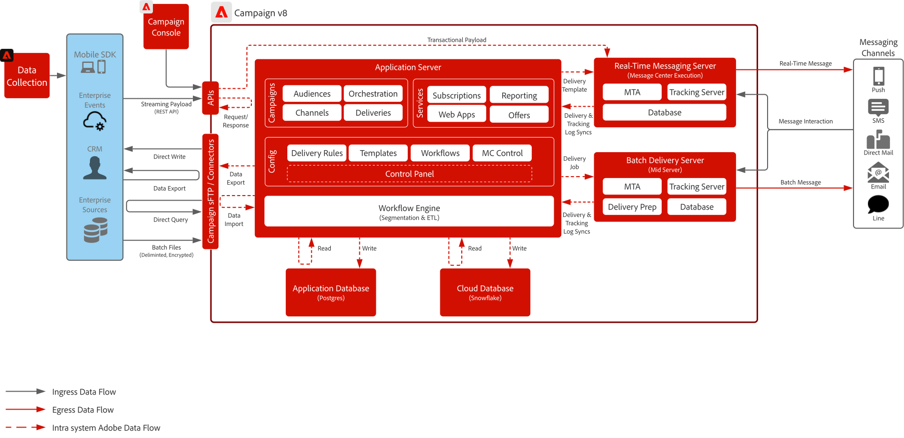

# Campaign v8藍圖

Adobe Campaign v8是新一代的行銷活動管理平台，專為電子郵件和直接郵件等傳統行銷管道而設計。 它提供強大的ETL和資料管理功能，以支援複雜的細分和受眾目標定位，加上強大的協調引擎，可用來建立多重觸控、批次導向的行銷方案。

它還包含可擴充的即時傳訊伺服器，可透過接受外部系統的完整裝載立即傳送來啟用異動通訊，例如密碼重設、訂單確認和電子收據。

## 使用案例

>[!BEGINTABS]

>[!TAB 批次行銷活動執行]

- 透過電子郵件、簡訊和直接郵件，設計及提供大規模、排程的行銷活動。
- 適合使用具有複雜細分與目標定位的促銷重大事件、電子報和季節性優惠方案。

>[!TAB 多重觸控協調流程]

- 建立多步驟、多管道方案，引導客戶完成預先定義的行銷歷程。
- 支援對象重新進入、條件式邏輯和時間型轉變。

>[!TAB 資料管理與ETL]

- 擷取、轉換及管理來自各種來源的客戶資料，以支援精確鎖定目標。
- 可建立自訂結構描述、計算欄位和對象定義。

>[!TAB 異動訊息]

- 傳送由外部系統觸發的即時預先定義訊息（例如，密碼重設、訂單確認、電子收據）。
- 使用可擴充的傳訊伺服器，接受IT系統的完整負載，以立即傳送。

>[!ENDTABS]

 

## 架構圖

深入瞭解[Campaign v8部署模型](https://experienceleague.adobe.com/docs/campaign/campaign-v8/config/architecture/architecture.html#ac-deployment){target="_blank"}。

### Campaign企業(FFDA)部署

 

### Campaign v8 FDA部署

 

## 整合模式

| 狀況 | 說明 | 技術考量 |
| :-- | :--- | :--- |
| 使用Adobe[[!DNL Real-time Customer Data Platform] 的 [!DNL Campaign]](rtcdp-and-campaign-v8.md) | 展示Adobe Experience Platform及其即時客戶設定檔和集中式細分工具如何與Adobe [!DNL Campaign]搭配使用，以提供個人化的對話 | <ul><li>透過使用雲端儲存空間檔案交換和Adobe [!DNL Real-Time CDP]擷取工作流程，從[!DNL Campaign]到Adobe [!DNL Campaign]共用設定檔和對象 </li><li>從Adobe [!DNL Real-Time CDP]輕鬆將客戶對話中的傳遞和互動資料分享回[!DNL Campaign]，以強化即時客戶設定檔並提供訊息行銷活動的跨管道報告</li></ul> |
| 使用Adobe[[!DNL Journey Optimizer] 的 [!DNL Campaign]](ajo-and-campaign-v8.md) | 顯示如何使用Adobe Journey Optimizer來利用即時客戶設定檔編排1:1個體驗，並運用原生Adobe [!DNL Campaign]異動訊息系統來傳送訊息 | <ul><li>可透過即時消息伺服器每小時發送最多 1M 訊息<li>不會從[!DNL Journey Optimizer]執行任何節流，因此請確定售前企業架構師的技術審查</li><li>Campaign v8 承載不支援決策管理</li></ul> |

 

## 先決條件

此Blueprint有下列必要條件。

### 應用程式伺服器和即時傳訊伺服器

- 需要Adobe [!DNL Campaign]使用者端主控台才能互動和使用[!DNL Campaign] v8軟體。 它是基於 Windows 的客戶端，使用標準 Internet 協定（SOAP、HTTP 等）。請確定您的組織已啟用必要權限，以分發、安裝及執行軟體

- IP位址允許清單：
   - 識別所有使用者在存取使用者端主控台期間使用的IP範圍。
   - 識別允許哪些企業系統與Real-Time Messaging Server通訊，並確定它們具有您可以允許清單的靜態指派IP或範圍。
   - 這可透過「行銷活動控制面板」來設定及控制。
- sFTP金鑰管理：
   - 具有可與 Campaign 提供的 sFTP 搭配使用的 SSH 公開金鑰。這可透過「行銷活動控制面板」來設定及控制。

### 電子郵件

- 讓子網域準備好用來傳送訊息。
- 子網域可以完全委派給Adobe （建議），或可以使用CNAME指向Adobe特定的DNS伺服器（自訂）。
- 每個子網域都需要Google TXT記錄以確保良好的傳遞能力。

### 行動裝置推送

- 讓行動開發人員部署、設定和建置行動應用程式。
- Adobe 僅提供 SDK 來收集來自 FCM (Android) 和 APNS (iOS) 以將訊息承載傳送至其伺服器的必要資訊。客戶應負責行動應用程式的程式碼、部署、管理和除錯。

### 網頁應用程式（可選）

- 可以委派Campaign託管取消訂閱和登陸頁面的其他子網域。
- 強烈建議使用SSL憑證。

 

## 護欄

### 應用程式伺服器大小調整

- 儲存空間可擴充至2億個設定檔，並有可能擴充至1B個設定檔。
- 透過Adobe [!DNL Admin Console]設定及控制使用者存取。
- 資料載入至[!DNL Campaign]應透過批次檔案完成：
   - API 資料載入支援主要用於管理資料庫內的個人資料或簡單物件（即建立和更新）。它不用於載入大量資料或批處理作業。
   - 不支援使用 API 來讀取用於自訂應用程式的資料
   - 透過 API 載入的資料會儲存在應用程式資料庫中，然後每小時複製到雲端資料庫
- API呼叫數上限。 進一步瞭解[Adobe Campaign產品說明](https://helpx.adobe.com/tw/legal/product-descriptions/adobe-campaign-managed-cloud-services.html){target="_blank"}。

### 批次傳訊伺服器大小調整

- 可擴展以處理每小時多達 2000 萬條訊息

### 即時傳訊伺服器大小調整

- 每小時最多可發送 100 萬條消息
- 預設會布建兩個即時傳訊伺服器。能夠擴展至最多八個即時傳訊伺服器。

### SMS 設定

- Campaign 提供與簡訊提供者整合的功能。提供者由客戶採購，並與Campaign整合，用於傳送SMS訊息。
- 透過SMPP通訊協定提供支援。
- 簡訊有三(3)種，Adobe 皆可支援：
   - SMS MT （已終止行動裝置）： Adobe [!DNL Campaign]透過SMPP提供者向行動電話發出的SMS。
   - SMS MO （行動原始）：行動透過SMPP提供者傳送給Adobe [!DNL Campaign]的SMS。
   - SMS SR （狀態報告）或DR或DLR （傳遞回條）：行動裝置透過SMPP提供者傳送給Adobe [!DNL Campaign]的回條，指出已成功接收SMS。 Adobe [!DNL Campaign]也可能收到指出訊息無法傳遞的SR，通常包含錯誤說明。

 

## 實施步驟

請參閱快速入門手冊， [實作 Adobe Campaign v8](https://experienceleague.adobe.com/docs/campaign/campaign-v8/implement/implement.html)

## 相關文件

- [Campaign v8 文件](https://experienceleague.adobe.com/docs/campaign-v8.html)
- [Campaign v8 產品說明](https://helpx.adobe.com/tw/legal/product-descriptions/adobe-campaign-managed-cloud-services.html)
- [Experience Platform Tags 文件](https://experienceleague.adobe.com/docs/launch.html)
- [Experience Platform Mobile SDK 文件](https://experienceleague.adobe.com/docs/mobile.html)