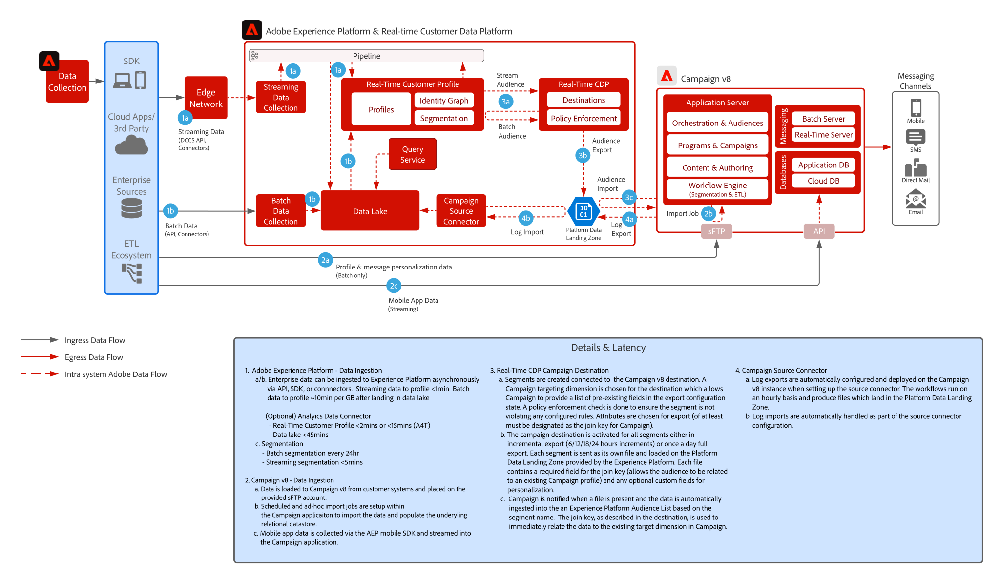

# 具有Adobe [!DNL Real-Time CDP] v8整合模式的[!DNL Campaign]

展示Adobe [!DNL Experience Platform]及其即時客戶設定檔和集中式細分工具如何與Adobe Campaign搭配使用，以提供個人化的對話。

## 應用程式

* Adobe [!DNL Experience Platform Real-Time CDP]
* Adobe [!DNL Campaign] v8

## 架構

 

## 先決條件

* 必須使用有效的 IMS Org，才能為 Experience Cloud 佈建客戶
* 建議將Adobe Experience Platform和[!DNL Campaign]布建在同一個用於單一登入URL的IMS組織中
* 客戶必須布建[!DNL Campaign]的V8執行個體
* 客戶必須符合資格且擁有 RTCDP、Sources、Destinations 的存取權。
* Adobe [!DNL Campaign]產品內容必須存在

 

## 實施步驟

請參閱下列文件，了解如何將 Campaign v8 來源連接器設定為 Adobe Experience Platform，以及將 Real-time Customer Data Platform 目標連接器設定為 Campaign v8。
[Campaign 與 AEP 連接器](https://experienceleague.adobe.com/docs/campaign/campaign-v8/connect/ac-aep.html?lang=zh-Hant)

## 護欄

### Adobe Campaign

* 請參閱 Campaign 來源連接器文件 — [Campaign 來源連接器](https://experienceleague.adobe.com/docs/experience-platform/sources/ui-tutorials/create/adobe-applications/campaign.html?lang=zh-Hant)
* 僅支援 Adobe Campaign 單一組織單位部署

### Experience Platform Real-time Customer Data Platform 區段共用

* 請參閱 RTCDP Campaign Destination 連接器 — [RTCDP Campaign 連線](https://experienceleague.adobe.com/docs/experience-platform/destinations/catalog/email-marketing/adobe-campaign-managed-services.html?lang=zh-Hant)

* 請參閱 AEP 的設定檔和資料擷取護欄 — [連結](https://experienceleague.adobe.com/docs/experience-platform/profile/guardrails.html?lang=zh-Hant)
