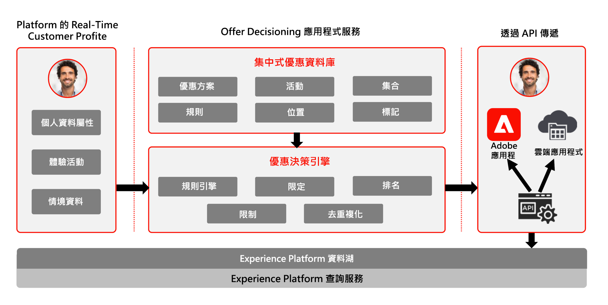

# Journey Optimizer — 決策管理藍圖

若要深入了解決策管理，請參閱[產品文件](https://experienceleague.adobe.com/docs/journey-optimizer/using/offer-decisioning/get-started-decision/starting-offer-decisioning.html?lang=zh-Hant)

Adobe Decision Management 是 Adobe Journey Optimizer 中提供的服務。此藍圖概述了應用程式的使用案例和技術功能，並深入介紹構成「決策管理」的各種體系結構元件和注意事項。

Journey Optimizer 可用來在適當的時間，跨所有接觸點為客戶提供最佳方案和體驗。「決策管理」透過集中的行銷選件資料庫和決策引擎，將規則和限制套用至 Adobe Experience Platform 建立的豐富、即時個人檔案中，協助您在正確的時間為客戶傳送正確的優惠方案，讓個人化更加輕鬆。

「決策管理」功能包含兩個主要元件：

* 集中式優惠方案庫，是您建立和管理組成優惠方案的不同元素，以及定義其規則和限制的介面。
* 優惠方案決策引擎，會運用 Adobe Experience Platform 資料和即時客戶個人資料，以及優惠方案庫，以選擇將要提供優惠方案的恰當時間、客戶和通道。

「決策管理」可以透過兩種方式之一部署在邊緣或中心上。每種方法都有一組特定的介面和協定，用於運行服務，如下面參考的各自藍圖中所述。其他詳細資訊也可包含在[「決策管理」文件](https://experienceleague.adobe.com/docs/journey-optimizer/using/offer-decisioning/api-reference/offer-delivery-api/start-offer-delivery-apis.html?lang=zh-Hant)中。

## 中心的決策管理

第一個是透過 Adobe Experience Platform 中心，這是中央資料中心基礎架構。在「中心」方法中，會執行並個人化優惠方案，並在超過 500 毫秒的延遲內傳送。因此，中心基礎架構最適合不需要次秒延遲的客戶體驗，例如，為資訊站或代理輔助體驗（例如在呼叫中心或個人互動中）提供的優惠方案決策。插入電子郵件、簡訊或推播通知以及其他傳出行銷活動的優惠方案，也採用中心方法提供技術支援。若要進一步了解中心上的決策管理，請參閱[中心的決策管理](https://experienceleague.adobe.com/docs/blueprints-learn/architecture/customer-journeys/journey-optimizer/decision-management/decision-management-hub.html?lang=zh-Hant)藍圖。

* 優惠方案資格可針對完整的即時客戶個人資料（包括所有屬性和體驗事件）運作

### 中心上決策管理的使用案例

* 資訊站和商店體驗上的個人化優惠方案。
* 透過代理輔助體驗（如呼叫中心或銷售互動）提供個性化優惠方案。
* 電子郵件、簡訊或其他傳出互動中包含的優惠方案。
* 跨通道歷程執行 — 透過 Adobe Journey Optimizer，提供網頁、行動裝置、電子郵件和其他互動通道的一致性。

### 中心決策管理的技術考量

* 每秒請求數= 2000。
* 回應延遲&lt; 500毫秒。
* 存取完整的即時客戶個人資料,包括對象資格、屬性和體驗事件。

## 邊緣決策管理

第二種方法是透過 Experience Edge Network，這是分散於全球各地的基礎架構，可提供亞秒及毫秒的快速體驗。由最接近消費者地理位置的邊緣基礎架構執行的最終消費者體驗，以將延遲降至最低。邊緣決策管理可提供即時消費者體驗，例如網路或行動傳入個人化請求。若要進一步了解邊緣上的「決策管理」，請參閱邊緣[上的「決策管理」](https://experienceleague.adobe.com/docs/blueprints-learn/architecture/customer-journeys/journey-optimizer/decision-management/decision-management-edge.html?lang=zh-Hant)藍圖。

### 邊緣決策管理的使用案例

* 透過網頁或行動傳入體驗進行線上個人化。
* 跨通道歷程執行 — 透過 Adobe Journey Optimizer，提供網頁、行動裝置、電子郵件和其他互動通道的一致性。

### 邊緣決策管理的技術考量

* 每秒請求數= 5000。
* 回應延遲&lt; 250毫秒。
* 存取邊緣即時個人資料。個人資料中將僅提供邊緣預計對象和個人資料屬性。
* 如果首次體驗中需要個人化，則中心會是理想的選擇，因為有完整的個人資料可用。邊緣個人資料必須從中心同步，才能第一次出現邊緣體驗。因此，來自邊緣的第一個體驗將不包含先前上傳至中心的個人資料。

## 相關文件

* [Adobe Experience Platform](https://experienceleague.adobe.com/docs/experience-platform.html?lang=zh-Hant)
* [Adobe Journey Optimizer](https://experienceleague.adobe.com/docs/journey-optimizer.html?lang=zh-Hant)
* [Adobe Journey Optimizer 決策管理](https://experienceleague.adobe.com/docs/journey-optimizer/using/offer-decisioning/get-started-decision/starting-offer-decisioning.html?lang=zh-Hant)
* [Adobe Journey Optimizer 產品說明](https://helpx.adobe.com/tw/legal/product-descriptions/adobe-journey-optimizer.html)
* [Adobe Decision Management 產品說明](https://helpx.adobe.com/tw/legal/product-descriptions/offer-decisioning-app-service.html)
