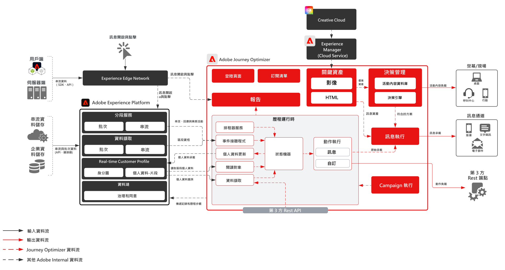

# 客戶歷程藍圖

客戶歷程可讓品牌透過電子郵件、簡訊和行動警報等通道，主動與客戶互動及溝通。協調工具還可透過與其他通道特定的決策引擎分享對象狀態來整合傳入通道等其他互動通道，以進行網頁/行動個人化。有很多元素決定了客戶歷程應使用哪些應用程式和部署選項，但可歸納為兩種不同的方法：在客戶參與 (觸發) 時對其做出反應，或在客戶參與 (排程) 時對一組客戶做出反應。

現在，有兩種Adobe選項可供客戶在想要客戶歷程解決方案時選擇：

<ul><li>Adobe Campaign Managed Cloud Services</li><li>Adobe Journey Optimizer</li></ul>

| Blueprint | 說明 | 架構 |
|---|---|---|
| **[Journey Optimizer](journey-optimizer.md)** | 建立在Experience Platform即時客戶個人檔案之上的原生功能，讓行銷團隊能對客戶行為的變化做出即時反應，並隨時符合客戶在任何管道的所在位置 |  |
| **[Adobe Campaign v8](campaign-v8.md)** | 新一代宣傳工具，針對高度複雜的資料管理和宣傳流程而優化。 可讓客戶結合Discover和建立豐富的行銷活動通訊 |  |
| **[Adobe Campaign v7](campaign-v7.md)** | 傳統的宣傳工具，專為電子郵件、簡訊和直接郵件等通路的批次行銷活動所打造。 使客戶能夠在單個位置協調和管理各種客戶通信 |  |
