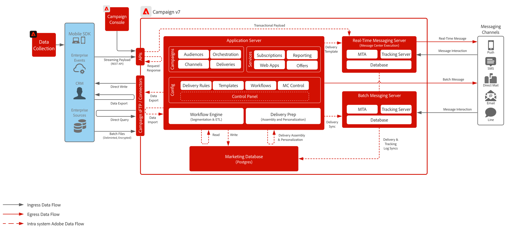

# 客戶歷程藍圖

現代行銷團隊需要平台同時支援反應式參與（回應個別客戶行為）和主動式外聯（啟動引導受眾進入轉換漏斗的促銷活動）。 這些使用案例涵蓋電子郵件、簡訊、推播等管道，且越來越多地涵蓋網頁和應用程式內體驗。

Adobe Journey Optimizer和Adobe Campaign v8都支援兩種客戶參與的基本模型：

- 客戶觸發的歷程：事件導向、根據個人行為和訊號的即時協調。
- 品牌啟動的行銷活動：根據細分或商業邏輯，將受眾引進參與漏斗的策略性時間推送。

這兩種解決方案都可跨傳統和數位頻道啟用傳出通訊。 AJO還透過對象狀態共用和決策服務，支援與傳入頻道（例如網頁和行動應用程式）整合，進而實現統一的跨頻道個人化。

這些工具的選擇取決於架構上的考量因素，例如延遲容許度、通道需求、資料整合策略及擴充能力。

 

| 藍圖 | 說明 | 架構 |
|---|---|:---:|
| **[Adobe Journey Optimizer](journey-optimizer/journey-optimizer-overview.md)** | 結合事件導向的1:1個人資料協調，與跨多個管道（例如電子郵件、簡訊、網頁、推播、應用程式內訊息、案頭等）的對象型品牌通訊。 |  |
| **[Adobe [!DNL Campaign] v8](campaign-v8/campaign-v8-overview.md)** | 著重於批次式、多管道的行銷活動管理，適用於電子郵件、簡訊和直接郵件等傳統行銷管道。 |  |

 

## 已棄用的Blueprint

| 藍圖 | 架構 |
|---|:---:|
| **[Adobe [!DNL Campaign] v7](campaign-v7/campaign-v7-overview.md)** |  |