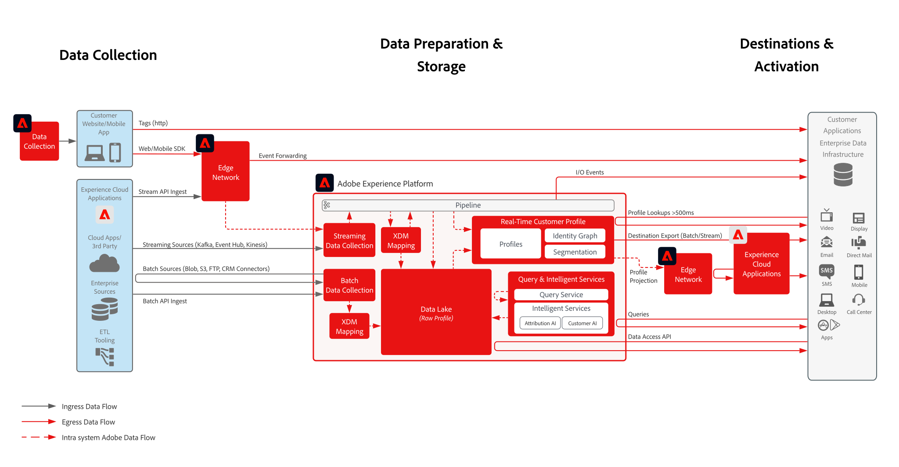

# 資料存取和匯出Blueprint

資料存取和匯出Blueprint概述可從[!DNL Experience Platform]和應用程式存取或匯出資料的所有可能方法。

Blueprint分為兩個類別，分別用於從[!DNL Experience Platform]和應用程式存取資料。

第一項包括從[!DNL Experience Platform]和應用程式匯出資料的方法。 這將視為資料輸出的&#x200B;_推送_&#x200B;型別方法。

第二個包括從[!DNL Experience Platform]和應用程式存取資料的方法。 這將視為資料存取的&#x200B;_提取_&#x200B;型別方法。

資料存取方法：

* [Real-time Customer Profile Access API](#rtcp-profile-access-api)
* [資料存取 API](#data-access-api)
* [查詢服務](#query-service)

資料匯出方法：

* [用戶端標籤](#client-side-tags-extensions)
* [事件轉送](#event-forwarding)
* [Real-time Customer Data Platform 目標](#RTCDP-destinations)
* [Journey Optimizer 自訂動作](#jo-custom-actions)

## 資料存取和匯出總覽架構

## 資料存取和匯出方法

<table cellspacing="0" class="Table" style="border-collapse:collapse; width:1133px">
<tbody>
<tr>
<td colspan="4" style="background-color:#308fff; border-bottom:4px solid white; border-left:1px solid white; border-right:1px solid white; border-top:1px solid white; height:39px; vertical-align:top; width:1133px">

<strong>串流目標</strong>

</td>
</tr>
<tr>
<td style="background-color:#969696; border-bottom:1px solid white; border-left:1px solid white; border-right:1px solid white; border-top:none; height:39px; vertical-align:top; width:240px">

方法

</td>
<td style="background-color:#969696; border-bottom:1px solid white; border-left:none; border-right:1px solid white; border-top:none; height:39px; vertical-align:top; width:467px">

常見使用案例

</td>
<td style="background-color:#969696; border-bottom:1px solid white; border-left:none; border-right:1px solid white; border-top:none; height:39px; vertical-align:top; width:144px">

通訊協定

</td>
<td style="background-color:#969696; border-bottom:1px solid white; border-left:none; border-right:1px solid white; border-top:none; height:39px; vertical-align:top; width:282px">

考量事項

</td>
</tr>
<tr>
<td style="background-color:#e8eeff; border-bottom:1px solid white; border-left:1px solid white; border-right:1px solid white; border-top:none; height:39px; vertical-align:top; width:240px">

<a href="https://experienceleague.adobe.com/docs/experience-platform/tags/event-forwarding/overview.html?lang=zh-Hant" style="color:#0563c1; text-decoration:underline">事件轉送</a>

</td>
<td style="background-color:#e8eeff; border-bottom:1px solid white; border-left:none; border-right:1px solid white; border-top:none; height:39px; vertical-align:top; width:467px">
<ul style="list-style-type:square">
<li>將從 Adobe SDK 收集的原始資料轉送至企業系統，以便進行分析和收集</li>
<li>透過擴充功能收集第三方資料的輕量標籤</li>
</ul>
</td>
<td style="background-color:#e8eeff; border-bottom:1px solid white; border-left:none; border-right:1px solid white; border-top:none; height:39px; vertical-align:top; width:144px">
<ul style="list-style-type:square">
<li>推播</li>
<li>JSON</li>
<li>REST API</li>
</ul>
</td>
<td style="background-color:#e8eeff; border-bottom:1px solid white; border-left:none; border-right:1px solid white; border-top:none; height:39px; vertical-align:top; width:282px">
<ul style="list-style-type:square">
<li>低階原始事件</li>
<li>未新增聚合或先前記錄的情境</li>
</ul>
</td>
</tr>
<tr>
<td style="background-color:#cddbff; border-bottom:1px solid white; border-left:1px solid white; border-right:1px solid white; border-top:none; height:39px; vertical-align:top; width:240px">

<a href="https://experienceleague.adobe.com/docs/experience-platform/destinations/destination-types.html?lang=zh-Hant#:~:text=containing%20profile%20exports.-,Streaming%20segment%20export%20destinations,-Segment%20export%20destinations" style="color:#0563c1; text-decoration:underline">RTCDP — 串流區段匯出</a>

</td>
<td style="background-color:#cddbff; border-bottom:1px solid white; border-left:none; border-right:1px solid white; border-top:none; height:39px; vertical-align:top; width:467px">
<ul style="list-style-type:square">
<li>從 RTCDP 到行銷和廣告系統啟用對象。</li>
</ul>
</td>
<td style="background-color:#cddbff; border-bottom:1px solid white; border-left:none; border-right:1px solid white; border-top:none; height:39px; vertical-align:top; width:144px">
<ul style="list-style-type:square">
<li>推播</li>
<li>JSON</li>
<li>REST API</li>
</ul>
</td>
<td style="background-color:#cddbff; border-bottom:1px solid white; border-left:none; border-right:1px solid white; border-top:none; height:39px; vertical-align:top; width:282px">
<ul style="list-style-type:square">
<li>代表受眾成員資格的彙總資料</li>
<li>未啟動原始體驗事件資料</li>
</ul>
</td>
</tr>
<tr>
<td style="background-color:#e8eeff; border-bottom:1px solid white; border-left:1px solid white; border-right:1px solid white; border-top:none; height:39px; vertical-align:top; width:240px">

<a href="https://experienceleague.adobe.com/docs/experience-platform/destinations/destination-types.html?lang=zh-Hant#:~:text=file%2Dbased)%20destinations-,Streaming%20profile%20export%20destinations%20(enterprise%20destinations),-IMPORTANT" style="color:#0563c1; text-decoration:underline">RTCDP — 個人資料匯出目標</a>

</td>
<td style="background-color:#e8eeff; border-bottom:1px solid white; border-left:none; border-right:1px solid white; border-top:none; height:39px; vertical-align:top; width:467px">
<ul style="list-style-type:square">
<li>運用 RTCDP 豐富的行為個人資料和對象，以改進消費者體驗和行銷。</li>
<li>從 RTCDP 將對象和個人資料屬性啟用到針對對象和個人資料屬性運作的行銷和廣告系統。 </li>
<li>向電子郵件服務提供者、銷售機會培養和 CRM 系統啟用 AEP 個人資料。</li>
</ul>
</td>
<td style="background-color:#e8eeff; border-bottom:1px solid white; border-left:none; border-right:1px solid white; border-top:none; height:39px; vertical-align:top; width:144px">
<ul style="list-style-type:square">
<li>推播</li>
<li>JSON</li>
<li>REST API</li>
</ul>
</td>
<td style="background-color:#e8eeff; border-bottom:1px solid white; border-left:none; border-right:1px solid white; border-top:none; height:39px; vertical-align:top; width:282px">
<ul style="list-style-type:square">
<li>表示受眾成員資格和設定檔記錄屬性的彙總資料</li>
<li>未啟動原始體驗事件資料</li>
</ul>
</td>
</tr>
<tr>
<td style="background-color:#cddbff; border-bottom:1px solid white; border-left:1px solid white; border-right:1px solid white; border-top:none; height:39px; vertical-align:top; width:240px">

<a href="https://experienceleague.adobe.com/docs/experience-platform/destinations/catalog/personalization/custom-personalization.html?lang=zh-Hant" style="color:#0563c1; text-decoration:underline">RTCDP — 個人化目標</a>

</td>
<td style="background-color:#cddbff; border-bottom:1px solid white; border-left:none; border-right:1px solid white; border-top:none; height:39px; vertical-align:top; width:467px">
<ul style="list-style-type:square">
<li>在瀏覽器和用戶端體驗中存取即時客戶個人資料檔，以豐富用戶端個人化內容。 </li>
</ul>
</td>
<td style="background-color:#cddbff; border-bottom:1px solid white; border-left:none; border-right:1px solid white; border-top:none; height:39px; vertical-align:top; width:144px">
<ul style="list-style-type:square">
<li>JSON</li>
</ul>
</td>
<td style="background-color:#cddbff; border-bottom:1px solid white; border-left:none; border-right:1px solid white; border-top:none; height:39px; vertical-align:top; width:282px">
<ul style="list-style-type:square">
<li>需要部署 Web SDK</li>
</ul>
</td>
</tr>
<tr>
<td style="background-color:#e8eeff; border-bottom:1px solid white; border-left:1px solid white; border-right:1px solid white; border-top:none; height:39px; vertical-align:top; width:240px">

<a href="https://experienceleague.adobe.com/docs/experience-platform/destinations/destination-sdk/overview.html?lang=zh-Hant" style="color:#0563c1; text-decoration:underline">RTCDP -Destination SDK</a>

</td>
<td style="background-color:#e8eeff; border-bottom:1px solid white; border-left:none; border-right:1px solid white; border-top:none; height:39px; vertical-align:top; width:467px">
<ul style="list-style-type:square">
<li>在 RTCDP 目標中設定自訂的目標卡。</li>
<li>支援檔案和串流類型目標</li>
</ul>
</td>
<td style="background-color:#e8eeff; border-bottom:1px solid white; border-left:none; border-right:1px solid white; border-top:none; height:39px; vertical-align:top; width:144px">
<ul style="list-style-type:square">
<li>JSON</li>
<li>CSV</li>
</ul>
</td>
<td style="background-color:#e8eeff; border-bottom:1px solid white; border-left:none; border-right:1px solid white; border-top:none; height:39px; vertical-align:top; width:282px">
<ul style="list-style-type:square">
<li>允許合作夥伴和品牌設定自訂目標卡</li>
</ul>
</td>
</tr>
<tr>
<td style="background-color:#cddbff; border-bottom:1px solid white; border-left:1px solid white; border-right:1px solid white; border-top:none; height:39px; vertical-align:top; width:240px">

<a href="https://experienceleague.adobe.com/docs/experience-platform/profile/api/entities.html?lang=zh-Hant" style="color:#0563c1; text-decoration:underline">RTCDP — 個人資料查詢中樞 API</a>

</td>
<td style="background-color:#cddbff; border-bottom:1px solid white; border-left:none; border-right:1px solid white; border-top:none; height:39px; vertical-align:top; width:467px">
<ul style="list-style-type:square">
<li>存取個人資料，以豐富消費者體驗，實現代理程式輔助體驗（例如支援或銷售代理程式互動）。</li>
</ul>
</td>
<td style="background-color:#cddbff; border-bottom:1px solid white; border-left:none; border-right:1px solid white; border-top:none; height:39px; vertical-align:top; width:144px">
<ul style="list-style-type:square">
<li>提取</li>
<li>JSON</li>
<li>REST API</li>
</ul>
</td>
<td style="background-color:#cddbff; border-bottom:1px solid white; border-left:none; border-right:1px solid white; border-top:none; height:39px; vertical-align:top; width:282px">
<ul style="list-style-type:square">
<li>中樞查找僅適用於 500 毫秒以上的使用案例</li>
</ul>
</td>
</tr>
<tr>
<td style="background-color:#e8eeff; border-bottom:1px solid white; border-left:1px solid white; border-right:1px solid white; border-top:none; height:27px; vertical-align:top; width:240px">

RTCDP — 設定檔查詢Edge API

</td>
<td style="background-color:#e8eeff; border-bottom:1px solid white; border-left:none; border-right:1px solid white; border-top:none; height:27px; vertical-align:top; width:467px">
<ul style="list-style-type:square">
<li>在邊緣存取個人資料，以豐富消費者體驗，實現即時小於;200 毫秒體驗（例如網頁和行動裝置上的個人化或優惠決策）。</li>
</ul>
</td>
<td style="background-color:#e8eeff; border-bottom:1px solid white; border-left:none; border-right:1px solid white; border-top:none; height:27px; vertical-align:top; width:144px">
<ul style="list-style-type:square">
<li>提取</li>
<li>JSON</li>
<li>REST API</li>
</ul>
</td>
<td style="background-color:#e8eeff; border-bottom:1px solid white; border-left:none; border-right:1px solid white; border-top:none; height:27px; vertical-align:top; width:282px">
<ul style="list-style-type:square">
<li>對於即時體驗和伺服器對伺服器的整合</li>
</ul>
</td>
</tr>
<tr>
<td style="background-color:#cddbff; border-bottom:1px solid white; border-left:1px solid white; border-right:1px solid white; border-top:none; height:39px; vertical-align:top; width:240px">

<a href="https://experienceleague.adobe.com/docs/journey-optimizer/using/orchestrate-journeys/about-journey-building/using-custom-actions.html?lang=zh-Hant" style="color:#0563c1; text-decoration:underline">Journey Optimizer 自訂動作</a>

</td>
<td style="background-color:#cddbff; border-bottom:1px solid white; border-left:none; border-right:1px solid white; border-top:none; height:39px; vertical-align:top; width:467px">
<ul style="list-style-type:square">
<li>啟動 1:1 歷程事件和觸發程式，以通知外部系統。放棄購物車、放棄應用程式、註冊。</li>
</ul>
</td>
<td style="background-color:#cddbff; border-bottom:1px solid white; border-left:none; border-right:1px solid white; border-top:none; height:39px; vertical-align:top; width:144px">
<ul style="list-style-type:square">
<li>推播</li>
<li>JSON</li>
<li>REST API</li>
</ul>
</td>
<td style="background-color:#cddbff; border-bottom:1px solid white; border-left:none; border-right:1px solid white; border-top:none; height:39px; vertical-align:top; width:282px">
<ul style="list-style-type:square">
<li>給定個人資料的單一事件啟動。不用於彙總或批量操作</li>
</ul>
</td>
</tr>
</tbody>
</table>

 

<table cellspacing="0" class="Table" style="border-collapse:collapse; width:1132px">
<tbody>
<tr>
<td colspan="4" style="background-color:#308fff; border-bottom:4px solid white; border-left:1px solid white; border-right:1px solid white; border-top:1px solid white; height:39px; vertical-align:top; width:1132px">

<strong>批次目標</strong>

</td>
</tr>
<tr>
<td style="background-color:#969696; border-bottom:1px solid white; border-left:1px solid white; border-right:1px solid white; border-top:none; height:39px; vertical-align:top; width:245px">

方法

</td>
<td style="background-color:#969696; border-bottom:1px solid white; border-left:none; border-right:1px solid white; border-top:none; height:39px; vertical-align:top; width:462px">

常見使用案例

</td>
<td style="background-color:#969696; border-bottom:1px solid white; border-left:none; border-right:1px solid white; border-top:none; height:39px; vertical-align:top; width:144px">

通訊協定

</td>
<td style="background-color:#969696; border-bottom:1px solid white; border-left:none; border-right:1px solid white; border-top:none; height:39px; vertical-align:top; width:281px">

考量事項

</td>
</tr>
<tr>
<td style="background-color:#e8eeff; border-bottom:1px solid white; border-left:1px solid white; border-right:1px solid white; border-top:none; height:39px; vertical-align:top; width:245px">

<a href="https://experienceleague.adobe.com/docs/experience-platform/data-access/api.html?lang=zh-Hant" style="color:#0563c1; text-decoration:underline">資料存取 API</a>

</td>
<td style="background-color:#e8eeff; border-bottom:1px solid white; border-left:none; border-right:1px solid white; border-top:none; height:39px; vertical-align:top; width:462px">
<ul style="list-style-type:square">
<li>存取資料科學的原始資料，以及 Experience Platform 外的 ML 工作流程。</li>
</ul>
</td>
<td style="background-color:#e8eeff; border-bottom:1px solid white; border-left:none; border-right:1px solid white; border-top:none; height:39px; vertical-align:top; width:144px">
<ul style="list-style-type:square">
<li>提取</li>
<li>REST API</li>
<li>Parquet 檔案</li>
</ul>
</td>
<td style="background-color:#e8eeff; border-bottom:1px solid white; border-left:none; border-right:1px solid white; border-top:none; height:39px; vertical-align:top; width:281px">
<ul style="list-style-type:square">
<li>需要開發流程才能存取 parquet 檔案並將其處理到可用的資料集中</li>
</ul>
</td>
</tr>
<tr>
<td style="background-color:#cddbff; border-bottom:1px solid white; border-left:1px solid white; border-right:1px solid white; border-top:none; height:39px; vertical-align:top; width:245px">

<a href="https://experienceleague.adobe.com/docs/experience-platform/query/home.html?lang=zh-Hant" style="color:#0563c1; text-decoration:underline">Query Service</a>

</td>
<td style="background-color:#cddbff; border-bottom:1px solid white; border-left:none; border-right:1px solid white; border-top:none; height:39px; vertical-align:top; width:462px">
<ul style="list-style-type:square">
<li>保留資料集的查詢結果，以彙總分析和製作報表。 </li>
</ul>
</td>
<td style="background-color:#cddbff; border-bottom:1px solid white; border-left:none; border-right:1px solid white; border-top:none; height:39px; vertical-align:top; width:144px">
<ul style="list-style-type:square">
<li>提取</li>
<li>PostgreSQL </li>
<li>SQL 用戶端</li>
</ul>
</td>
<td style="background-color:#cddbff; border-bottom:1px solid white; border-left:none; border-right:1px solid white; border-top:none; height:39px; vertical-align:top; width:281px">
<ul style="list-style-type:square">
<li>僅彙總資料。查詢時間限制為 10 分鐘。</li>
</ul>
</td>
</tr>
<tr>
<td style="background-color:#e8eeff; border-bottom:1px solid white; border-left:1px solid white; border-right:1px solid white; border-top:none; height:39px; vertical-align:top; width:245px">

<a href="https://experienceleague.adobe.com/docs/experience-platform/destinations/ui/activate/export-datasets.html?lang=zh-Hant" style="color:#0563c1; text-decoration:underline">資料集匯出</a>

</td>
<td style="background-color:#e8eeff; border-bottom:1px solid white; border-left:none; border-right:1px solid white; border-top:none; height:39px; vertical-align:top; width:462px">
<ul style="list-style-type:square">
<li>匯出 Experience Platform 事件資料，以便在外部報告、分析和資料科學工具中存取。 </li>
<li>匯出彙總的個人資料見解和對象會籍，用於外部報告、分析和資料科學工具。 </li>
</ul>
</td>
<td style="background-color:#e8eeff; border-bottom:1px solid white; border-left:none; border-right:1px solid white; border-top:none; height:39px; vertical-align:top; width:144px">
<ul style="list-style-type:square">
<li>推播</li>
<li>REST API </li>
<li>CSV</li>
</ul>
</td>
<td style="background-color:#e8eeff; border-bottom:1px solid white; border-left:none; border-right:1px solid white; border-top:none; height:39px; vertical-align:top; width:281px">
<ul style="list-style-type:square">
<li>如產品檔案中所述，支援資料集的子集。</li>
</ul>
</td>
</tr>
</tbody>
</table>

## 資料存取方法

### Real-time Customer Profile Access API {#rtcp-profile-access-api}

客戶可使用 Real-time Customer Profile Access API，從即時客戶個人檔案存放區存取單一統一的個人資料，包括所有個人資料身分、對象會籍、屬性和體驗事件。

請參閱 [Real-time Customer Profile Access API](https://experienceleague.adobe.com/docs/experience-platform/profile/api/entities.html?lang=zh-Hant) 文件以取得其他資訊。

#### 使用案例

* 查找單個個人資料以將上下文添加到代理客戶交互，例如透過聊天和呼叫中心進行的支援交互，或銷售點的銷售交互。
* 允許新增情境至外部系統（例如網頁個人化系統或優惠方案決策系統）所做的個人化決策。

#### 考量事項

* Real-time Customer Profile [護欄](https://experienceleague.adobe.com/docs/experience-platform/profile/guardrails.html?lang=zh-Hant)套用。
* 專為一次單一個人資料查閱而設計。不用於大量存取個人資料或下載整個個人資料，以用於分析或資料科學。
* 個人資料查詢回應時間會貼上至個人資料護欄。即時低延遲需求 — 例如針對相同頁面個人化需求，應從到利用邊緣個人資料到 [Adobe Target Connection](https://experienceleague.adobe.com/docs/experience-platform/destinations/catalog/personalization/adobe-target-connection.html?lang=zh-Hant) 或 [自訂個人化連線](https://experienceleague.adobe.com/docs/experience-platform/destinations/catalog/personalization/custom-personalization.html?lang=zh-Hant)，用於在瀏覽器和應用程式個人化中即時存取個人資料。

### 資料存取 API {#data-access-api}

使用資料存取 API，客戶可以直接存取儲存在 Experience Platform 資料湖中原始資料集檔案。

* 有關使用資料存取 API 的其他詳細資訊，請參閱[文件](https://experienceleague.adobe.com/docs/experience-platform/data-access/home.html?lang=zh-Hant)。

#### 使用案例

* 從 Experience Platform 中提取原始資料和已處理的資料檔案，以便在企業環境中進行儲存和評估。

#### 考量事項

* 與串流資料輸出方法（例如使用標籤、事件轉送或 RTCDP 目標）相比，以非同步方式批次存取資料時，資料的存取將原本延遲。
* 將資料檔案處理為 Experience Platform 時，會以批次檔案的集合形式儲存，並以 parquet 格式壓縮和儲存。因此，在將檔案存取和下載到不同環境時，必須以與整個資料集對應的批次和文件系統地存取這些檔案，且資料上的任何操作都必須考慮以 parquet 格式壓縮的檔案。

### 查詢服務 {#query-service}

使用 Experience Platform Query Service，客戶可以在 Experience Platform 內查詢資料集，並保留查詢結果。SQL Client 可用於查詢和保存 SQL 客戶端可支援的所需儲存目標中的查詢回應。Query Service UI 可用於將 SQL 結果儲存在 Experience Platform 中的目標資料集，或將結果保存到本地電腦。

* 有關連接到 SQL 客戶端以保存 Experience Platform Query Service 的 SQL 結果的其他詳細資訊，請參見以下內容[文件](https://experienceleague.adobe.com/docs/experience-platform/query/clients/overview.html?lang=zh-Hant)。

#### 使用案例

* 從 Experience Platform 資料集查詢原始資料，並保留查詢結果。
* 查詢設定檔快照資料集，以擷取 Real-time Customer Profile 的深入分析。[文件](https://experienceleague.adobe.com/docs/experience-platform/dashboards/query.html?lang=zh-Hant#profile-attribute-datasets).
* 將查詢結果儲存到單獨的資料集中，以便訪問或放入啟用配置檔案的資料集中，這些資料集稍後可透過 RTCDP 其他存取 Real-time Customer Profile 的 Experience Cloud 應用程式進行輸出。

#### 考量事項

* 與串流資料輸出方法（例如使用標籤、事件轉送或 RTCDP 目標）相比，以非同步方式批次存取資料時，資料的查詢將原本延遲。
* 只能使用 Query Service 查詢 Experience Platform 資料湖中可用的資料。Real-time Customer Profile 存放區、身分圖表、Customer Journey Analytics 無法透過 Query Service 直接查詢。只有將資料集匯出至資料湖時，才能查詢這些資料集，如個人資料快照資料集的範例中所示。
* 請注意，查詢結果數和查詢逾時的護欄會套用，如[ Query Service 護欄](https://experienceleague.adobe.com/docs/experience-platform/query/guardrails.html?lang=zh-Hant)文件所述。

## 資料匯出方法

### 用戶端標籤擴充功能 {#client-side-tags-extensions}

可使用 Adobe 的標籤解決方案部署擴充功能。在部署擴充功能後，資料請求會直接部署在用戶端瀏覽器或應用程式上，而且可以調用請求，將資料和請求傳送至所需目標。

請參閱[標籤概述](https://experienceleague.adobe.com/docs/experience-platform/tags/home.html?lang=zh-Hant)文件以取得其他資訊。

#### 使用案例

* 使用標籤直接從用戶端環境收集原始串流資訊。

#### 考量事項

* 無法直接存取任何伺服器端資訊，例如 Experience Platform Real-time Customer Profile 和對象會籍。
* 將其他資料收集標籤新增至頁面可能會增加頁面載入時間。
* 能夠設定規則，只在符合特定條件時要求資料。
* 直接從客戶端收集資料，限制在收集資料之前可以執行的轉換類型和擴充。

### 事件轉送 {#event-forwarding}

資料收集要求會直接收集給Adobe的[!DNL Edge Network]。 可以設定從[!DNL Edge Network]請求到外部RESTful端點，將這些請求轉送到外部目的地。

請參閱下列的[事件轉送](https://experienceleague.adobe.com/docs/experience-platform/tags/event-forwarding/overview.html?lang=zh-Hant)文件以取得其他資訊。

#### 使用案例

* 使用 Adobe 的伺服器端事件轉送，直接從用戶端環境收集原始串流資訊至企業端點。

#### 考量事項

* 若要使用事件轉送，必須使用Web SDK或MobileSDK將資料傳送至[!DNL Edge Network]。
* 事件轉送方法會因為頁面上新增其他標籤，而縮短頁面載入時間並減輕重量。
* 目前不支援從邊緣設定檔或其他資料來源進行擴充。
* 支援有限的資料篩選和簡單的映射轉換。

### Real-time Customer Data Platform 目標 {#RTCDP-destinations}

可將設定檔屬性資料和對象成員資格資料啟用至企業和廣告目標。這意味著所輸出的資料必須擷取至 Experience Platform Real-time Customer Profile。

請參閱 [Real-time Customer Data Platform 目標](https://experienceleague.adobe.com/docs/experience-platform/destinations/home.html?lang=zh-Hant)文件以取得其他資訊。

#### 使用案例

* 啟用個人資料屬性資訊，包括內部企業資料存放區、分析工具、電子郵件系統或支援系統的對象成員資格。
* 為外部廣告供應商啟用個人資料對象成員資格，以定位並個人化個人資料的內容。

#### 考量事項

* 可啟用個人資料屬性和對象成員資格。目前無法啟用作為 RTCDP 目標中的原始體驗事件。
* 視區段評估的性質和目的地接受的擷取通訊協定的性質而定，會在串流或批次中進行啟用。

### Journey Optimizer 自訂動作 {#jo-custom-actions}

使用 Journey Optimizer 的客戶可從歷程畫布調用自訂動作，以傳送裝載或訊息至已設定的外部 API 的端點。動作可設為來自任何提供者的任何服務，這些服務可透過具有 JSON 格式裝載的 REST API 進行呼叫。此裝載可包含歷程中設定的事件資訊、個人資料屬性和先前的事件資料、轉換和擴充。

請參閱 [Journey Optimizer 自訂動作](https://experienceleague.adobe.com/docs/journey-optimizer/using/orchestrate-journeys/about-journey-building/using-custom-actions.html?lang=zh-Hant)檔案以取得其他資訊。

#### 使用案例

* 來自 Experience Platform 和 Journey Optimizer 的啟動事件，其中包含來自 Real-time Customer Profile 的其他資訊。
* 當客戶到達歷程的特定點時，通知外部系統。

#### 考量事項

* 由 [Journey Optimizer](https://experienceleague.adobe.com/docs/journey-optimizer/using/get-started/guardrails.html?lang=zh-Hant) 支持的輸送量護欄和由 [Real-time Customer Profile](https://experienceleague.adobe.com/docs/experience-platform/profile/guardrails.html?lang=zh-Hant) 支持的擴充可套用。
* 您可以逐一對歷程中的每個事件或個人資料，以串流方式執行自訂動作。無法跨客戶歷程執行大量作業或以檔案或匯總請求形式執行大量資料輸出。
* 串流存取即時客戶個人資料屬性和體驗事件，可包含在啟用裝載中。
* 在將事件傳送至外部目標之前，可以篩選事件資料並套用簡單的對應轉換。
