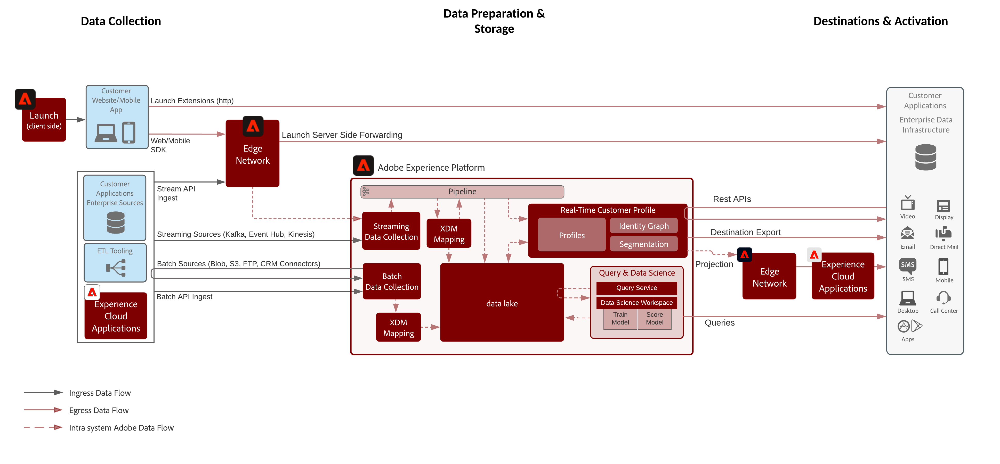
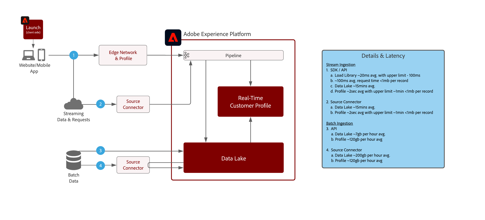

# 資料準備與擷取 Blueprint

資料準備與擷取 Blueprint 涵蓋可在 Adobe Experience Platform 中準備和擷取資料的所有方法。

資料準備包括將來源資料對應至 Experience Data Model (XDM) 方案。它還包括對資料執行轉換，包括資料格式化、欄位拆分 / 聯結 / 轉換以及記錄的接合 / 合併 / 重建按鍵索引。資料準備有助於統一客戶資料以提供彙總 / 篩選的分析，包括為客戶個人資料匯整 / 資料科學 / 啟用報告或準備資料。

## 架構

## 資料擷取護欄

下圖說明了將資料擷取至 Adobe Experience Platform 的平均效能護欄和延遲。

## 資料擷取方法

| 擷取方法 | 說明 |
|------------------------------|-----------------------------------------------------------------------------------------------------------------------------------------------------------------------------------------------------------------------------------------------------------------------------------------------------------------------------------------------------------------------------------------------------------------------------------------|
| Web/Mobile SDK | 延遲：<ul><li>即時 - 同頁集合到 Edge 網路</li><li>大約 1 分鐘串流擷取到個人資料</li><li>串流擷取到資料湖 (微批次約 15 分鐘)</ul>文件： <ul><li>[Web SDK](https://experienceleague.adobe.com/docs/web-sdk.html?lang=zh-Hant)</li><li>[使用 Web SDK 教學課程實作 Adobe Experience Cloud](https://experienceleague.adobe.com/docs/platform-learn/implement-web-sdk/overview.html)</li><li>[Mobile SDK](https://experienceleague.adobe.com/docs/mobile.html?lang=zh-Hant)</li><li>[在移動應用教程中實施Adobe Experience Cloud](https://experienceleague.adobe.com/docs/platform-learn/implement-mobile-sdk/overview.html)</li></ul> |
| 串流來源 | 延遲：<ul><li>即時 - 同頁集合到 Edge 網路</li><li>大約 1 分鐘串流擷取到個人資料</li><li>串流擷取到資料湖 (微批次約 15 分鐘)</li></ul>[文件](https://experienceleague.adobe.com/docs/experience-platform/sources/home.html?lang=zh-Hant#connectors) |
| 串流 API | 延遲：<ul><li>即時 - 同頁集合到 Edge 網路</li><li>大約 1 分鐘串流擷取到個人資料</li><li>串流擷取到資料湖 (微批次約 15 分鐘)</li><li>7 GB/時</li></ul>[文件](https://experienceleague.adobe.com/docs/experience-platform/ingestion/streaming/overview.html?lang=zh-Hant#what-can-you-do-with-streaming-ingestion%3F) |
| ETL 工具 | 在擷取到 Experience Platform 之前，使用 ETL 工具修改和轉換企業資料。  延遲：<ul><li>時間取決於外部 ETL 工具排程，然後基於擷取所用方法套用標準擷取護欄。</li></ul> |
| 批次來源 | 已排程從來源擷取 延遲：約 200 GB/時  [文件](https://experienceleague.adobe.com/docs/experience-platform/sources/home.html?lang=en#connectors) [視訊教學課程](https://experienceleague.adobe.com/docs/platform-learn/tutorials/sources/overview.html?lang=zh-Hant) |
| 批次 API | 延遲：<ul><li>批次擷取到個人資料取決於大小和流量，約 45 分鐘</li><li>批次擷取到資料湖取決於大小和流量</li></ul>[文件](https://experienceleague.adobe.com/docs/experience-platform/ingestion/batch/overview.html?lang=zh-Hant#batch) |
| Adobe 應用程式連接器 | 自動擷取來自 Adobe Experience Cloud 應用程式的資料<ul><li>Adobe Analytics：[文件](https://experienceleague.adobe.com/docs/experience-platform/sources/connectors/adobe-applications/analytics.html?lang=zh-Hant#connectors)與[視訊教學課程](https://experienceleague.adobe.com/docs/platform-learn/tutorials/sources/ingest-data-from-adobe-analytics.html?lang=zh-Hant)</li><li>Audience Manager：[文件](https://experienceleague.adobe.com/docs/experience-platform/sources/connectors/adobe-applications/audience-manager.html?lang=zh-Hant#connectors)與[視訊教學課程](https://experienceleague.adobe.com/docs/platform-learn/tutorials/sources/ingest-data-from-aam.html?lang=zh-Hant)</li></ul> |

## 資料準備方法

| 資料準備的方法 | 說明 |
|------------------------------------------------------------|------------------------------------------------------------------------------------------------------------------------------------------------------------------------------------------------------------------------------------------------------------------------------------------------|
| [!UICONTROL Data Science Workspace] - 資料準備 | 模型驅動的轉換，指令檔化的轉換。 [文件](https://experienceleague.adobe.com/docs/experience-platform/data-science-workspace/home.html?lang=zh-Hant) |
| 外部 ETL 工具 ([!DNL Snaplogic]、[!DNL Mulesoft]、[!DNL Informatica]等) | 在 ETL 工具中執行複雜的轉換，並使用標準 Experience Platform [!UICONTROL Flow Service] API 或來源連接器來擷取結果資料。 |
| [!UICONTROL 查詢服務] - 資料準備 | 將連接、分割、合併、轉換、查詢和篩選資料整合為新資料集。使用 Create Table as Select (CTAS)  [文件](https://experienceleague.adobe.com/docs/experience-platform/query/home.html?lang=zh-Hant#sql) |
| XDM Mapper 與資料準備功能 (串流與批次) | 在 Experience Platform 擷取期間，將 CSV 或 JSON 格式的來源屬性對應至 XDM 屬性。 在資料擷取時計算其功能；即資料格式化、拆分、聯結等。 [文件](https://experienceleague.adobe.com/docs/experience-platform/data-prep/home.html?lang=zh-Hant) |

## 相關部落格貼文

* [[!DNL Leveraging External Data Platforms in Adobe Experience Platform Journey Orchestration]](https://medium.com/adobetech/leveraging-external-data-platforms-in-adobe-experience-platform-journey-orchestration-54fc6134fe17?source=your_stories_page-------------------------------------)
* [[!DNL High Throughput Ingestion with Iceberg]](https://medium.com/adobetech/high-throughput-ingestion-with-iceberg-ccf7877a413f?source=your_stories_page-------------------------------------)
* [[!DNL Query Service Tricks in Adobe Experience Platform (Writing Queries and Storing Derived Datasets)]](https://medium.com/adobetech/query-service-tricks-in-adobe-experience-platform-writing-queries-and-storing-derived-datasets-eaee0d6d683e?source=your_stories_page-------------------------------------)
* [[!DNL Digging into Adobe Experience Platform’s Experience Data Model to More Fully Understand the Power of Real-time Customer Profile]](https://medium.com/adobetech/digging-into-adobe-experience-platforms-experience-data-model-to-more-fully-understand-the-power-3e109271e04f?source=your_stories_page-------------------------------------)
* [[!DNL An Introductory Look at Exploratory Data Analysis on Adobe Experience Platform]](https://medium.com/adobetech/an-introductory-look-at-exploratory-data-analysis-on-adobe-experience-platform-1bfce7501d9a?source=your_stories_page-------------------------------------)
* [[!DNL Modeling XDM Data for Data Science at Scale on Adobe Experience Platform]](https://medium.com/adobetech/modeling-xdm-data-for-data-science-at-scale-on-adobe-experience-platform-222bb2a6dbf7?source=your_stories_page-------------------------------------)
