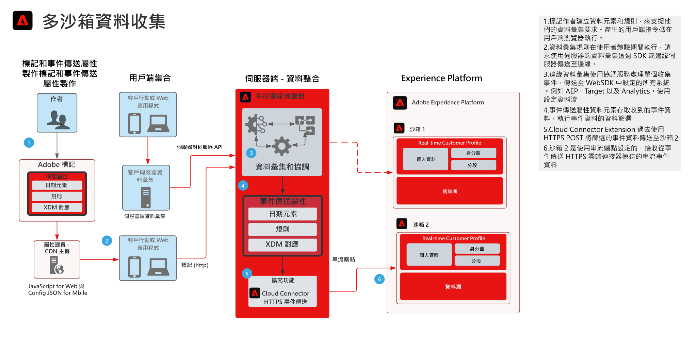

# 多沙箱事件轉送資料收集Blueprint

多沙箱事件轉送資料收集藍圖顯示如何使用Adobe收集資料 [!DNL Experience Platform] Web和Mobile SDK可設定為收集單一事件並轉送至多個 [!DNL Experience Platform] (AEP)沙箱。 此藍圖是使用「Adobe 標籤」之「事件轉送」功能的特定使用案例。

除了複製事件外，您也可以使用「事件轉送」功能，新增、篩選或操控原始收集的資料，使其符合其他沙箱的需求。例如，沙箱 A 需要接收所有事件資料元素，沙箱 B 應僅接收非 PII 資料。

事件轉送會使用個別的標籤屬性，其中包含資料需求所需的資料元素、規則和擴充功能。 若有傳入的事件，您的事件轉送屬性可以收集資料，並在轉送前視需要進行管理。

您的目的地沙箱需要設定HTTP串流端點，以供事件轉送HTTPS擴充功能使用。

## 使用案例

* 全域資料報表 — 使用多個沙箱來隔離作業環境，且需要將資料收集合併至一個沙箱，以便進行跨沙箱報表。事件轉送至報表沙箱可讓每個沙箱作業環境在資料即時收集時，將資料傳送至報表沙箱
* 根據每個沙箱作業環境的不同資料規則，管理不同沙箱的資料收集。需要篩選敏感資料（如醫療保健和金融服務）的此類操作環境

## 應用程式

* Adobe [!DNL Experience Platform] 資料彙集

## 架構

1. 標籤作者會定義標籤屬性和事件轉送屬性。在這裡，作者會定義管理資料收集的資料元素、規則和動作。 請記住，標籤屬性程式碼會在用戶端上執行，並由 CDN 主機分發。此 [!UICONTROL 事件轉送屬性] 程式碼在Adobe上執行 [!DNL Edge Server].

1. 使用者端上收集的資料會傳送至 [!DNL Edge Network]. 客戶也可以選擇先將資料傳送至自己的伺服器，作為伺服器端收集的方法。 Web SDK 可提供伺服器對伺服器的收集功能。但這確實需要不同的程式設計模型才能實施。請參閱檔案 **[!DNL Edge Network]伺服器API總覽** 以下

1. Platform [!DNL Edge Network] 接收資料收集裝載，並協調資料流向所需的系統，例如Target和Analytics。

1. 事件轉送屬性資料元素可用來存取到達承載中的事件資料。在轉送前，也可以視需要使用規則來操控事件資料。例如，將資料格式化為串流資料擷取所需的 XDM

1. 事件轉送提供 HTTPS 擴充功能，可將事件資料轉送至 HTTPS 端點。

1. 沙箱 2 設定了使用接收轉送事件的串流端點。

## 相關文件

* [事件轉送文件](https://experienceleague.adobe.com/docs/experience-platform/tags/event-forwarding/overview.html?lang=zh-Hant)
* [事件轉送影片](https://experienceleague.adobe.com/docs/launch-learn/tutorials/server-side/overview.html?lang=zh-Hant)
* [事件轉送課程](https://experienceleague.adobe.com/docs/platform-learn/implement-web-sdk/event-forwarding/setup-event-forwarding.html?lang=zh-Hant)（Web SDK 教程）
* [[!DNL Experience Platform] Web SDK總覽](https://experienceleague.adobe.com/docs/experience-platform/edge/home.html?lang=zh-Hant)
* [[!DNL Edge Network] 伺服器API總覽](https://experienceleague.adobe.com/docs/experience-platform/edge-network-server-api/overview.html?lang=zh-Hant)

## 相關部落格貼文

* [透過Adobe提升網站效能 [!DNL Experience Platform] Web SDK和 [!DNL Edge Network]](https://medium.com/adobetech/boosting-website-performance-with-adobe-experience-platform-web-sdk-and-edge-network-329fcf70fdf9)
* [使用Adobe解決實作的痛點 [!DNL Experience Platform] Web SDK和 [!DNL Edge Network]](https://medium.com/adobetech/solving-implementation-pain-points-with-adobe-experience-platform-web-sdk-and-edge-network-880b635e6819)
* [Adobe [!DNL Experience Platform] 適用於對象管理的Web SDK](https://medium.com/adobetech/adobe-experience-platform-web-sdk-for-audience-management-751fa6d063bc)
* [Adobe [!DNL Experience Platform] Web SDK - Adobe Target](https://medium.com/adobetech/adobe-experience-platform-web-sdk-adobe-target-9b9f621d271)
* [Adobe [!DNL Experience Platform] Adobe Analytics的Web SDK移轉案例](https://medium.com/adobetech/adobe-experience-platform-web-sdk-migration-scenarios-for-adobe-analytics-91c255ec82b0)
* [統一您的Adobe [!DNL Experience Platform] 具有Adobe的服務 [!DNL Experience Platform] Web SDK](https://medium.com/adobetech/unify-your-adobe-experience-platform-services-with-adobe-experience-platform-web-sdk-75cf6851a9fc)
* [利用Adobe加速您的行動應用程式開發 [!DNL Experience Platform] Mobile SDK和Launch](https://medium.com/adobetech/accelerate-your-mobile-application-development-with-adobe-experience-platform-mobile-sdk-and-launch-ed023536d611)
* [使用 Adobe Experience Platform Web SDK 簡化客戶工作流程](https://medium.com/adobetech/simplifying-customer-workflows-with-adobe-experience-platform-web-sdk-4e54fe134f4a)
