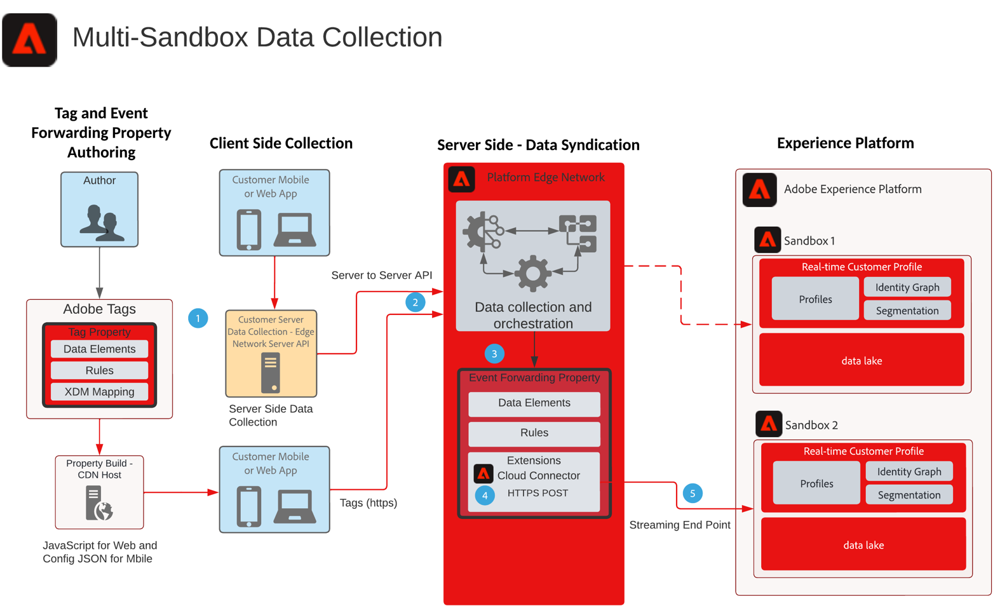

# 多沙箱事件轉送資料收集藍圖

此藍圖顯示如何將使用Experience Platform Web和Mobile SDK收集的資料設定為收集單一事件並轉送至多個AEP沙箱。 此Blueprint是多沙箱資料收集的特定使用案例，其使用事件轉送來達成此目標。

除了使用事件轉送功能複製事件之外，您還可以新增到、篩選或操作原始收集的資料，以符合其他沙箱的要求。

「事件轉送」會使用個別屬性，其中包含資料需求所需的資料元素、規則和擴充功能。 對於傳入事件，您的「事件轉送」屬性可以收集資料，並在轉送之前視需要管理。

您的目的地沙箱需要設定的HTTP串流端點，以供Adobe Cloud Connector擴充功能使用。

## 使用案例

* 全域資料報表 — 使用多個沙箱來隔離作業環境，且需要將資料收集合併至一個沙箱，以便進行跨沙箱報表。透過「事件轉送」將Experience Edge事件路由至報告沙箱，讓每個沙箱作業環境可將在即時收集到的資料傳送至報告沙箱
* 根據每個沙箱作業環境的不同資料規則，管理不同沙箱的資料收集。

## 應用程式

* Adobe Experience Platform 資料彙集
* 事件轉送
* AEP Extension
* 雲端聯結器擴充功能

## 考量事項

使用事件轉送作為將資料傳送至多個沙箱的方法，在您的解決方案架構中必須考慮一些注意事項。

### 無HIPAA資料

事件轉送不視為HIPAA就緒，且不應用於收集HIPAA資料的任何HIPAA使用案例。 不過，用於事件轉送的基礎架構被視為HIPAA已就緒，完全由客戶自行決定。 當事件轉送標籤屬性位在事件轉送系統中時，收集的整個資料裝載都會傳送至事件轉送系統以供處理。 正是這個程式讓HIPAA使用案例的事件轉送產生疑慮。 將整個裝載運送到事件轉送系統後，這將包含任何HIPAA值。 即使事件轉送規則會在傳送至目的地之前篩選該資料，該HIPAA資料仍會傳送至未就緒HIPAA的基礎架構。 不過，裝載資料絕不會儲存，且只是傳遞。

### 不同的資料串流和串流端點

當資料從Platform Edge Network流經資料流時，使用事件轉送至另一個AEP沙箱時，硬性要求是「永不」使用與製作原始集合的資料流相同的資料流或串流端點。 這可能會對AEP執行個體造成傷害，並可能觸發DoS情況。

### 預估流量

每個使用案例的流量都必須進行檢閱。 這很重要，因為高流量可能會導致節流情況，如果發生這種情況，客戶將會收到通知。

## 架構

1. 您必須收集事件資料並傳送至Platform Edge Network，才能使用事件轉送。 客戶可以使用使用者端的Adobe標籤，或使用Platform Edge Network Server API進行伺服器對伺服器資料收集。 Platform Edge Network API可提供伺服器對伺服器的收集功能。 但這確實需要不同的程式設計模型才能實施。請參閱 [Edge Network Server API概觀](https://experienceleague.adobe.com/docs/experience-platform/edge-network-server-api/overview.html?lang=en)

1. 收集到的裝載會從Tags實作傳送至Platform Edge Network至事件轉送服務，並由其本身的資料元素、規則和動作處理。 您可以深入瞭解以下各項的差異： [標籤和事件轉送](https://experienceleague.adobe.com/docs/experience-platform/tags/event-forwarding/overview.html?lang=en#differences-from-tags).

1. 若要從Platform Edge Network接收收集的事件資料，也需要事件轉送屬性。 該事件資料是由部署的Tags實作還是伺服器對伺服器集合傳送至Platform Edge Network。 作者會定義資料元素、規則和動作，以在轉送至第二個沙箱之前擴充事件資料。 請考慮使用自訂程式碼JavaScript資料元素，協助您建構資料以擷取沙箱。 結合AEP資料準備功能，您有幾個選項可管理您的資料結構。

1. 目前，需要在Event Forwarding屬性中使用Adobe Cloud Connector擴充功能。 一旦規則處理或擴充事件資料後，就會在擷取呼叫中使用雲端聯結器，該擷取呼叫是為將裝載傳送至第二個沙箱的POST所設定

1. 第二個沙箱需要資料擷取的串流端點。 您也可以考慮AEP中的「資料準備」功能，以協助事件轉送裝載擷取及對應至XDM。 請參閱AEP檔案建立 [使用UI的HTTP API串流連線](https://experienceleague.adobe.com/docs/experience-platform/sources/ui-tutorials/create/streaming/http.html?lang=zh-Hant)
