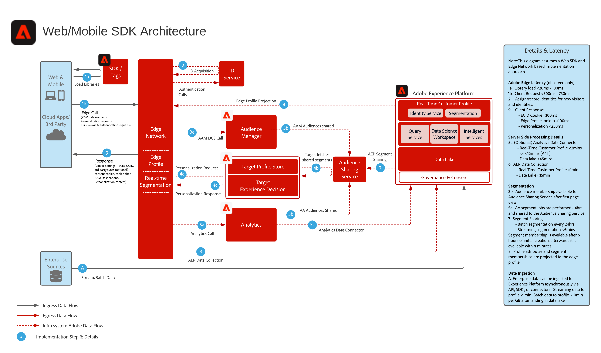

# Experience Platform Web/Mobile SDK 資料彙集

以下架構圖說明運用Experience PlatformWeb SDK的整合路徑和資料收集。

## 參考文件

* [Experience Platform Web/Mobile SDK 概覽](https://experienceleague.adobe.com/docs/experience-platform/edge/home.html?lang=zh-Hant)
* [使用Web SDK實作Adobe Experience Cloud教學課程](https://experienceleague.adobe.com/docs/blueprints-learn/architecture/data-ingestion/websdk.html)
