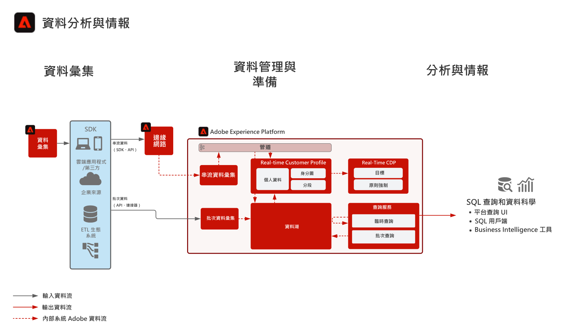

# 資料分析與情報 Blueprint

資料分析與情報包括 Adobe Experience Platform 中對資料湖中現有資料執行探索查詢和分析的功能。

Experience Platform 的[!UICONTROL 查詢服務]顯示對資料執行的 SQL 查詢。

Experience Platform允許與第三方SQL客戶端、介面和Business Intelligence(BI)工具連接，以直接連接、訪問和查詢Experience Platform內的資料，使用 [!DNL PostgreSQL] 協定。

某些護欄適用於查詢超時和查詢結果中包含的資料量，如下面的護欄部分所述。

## 使用案例

* 互動式查詢與資料彙總
* 存取擷取資料列與欄以進行探索和驗證
* 透過 Business Intelligence 工具進行儀表板處理與視覺化

## 應用程式

* Adobe Experience Platform

## 架構

## 護欄

請參閱查詢服務產品文件，以了解關於最佳實踐與護欄的詳細資訊。
[查詢服務指南](https://experienceleague.adobe.com/docs/experience-platform/query/best-practices/writing-queries.html?lang=zh-Hant#best-practices)

## 實施步驟

1. 為要擷取的資料[建立資料方案](https://experienceleague.adobe.com/?recommended=ExperiencePlatform-D-1-2021.1.xdm)。
1. 為要擷取的資料[建立資料集](https://experienceleague.adobe.com/docs/platform-learn/tutorials/data-ingestion/create-datasets-and-ingest-data.html?lang=zh-Hant)。
1. [擷取資料](https://experienceleague.adobe.com/?recommended=ExperiencePlatform-D-1-2020.1.dataingestion&amp;lang=zh-Hant)到 Experience Platform。
1. 確認資料可用於 [[!UICONTROL Query Service]](https://experienceleague.adobe.com/docs/platform-learn/tutorials/queries/explore-data.html?lang=en) 及 [[!UICONTROL Data Science Workspace] 以進行原始存取與查詢。](https://experienceleague.adobe.com/docs/platform-learn/tutorials/data-science-workspace/load-data-in-jupyterlab-notebooks.html?lang=en)
1. [將 Business Intelligence 工具和 SQL 用戶端連接到 [!UICONTROL Query Service] 以進行視覺化、資料查詢和探索。](https://experienceleague.adobe.com/?recommended=ExperiencePlatform-D-1-2021.1.qsvc.dash)

## 相關文件

* [Adobe Experience Platform Intelligence 產品說明](https://helpx.adobe.com/tw/legal/product-descriptions/adobe-experience-platform-intelligence---product-description.html)
* [[!UICONTROL Query Service] 文件](https://experienceleague.adobe.com/docs/experience-platform/query/home.html?lang=zh-Hant)
