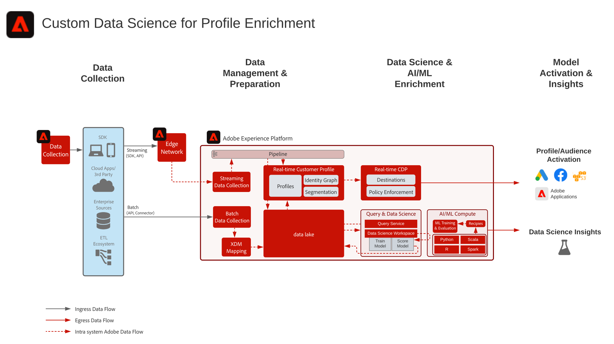

# 自訂 Profile Enrichment 藍圖的資料科學

Custom Data Science for Profile Excremint Blueprint說明如何在[!UICONTROL 資料科學工作區]中使用Adobe Experience Platform的資料來訓練、部署和計分模型，以提供機器學習見解。 這些模型可直接輸出至啟用[!UICONTROL 即時客戶個人檔案]的資料集，以進一步豐富客戶個人檔案。 然後，這些洞見可以據以個人化。 機器學習深入資訊的範例包括終身價值評分、產品與類別相似性、轉換傾向或流失傾向。

## 使用案例

* 從 Experience Platform 中的客戶資料擷取深入見解並探索模式。從這些資料對模型進行訓練和評分。
* 利用模型導向的見解和屬性豐富[!UICONTROL 即時客戶個人檔案]，以便更精細的個人化和最佳化歷程。
* 對模型訓練和評分以確定客戶深入見解，例如客戶期限值、轉換或退訂傾向性、產品和內容相似性及參與分數。

## 架構

## 實施步驟

1. [建立](https://experienceleague.adobe.com/docs/platform-learn/tutorials/schemas/create-a-schema.html) 要收錄的資料架構。
1. [建立](https://experienceleague.adobe.com/docs/platform-learn/tutorials/data-ingestion/create-datasets-and-ingest-data.html) 要收錄的資料資料集。
1. [擷取資料到 Experience Platform。](https://experienceleague.adobe.com/?recommended=ExperiencePlatform-D-1-2020.1.dataingestion)
1. 建立 DSW 筆記本。
1. 選擇語言。支援 Python 和 PySpark。
1. 在筆記本中建立模型。
1. 訓練模型。
1. 對模型評分以使用目標資料產生預測。
1. 如果將模型結果推送至[!UICONTROL 即時客戶描述檔]，請啟用描述檔的模型結果資料集。

## 相關文件

* [Adobe Experience Platform Intelligence 產品說明](https://helpx.adobe.com/tw/legal/product-descriptions/adobe-experience-platform-intelligence---product-description.html)
* [Data Science Workspace 文件](https://experienceleague.adobe.com/docs/experience-platform/data-science-workspace/home.html?lang=zh-Hant)
* [Data Science Workspace 教學課程](https://experienceleague.adobe.com/docs/platform-learn/tutorials/data-science-workspace/understanding-data-science-workspace.html?lang=zh-Hant)

## 相關部落格貼文

* [[!DNL Simplifying the Data Science Lifecycle with Adobe Platform Experience]](https://medium.com/adobetech/simplifying-the-data-science-lifecycle-with-adobe-platform-experience-8ea4f056d82f)
* [[!DNL Content and Commerce AI: Personalizing Your Interactions with Customers Through Content Intelligence]](https://medium.com/adobetech/content-and-commerce-ai-personalizing-your-interactions-with-customers-through-content-intelligence-dc182601deab)
* [[!DNL Gaining a Deeper Understanding of Churn Using Data Science Workspace]](https://medium.com/adobetech/gaining-a-deeper-understanding-of-churn-using-data-science-workspace-18a2190e0cf3)
* [[!DNL Understanding Data Science In Adobe Experience Platform]](https://medium.com/adobetech/understanding-data-science-in-adobe-experience-platform-5bce5a17b42)
* [[!DNL An Introductory Look at Exploratory Data Analysis on Adobe Experience Platform]](https://medium.com/adobetech/an-introductory-look-at-exploratory-data-analysis-on-adobe-experience-platform-1bfce7501d9a)
* [[!DNL Cutting Across Adobe Experience Products with Machine Learning to Elevated User Experience]](https://medium.com/adobetech/cutting-across-adobe-experience-products-with-machine-learning-to-elevated-user-experience-7c85000510d1)
* [[!DNL Modeling XDM Data for Data Science at Scale on Adobe Experience Platform]](https://medium.com/adobetech/modeling-xdm-data-for-data-science-at-scale-on-adobe-experience-platform-222bb2a6dbf7)
* [[!DNL Segmentation.AI: Automated Audience-Clustering-as-a-Service in Adobe Experience Platform]](https://medium.com/adobetech/segmentation-ai-automated-audience-clustering-as-a-service-in-adobe-experience-platform-261f4099462c)
* [[!DNL Reimagining Jupyter Notebooks for Enterprise Scale]](https://medium.com/adobetech/reimagining-jupyter-notebooks-for-enterprise-scale-8bc6340d504a)
* [[!DNL Accelerate Intelligent Insights with Adobe Experience Platform Data Science Workspace]](https://medium.com/adobetech/accelerate-intelligent-insights-with-adobe-experience-platform-data-science-workspace-89538bacbbea)
* [[!DNL A Preview of Time Series Forecasting with Adobe Experience Platform]](https://medium.com/adobetech/preview-of-time-series-forecasting-with-adobe-experience-platform-38a2fc778e89)
* [[!DNL Cutting Across Adobe Experience Products with Machine Learning to Elevated User Experience]](https://medium.com/adobetech/cutting-across-adobe-experience-products-with-machine-learning-to-elevated-user-experience-7c85000510d1)
