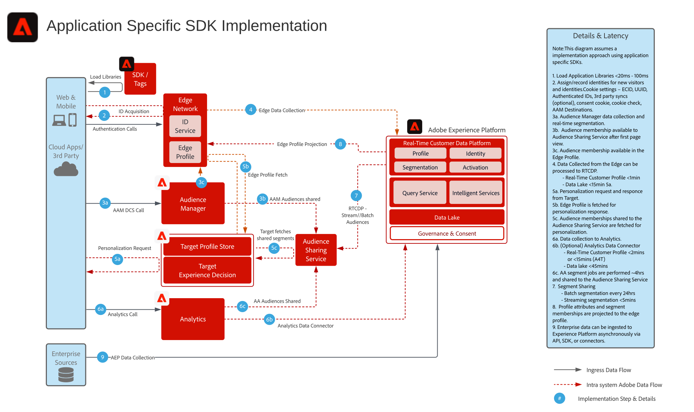

# 應用程式專用 SDK 部署架構圖

以下架構圖說明運用應用程式專用 SDK 進行實作的整合路徑和資料彙集。

## 參考文件

* [Experience Platform Web/Mobile SDK 概覽](https://experienceleague.adobe.com/docs/experience-platform/edge/home.html?lang=zh-Hant)
* [使用 Web SDK 教學課程實作 Adobe Experience Cloud](https://experienceleague.adobe.com/docs/platform-learn/implement-web-sdk/overview.html?lang=zh-Hant)
* [在行動應用程式教學課程中實作 Adobe Experience Cloud](https://experienceleague.adobe.com/docs/platform-learn/implement-mobile-sdk/overview.html?lang=zh-Hant)
