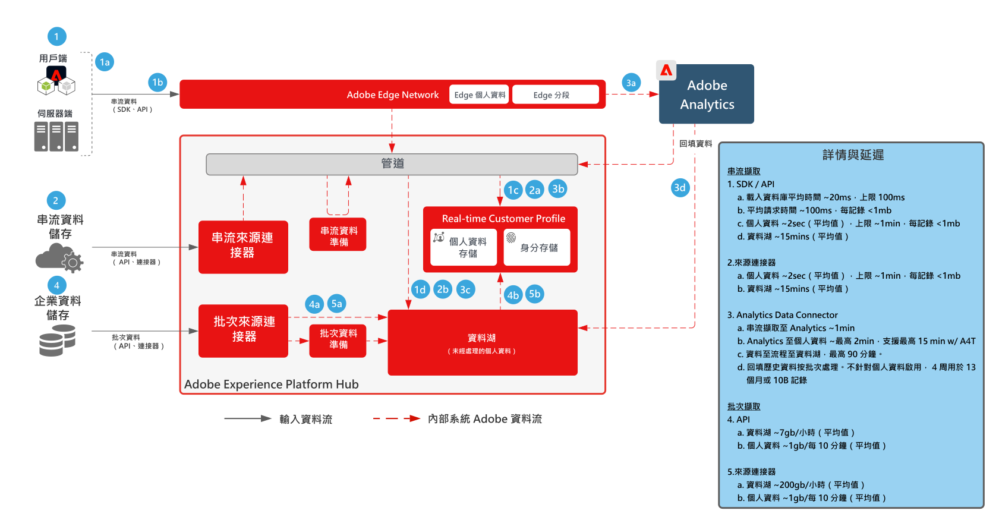
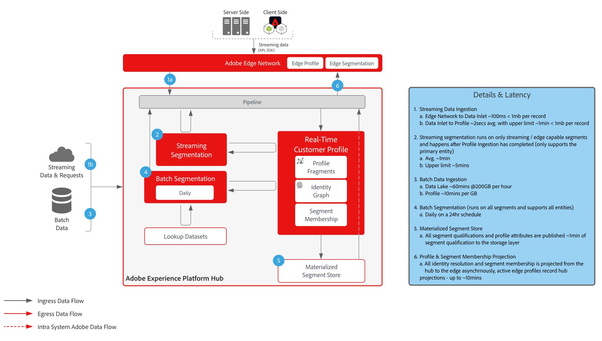
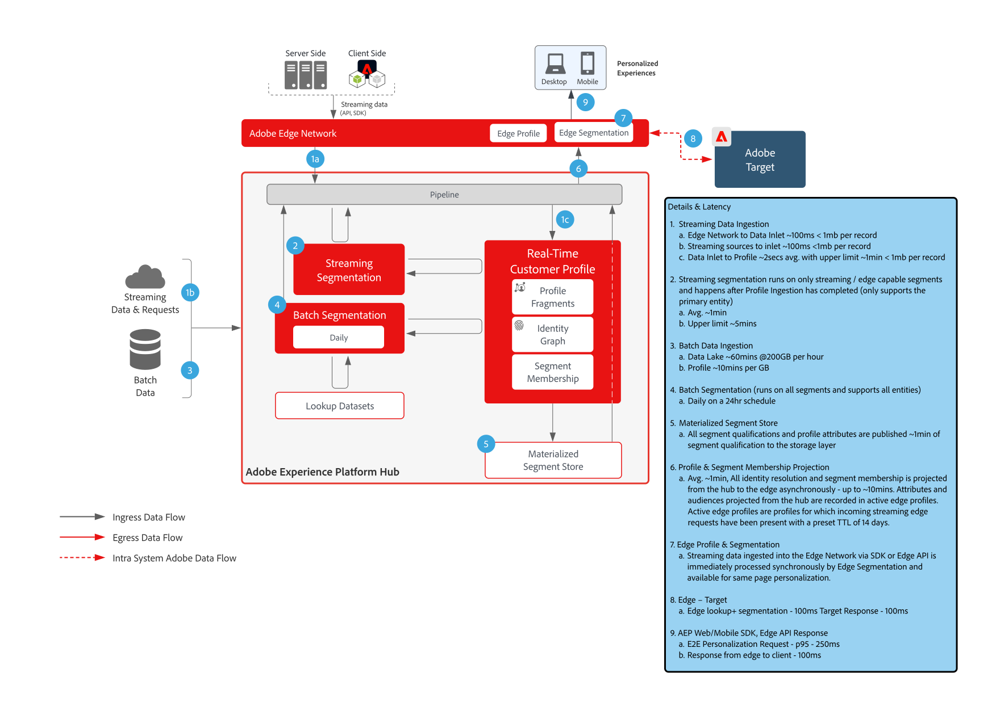
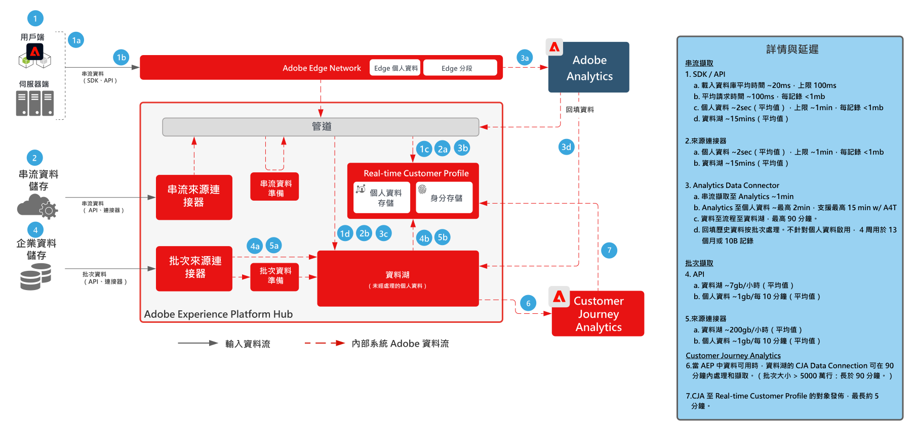
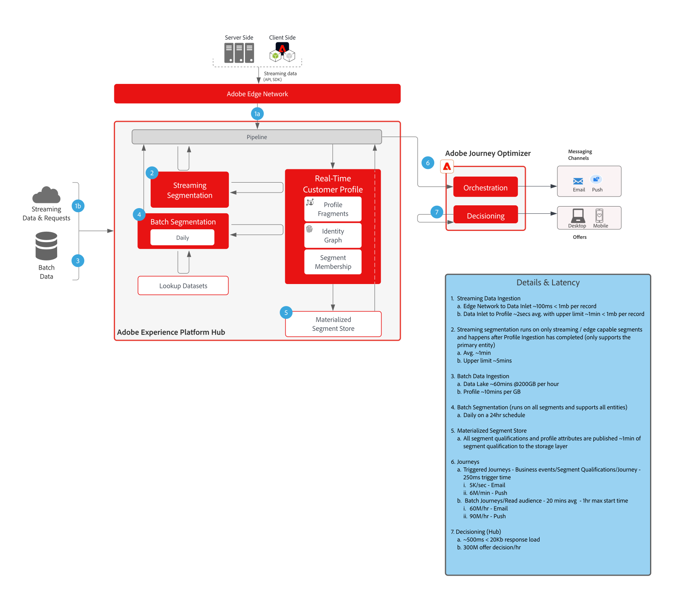

# 護欄

護欄是建議的閾值，可為資料和系統使用提供指導、優化效能，以及避免在Adobe Experience Platform和應用程式中出現錯誤或意外結果。 護欄旨在反映系統約束和效能期望，以促進客戶架構和使用案例效能優化。 護欄不是服務級別協定，有關特定產品服務級別協定的資訊，請參閱以下連結的產品說明文檔。

## Adobe Experience Platform和應用程式的護欄

[資料擷取護欄](https://experienceleague.adobe.com/docs/experience-platform/ingestion/guardrails.html?lang=en)

[邊緣網路API護欄](https://experienceleague.adobe.com/docs/experience-platform/edge-network-server-api/guardrails.html?lang=en)

[即時客戶設定檔護欄](https://experienceleague.adobe.com/docs/experience-platform/profile/guardrails.html?lang=zh-Hant)

[身分護欄](https://experienceleague.adobe.com/docs/experience-platform/identity/guardrails.html?lang=en)

[查詢服務護欄](https://experienceleague.adobe.com/docs/experience-platform/query/guardrails.html?lang=en)

[目標激活護欄](https://experienceleague.adobe.com/docs/experience-platform/destinations/guardrails.html)

[Journey Optimizer護欄](https://experienceleague.adobe.com/docs/journey-optimizer/using/get-started/guardrails.html?lang=en)

 

## 端到端延遲圖表

### 資料擷取

 

### 區段

 

### Real-time Customer Data Platform與Adobe Target

 

### Customer Journey Analytics

 

### Journey Optimizer

 

## 產品說明

[Experience Platform收集Enterprise](https://helpx.adobe.com/legal/product-descriptions/adobe-experience-platform-collection-enterprise.html)

[即時客戶資料平台](https://helpx.adobe.com/tw/legal/product-descriptions/real-time-customer-data-platform.html)

[B2B客戶資料平台](https://helpx.adobe.com/legal/product-descriptions/adobe-experience-platform-b2b.html)

[Experience Platform 啟用](https://helpx.adobe.com/tw/legal/product-descriptions/adobe-experience-platform0.html)

[Experience Platform 情報](https://helpx.adobe.com/tw/legal/product-descriptions/adobe-experience-platform-intelligence---product-description.html)

[Intelligent Services](https://helpx.adobe.com/legal/product-descriptions/intelligent-services.html)

[資料Distiller](https://helpx.adobe.com/legal/product-descriptions/data-distiller.html)

[Customer Journey Analytics](https://helpx.adobe.com/tw/legal/product-descriptions/customer-journey-analytics.html)

[Journey Optimizer](https://helpx.adobe.com/legal/product-descriptions/adobe-journey-optimizer.html)

[Journey Orchestration](https://helpx.adobe.com/legal/product-descriptions/journey-orchestration.html)

[offer decisioning](https://helpx.adobe.com/legal/product-descriptions/offer-decisioning-app-service.html)
