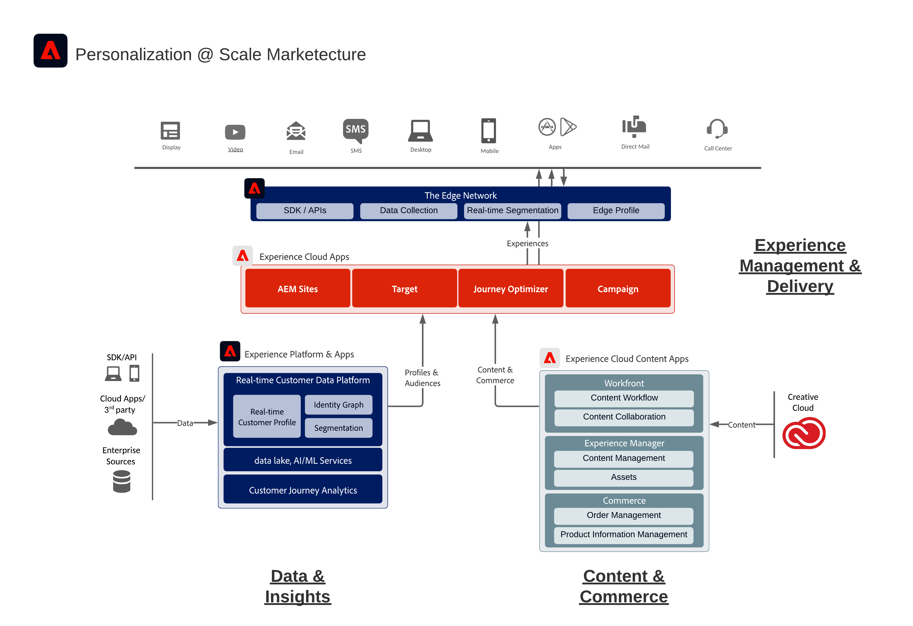

# Adobe Experience Cloud 架構圖

以下架構圖表說明Adobe Experience Platform如何連線及與Adobe Experience Cloud應用程式整合，以在資料、內容和體驗傳遞之間大規模實現個人化。
 
 

 
 
以下架構圖說明Adobe Experience Cloud應用程式和Adobe Experience Platform如何融入企業客戶體驗架構。
 
 

 
 

以下架構圖說明Adobe Experience Platform如何連線及與Adobe Experience Cloud應用程式整合。
 
 

