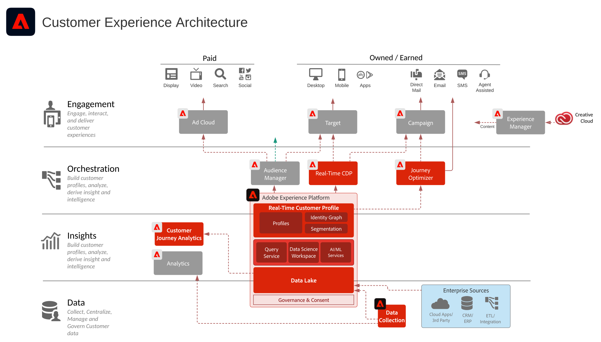

# Adobe Experience Cloud 架構圖

下面的體系結構圖說明了Adobe Experience Platform如何與Adobe Experience Cloud應用程式連接並與之整合，以實現跨資料、內容和體驗交付的大規模個性化。

 下面的架構圖說明了 Adobe Experience Cloud 應用程式和 Adobe Experience Platform 如何適合企業客戶體驗架構。

