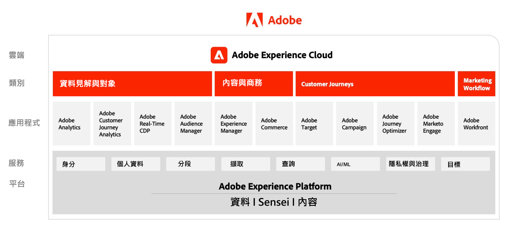

# Adobe Experience Cloud架構圖

## Adobe Experience Cloud行銷架構

下圖說明Adobe Experience Cloud在Adobe Experience Platform基礎上所建置及整合之Data Insights &amp; Audiences、Content &amp; Commerce、Customer Journeys、Marketing Workflow中的各種元件。

## 資料與分析、內容與商務及體驗傳送的整合架構

以下架構圖表說明Adobe Experience Cloud的各種元件如何連結和整合，以在資料、內容和體驗傳送之間大規模實現個人化。

## Adobe Experience Cloud在企業景觀中

以下架構圖表說明Adobe Experience Cloud應用程式和Adobe Experience Platform如何整合到資料、前瞻分析、協調和參與這四個類別的企業客戶體驗架構中。

