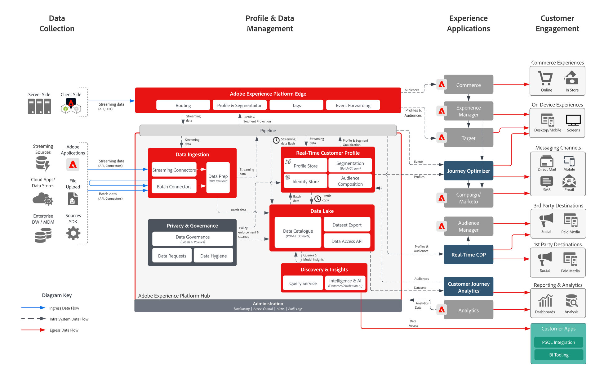

# Adobe Experience Platform 與應用程式 架構圖

## Adobe Experience Platform 與應用程式架構圖

此架構圖顯示 Adobe Experience Platform 如何與 Adobe Experience Cloud 應用程式及應用程式服務連結。

## Adobe Experience Platform 與應用程式詳細架構圖

>[!VIDEO](https://video.tv.adobe.com/v/32456/?quality=12&learn=on)

## Adobe Experience Platform與Experience Cloud應用程式整合

<table class="relative-table wrapped" style="width: 100%;">
<colgroup>
<col style="width: 16.0202%;" />
<col style="width: 29.3423%;" />
<col style="width: 33.5582%;" />
<col style="width: 21.0793%;" />
</colgroup>
<tbody>
<tr>
<th>應用程式</th>
<th>Experience Platform 到應用程式</th>
<th>應用程式到 Experience Platform</th>
<th>相關 Blueprints</th>
</tr>
<tr>
<td colspan="1">Ad Cloud</td>
<td colspan="1">
<ul>
<li>Real-time Customer Data Platform中定義的對象可以共用至Ad Cloud，以透過Audience Manager鎖定目標。</li>
</ul>
</td>
<td colspan="1">
<ul>
<li>目前無整合</li>
</ul>
</td>
<td colspan="1">
<ul>
<li><a href="https://experienceleague.adobe.com/docs/blueprints-learn/architecture/audience-activation/anonymous.html?lang=zh-Hant">匿名對象啟用</a></li>
<li><a href="https://experienceleague.adobe.com/docs/blueprints-learn/architecture/audience-activation/known-customer-audience-activation/known.html">已知客戶啟用</a></li>
<li><a href="https://experienceleague.adobe.com/docs/blueprints-learn/architecture/architecture-overview/platform-applications.html?lang=zh-Hant">使用 Experience Platform 和應用程式啟用</a></li>
</ul>
</td>
</tr>
<tr>
<td>Analytics</td>
<td>
<ul>
<li>透過Web/Mobile SDK收集的資料可轉送至Adobe Analytics。</li>
</ul>
</td>
<td>
<ul>
<li>Analytics 收集的資料可傳送至 Experience Platform 資料湖和個人資料儲存區。<a href="https://experienceleague.adobe.com/docs/experience-platform/sources/connectors/adobe-applications/analytics.html?lang=zh-Hant">Analytics 資料連接器</a></li>
</ul>
</td>
<td>
<ul>
<li><a href="https://experienceleague.adobe.com/docs/blueprints-learn/architecture/architecture-overview/platform-data-flow.html?lang=zh-Hant">Experience Platform 資料流程</a></li>
</ul>
</td>
</tr>
<tr>
<td>Audience Manager</td>
<td>
<ul>
<li>可在Real-time Customer Data Platform中定義的對象可共用至Audience Manager，以啟用至第三方Cookie目的地。</li>
</ul>
</td>
<td>
<ul>
<li>從Audience Manager收集和評估的資料，以及對象成員資格，可以與Experience Platform資料湖和設定檔存放區共用。<a href="https://experienceleague.adobe.com/docs/experience-platform/sources/connectors/adobe-applications/audience-manager.html?lang=zh-Hant">Audience Manager 來源連接器</a></li>
</ul>
</td>
<td>
<ul>
<li><a href="https://experienceleague.adobe.com/docs/blueprints-learn/architecture/audience-activation/anonymous.html?lang=zh-Hant">匿名對象啟用</a></li>
<li><a href="https://experienceleague.adobe.com/docs/blueprints-learn/architecture/audience-activation/known-customer-audience-activation/known.html">已知客戶啟用</a></li>
<li><a href="https://experienceleague.adobe.com/docs/blueprints-learn/architecture/audience-activation/platform-and-applications.html?lang=zh-Hant">使用 Experience Platform 和應用程式啟用</a></li>
</ul>
</td>
</tr>
<tr>
<td colspan="1">Campaign Classic</td>
<td colspan="1">
<ul>
<li>可在Real-time Customer Data Platform中定義的對象共用給Campaign Classic，作為啟動行銷活動的對象。</li>
</ul>
</td>
<td colspan="1">
<ul>
<li>Campaign收集的互動和促銷活動資料可擷取至Experience Platform，作為資料來源，以便透過Real-time Customer Data Platform建立受眾，以及透過Customer Journey Analytics和Experience Platform查詢服務進行分析時進一步使用。</li>
</ul>
</td>
<td colspan="1">
<ul>
<li><a href="https://experienceleague.adobe.com/docs/blueprints-learn/architecture/customer-journeys/overview.html?lang=en">客戶歷程</a></li>
</ul>
</td>
</tr>
<tr>
<td colspan="1">Campaign Standard</td>
<td colspan="1">
<ul>
<li>可在Real-time Customer Data Platform中定義的對象共用給Campaign Standard，作為啟動行銷活動的對象。</li>
</ul>
</td>
<td colspan="1">
<ul>
<li>Campaign收集的互動和促銷活動資料可擷取至Experience Platform，作為資料來源，以便透過Real-time Customer Data Platform建立受眾，以及透過Customer Journey Analytics和Experience Platform查詢服務進行分析時進一步使用。</li>
</ul>
</td>
<td colspan="1">
<ul>
<li><a href="https://experienceleague.adobe.com/docs/blueprints-learn/architecture/customer-journeys/overview.html">客戶歷程</a></li>
</ul>
</td>
</tr>
<tr>
<td colspan="1">Customer Journey Analytics</td>
<td colspan="1">
<ul>
<li>收集並擷取至 Experience Platform 資料湖的資料可供處理 Customer Journey Analytics。 </li>
<li>可將Real-time Customer Data Platform的設定檔和對象資料擷取至CJA。 <a href="https://experienceleague.adobe.com/docs/analytics-platform/using/cja-usecases/ingest-aep-segments.html?lang=en">RTCDP與CJA整合</a>.
</li>
</ul>
</ul>
</td>
<td colspan="1">
<ul>
<li>在Customer Journey Analytics中建立受眾，並將受眾結果共用至Real-time Customer Data Platform。 <a href="https://experienceleague.adobe.com/docs/analytics-platform/using/cja-components/audiences/publish.html?lang=en">CJA對象發佈</a></li>
</ul>
</td>
<td colspan="1">
<ul>
<li><a href="https://experienceleague.adobe.com/docs/blueprints-learn/architecture/customer-journey-analytics/overview.html?lang=zh-Hant">Customer Journey Analytics</a></li>
</ul>
</td>
</tr>
<tr>
<td colspan="1">Experience Manager</td>
<td colspan="1">
<ul>
<li>Experience Platform 個人資料可直接在伺服器端存取，以支援透過 Experience Manager 提供的個人化體驗。請注意，個人化活動最常透過 Experience Manager 經由 Target 整合傳送。 </li>
</ul>
</td>
<td colspan="1">
<ul>
<li>不會直接透過 Experience Platform Web 和 Mobile SDK 收集目前在 Experience Manager 網站上執行的整合、行為和互動。</li>
</ul>
</td>
<td colspan="1">
<ul>
<li><a href="https://experienceleague.adobe.com/docs/blueprints-learn/architecture/audience-activation/known-customer-audience-activation/known.html?lang=en">已知客戶啟用</a></li>
</ul>
</td>
</tr>
<tr>
<td colspan="1">Journey Optimizer</td>
<td colspan="1">
<ul>
<li>擷取至 Experience Platform 的資料事件和個人資料可供 Journey Optimizer 使用，以發起並支援 Journey Optimizer 中的歷程。</li>
</ul>
</td>
<td colspan="1">
<ul>
<li>Journey Optimizer產生的互動和促銷活動資料會收集到Experience Platform中，以供透過Real-time Customer Data Platform建立受眾、透過Customer Journey Analytics分析，以及Experience Platform查詢服務進一步使用。</li>
</ul>
</td>
<td colspan="1">
<ul>
<li><a href="https://experienceleague.adobe.com/docs/blueprints-learn/architecture/customer-journeys/journey-optimizer.html?lang=en">Journey Optimizer</a></li>
</ul>
</td>
</tr>
<tr>
<td colspan="1">Adobe Commerce</td>
<td colspan="1">
<ul>
<li>Real-time Customer Data Platform中建置的設定檔和對象可在Adobe Commerce中供個人化使用。 </li>
</ul>
</td>
<td colspan="1">
<ul>
<li>Adobe Commerce原生的資料可透過Adobe Commerce來源連接器傳送至Experience Platform。 </li>
</ul>
</td>
<td colspan="1">目前無整合</td>
</tr>
<tr>
<td colspan="1">Marketo</td>
<td colspan="1">
<ul>
<li>可在Real-time Customer Data Platform中定義的對象可以共用給Marketo，作為對象，以起始Marketo促銷活動和更新Marketo物件。</li>
</ul>
</td>
<td colspan="1">
<ul>
<li>Marketo帳戶、連絡人和商機資料，以及Marketo產生的互動和行銷活動資料會擷取至Experience Platform中，以便透過B2B-CDP建立受眾，以及透過Customer Journey Analytics和Experience Platform查詢服務進行分析時進一步使用。<a href="https://experienceleague.adobe.com/docs/experience-platform/sources/connectors/adobe-applications/marketo/marketo.html?lang=zh-Hant">Marketo Engage 連接器</a></li>
</ul>
</td>
<td colspan="1">
<ul>
<li><a href="https://experienceleague.adobe.com/docs/blueprints-learn/architecture/b2b-activation/b2bactivation.html?lang=en">B2B啟動Blueprint</a></li>
</ul>
</td>
</tr>
<tr>
<td colspan="1">Real-Time CDP</td>
<td colspan="1">
<ul>
<li>匯入和收集至Experience Platform的資料是匯整即時客戶設定檔的資料來源，為Real-time Customer Data Platform提供強大動力。</li>
</ul>
</td>
<td colspan="1">
<ul>
<li>「對象」和「個人資料」量度指標會傳送至 Experience Platform 資料湖，以支援個人資料深入分析報告控制面板。</li>
<li>資料湖中的「對象」和「設定檔」資料可透過「查詢服務」和「Customer Journey Analytics」來進一步深入分析。</li>
</ul>
</td>
<td colspan="1">
<ul>
<li><a href="https://experienceleague.adobe.com/docs/blueprints-learn/architecture/audience-activation/known-customer-audience-activation/known.html?lang=en">已知客戶啟用</a></li>
<li><a href="https://experienceleague.adobe.com/docs/blueprints-learn/architecture/audience-activation/platform-and-applications.html?lang=zh-Hant">使用 Experience Platform 和應用程式啟用</a></li>
</ul>
</td>
</tr>
<tr>
<td colspan="1">Target</td>
<td colspan="1">
<ul>
<li>Real-time Customer Data Platform中定義的對象和設定檔屬性可以共用至Target，並用於Target傳送的個人化和鎖定體驗。</li>
</ul>
</td>
<td colspan="1">
<ul>
<li>針對Target體驗和互動收集的資料可透過Experience PlatformWeb/Mobile SDK收集以Experience Platform。 此資料可用於透過Real-time Customer Data Platform建立受眾、透過Customer Journey Analytics分析，以及Experience Platform查詢服務。</li>
</ul>
</td>
<td colspan="1">
<ul>
<li><a href="https://experienceleague.adobe.com/docs/blueprints-learn/architecture/audience-activation/known-customer-audience-activation/known.html?lang=en">已知客戶啟用</a></li>
<li><a href="https://experienceleague.adobe.com/docs/blueprints-learn/architecture/audience-activation/platform-and-applications.html?lang=zh-Hant">使用 Experience Platform 和應用程式啟用</a></li>
</ul>
</td>
</tr>
</tbody>
</table>