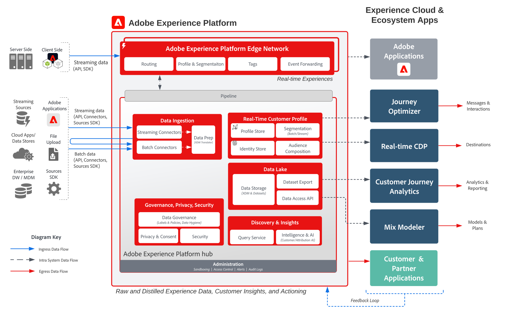

# Adobe Experience Platform和應用程式架構圖

這些架構圖表顯示Experience Platform(AEP)與其他Experience Cloud應用程式和應用程式服務的關聯性。

>[!MORELIKETHIS]
>
>[Experience Cloud應用程式整合的整合設定](https://experienceleague.adobe.com/docs/integrations-learn/experience-cloud/overview.html?lang=en).

## 架構圖

此架構圖顯示 Adobe Experience Platform 如何與 Adobe Experience Cloud 應用程式及應用程式服務連結。

## 概觀圖表

## 詳細的架構圖

>[!VIDEO](https://video.tv.adobe.com/v/32456/?quality=12&learn=on)

## AEP和Experience Cloud應用程式整合

<table class="relative-table wrapped" style="width: 100%;">
<colgroup>
<col style="width: 16.0202%;" />
<col style="width: 29.3423%;" />
<col style="width: 33.5582%;" />
<col style="width: 21.0793%;" />
</colgroup>
<tbody>
<tr>
<th>應用程式</th>
<th>Experience Platform 到應用程式</th>
<th>應用程式到 Experience Platform</th>
<th>相關 Blueprints</th>
</tr>
<tr>
<td colspan="1">Ad Cloud</td>
<td colspan="1">
<ul>
<li>在 Real-time Customer Data Platform 中定義的對象可透過 Audience Manager 共用至 Ad Cloud，以進行目標定位。</li>
</ul>
</td>
<td colspan="1">
<ul>
<li>目前無整合</li>
</ul>
</td>
<td colspan="1">
<ul>
<li><a href="https://experienceleague.adobe.com/docs/blueprints-learn/architecture/audience-activation/anonymous.html?lang=zh-Hant">匿名對象啟用</a></li>
<li><a href="https://experienceleague.adobe.com/docs/blueprints-learn/architecture/audience-activation/known-customer-audience-activation/known.html?lang=zh-Hant">已知客戶啟用</a></li>
<li><a href="https://experienceleague.adobe.com/docs/blueprints-learn/architecture/architecture-overview/platform-applications.html?lang=zh-Hant">使用 Experience Platform 和應用程式啟用</a></li>
</ul>
</td>
</tr>
<tr>
<td>Analytics</td>
<td>
<ul>
<li>透過 Web/Mobile SDK 收集的資料可轉送至 Adobe Analytics。</li>
</ul>
</td>
<td>
<ul>
<li>Analytics 收集的資料可傳送至 Experience Platform 資料湖和個人資料儲存區。 <a href="https://experienceleague.adobe.com/docs/experience-platform/sources/connectors/adobe-applications/analytics.html?lang=zh-Hant">Analytics 資料連接器</a></li>
</ul>
</td>
<td>
<ul>
<li><a href="https://experienceleague.adobe.com/docs/blueprints-learn/architecture/architecture-overview/platform-data-flow.html?lang=zh-Hant">Experience Platform 資料流程</a></li>
</ul>
</td>
</tr>
<tr>
<td>Audience Manager</td>
<td>
<ul>
<li>可以與 Audience Manager 共用在 Real-time Customer Data Platform 中定義的對象，以啟用至第三方 Cookie 目的地。</li>
</ul>
</td>
<td>
<ul>
<li>從 Audience Manager 收集和評估的資料以及對象會籍可以共用至 Experience Platform 資料湖和個人資料儲存區。 <a href="https://experienceleague.adobe.com/docs/experience-platform/sources/connectors/adobe-applications/audience-manager.html?lang=zh-Hant">Audience Manager 來源連接器</a></li>
</ul>
</td>
<td>
<ul>
<li><a href="https://experienceleague.adobe.com/docs/blueprints-learn/architecture/audience-activation/anonymous.html?lang=zh-Hant">匿名對象啟用</a></li>
<li><a href="https://experienceleague.adobe.com/docs/blueprints-learn/architecture/audience-activation/known-customer-audience-activation/known.html?lang=zh-Hant">已知客戶啟用</a></li>
<li><a href="https://experienceleague.adobe.com/docs/blueprints-learn/architecture/audience-activation/platform-and-applications.html?lang=zh-Hant">使用 Experience Platform 和應用程式啟用</a></li>
</ul>
</td>
</tr>
<tr>
<td colspan="1">Campaign Classic</td>
<td colspan="1">
<ul>
<li>在 Real-time Customer Data Platform 中定義的對象可以共用至 Campaign Classic，作為啟動行銷活動的對象。</li>
</ul>
</td>
<td colspan="1">
<ul>
<li>Campaign 所收集的互動和行銷活動資料可作為資料來源擷取至 Experience Platform，以便透過 Real-time Customer Data Platform 進一步用於對象建立，以及透過 Customer Journey Analytics 和 Experience Platform 查詢服務進一步用於分析。</li>
</ul>
</td>
<td colspan="1">
<ul>
<li><a href="https://experienceleague.adobe.com/docs/blueprints-learn/architecture/customer-journeys/overview.html?lang=zh-Hant">客戶歷程</a></li>
</ul>
</td>
</tr>
<tr>
<td colspan="1">Campaign Standard</td>
<td colspan="1">
<ul>
<li>在 Real-time Customer Data Platform 中定義的對象可以共用至 Campaign Standard，作為啟動行銷活動的對象。</li>
</ul>
</td>
<td colspan="1">
<ul>
<li>Campaign 所收集的互動和行銷活動資料可作為資料來源擷取至 Experience Platform，以便透過 Real-time Customer Data Platform 進一步用於對象建立，以及透過 Customer Journey Analytics 和 Experience Platform 查詢服務進一步用於分析。</li>
</ul>
</td>
<td colspan="1">
<ul>
<li><a href="https://experienceleague.adobe.com/docs/blueprints-learn/architecture/customer-journeys/overview.html?lang=zh-Hant">客戶歷程</a></li>
</ul>
</td>
</tr>
<tr>
<td colspan="1">Customer Journey Analytics</td>
<td colspan="1">
<ul>
<li>收集並擷取至 Experience Platform 資料湖的資料可供處理 Customer Journey Analytics。 </li>
<li>可將 Real-time Customer Data Platform 的個人資料和對象資料擷取至 CJA。<a href="https://experienceleague.adobe.com/docs/analytics-platform/using/cja-usecases/data-ingestion/ingest-aep-segments.html?lang=zh-Hant">RTCDP 與 CJA 整合</a>
</li>
</ul>
</ul>
</td>
<td colspan="1">
<ul>
<li>在 Customer Journey Analytics 中建立對象，並將對象結果共用至 Real-time Customer Data Platform。<a href="https://experienceleague.adobe.com/docs/analytics-platform/using/cja-components/audiences/publish.html?lang=zh-Hant">CJA 對象發佈</a></li>
</ul>
</td>
<td colspan="1">
<ul>
<li><a href="https://experienceleague.adobe.com/docs/blueprints-learn/architecture/customer-journey-analytics/overview.html?lang=zh-Hant">Customer Journey Analytics</a></li>
</ul>
</td>
</tr>
<tr>
<td colspan="1">Experience Manager</td>
<td colspan="1">
<ul>
<li>Experience Platform 個人資料可直接在伺服器端存取，以支援透過 Experience Manager 提供的個人化體驗。請注意，個人化活動最常透過 Experience Manager 經由 Target 整合傳送。 </li>
</ul>
</td>
<td colspan="1">
<ul>
<li>不會直接透過 Experience Platform Web 和 Mobile SDK 收集目前在 Experience Manager 網站上執行的整合、行為和互動。</li>
</ul>
</td>
<td colspan="1">
<ul>
<li><a href="https://experienceleague.adobe.com/docs/blueprints-learn/architecture/audience-activation/known-customer-audience-activation/known.html?lang=zh-Hant">已知客戶啟用</a></li>
</ul>
</td>
</tr>
<tr>
<td colspan="1">Journey Optimizer</td>
<td colspan="1">
<ul>
<li>擷取至 Experience Platform 的資料事件和個人資料可供 Journey Optimizer 使用，以發起並支援 Journey Optimizer 中的歷程。</li>
</ul>
</td>
<td colspan="1">
<ul>
<li>Journey Optimizer 所生成的互動和行銷活動資料被收集至 Experience Platform，以便透過 Real-time Customer Data Platform 進一步用於對象建立，以及透過 Customer Journey Analytics、Experience Platform 查詢服務進一步用於分析。</li>
</ul>
</td>
<td colspan="1">
<ul>
<li><a href="https://experienceleague.adobe.com/docs/blueprints-learn/architecture/customer-journeys/journey-optimizer.html?lang=zh-Hant">Journey Optimizer</a></li>
</ul>
</td>
</tr>
<tr>
<td colspan="1">Adobe Commerce</td>
<td colspan="1">
<ul>
<li>Real-time Customer Data Platform 中建置的個人資料和對象可在 Adobe Commerce 中供個人化使用。 </li>
</ul>
</td>
<td colspan="1">
<ul>
<li>Adobe Commerce 原生的資料可透過 Adobe Commerce 來源連接器傳送至 Experience Platform。 </li>
</ul>
</td>
<td colspan="1">目前無整合</td>
</tr>
<tr>
<td colspan="1">Marketo</td>
<td colspan="1">
<ul>
<li>在 Real-time Customer Data Platform 中定義的對象可以共用至 Marketo，作為啟動 Marketo 行銷活動和更新 Marketo 物件的對象。</li>
</ul>
</td>
<td colspan="1">
<ul>
<li>Marketo 帳戶、連絡人和商機資料以及 Marketo 所產生的互動和行銷活動資料，會擷取至 Experience Platform 中，以便透過 B2B-CDP 進一步用於對象構建，以及透過 Customer Journey Analytics、Experience Platform 查詢服務進一步用於分析。 <a href="https://experienceleague.adobe.com/docs/experience-platform/sources/connectors/adobe-applications/marketo/marketo.html?lang=zh-Hant">Marketo Engage 連接器</a></li>
</ul>
</td>
<td colspan="1">
<ul>
<li><a href="https://experienceleague.adobe.com/docs/blueprints-learn/architecture/b2b-activation/b2bactivation.html?lang=zh-Hant">B2B 啟用藍圖</a></li>
</ul>
</td>
</tr>
<tr>
<td colspan="1">Real-Time CDP</td>
<td colspan="1">
<ul>
<li>擷取和收集至 Experience Platform 的資料是匯整即時客戶個人資料的資料來源，這些個人資料為 Real-time Customer Data Platform 提供支援。</li>
</ul>
</td>
<td colspan="1">
<ul>
<li>「對象」和「個人資料」量度指標會傳送至 Experience Platform 資料湖，以支援個人資料深入分析報告控制面板。</li>
<li>資料湖中的「對象」和「個人資料」資料可用於透過查詢服務和 Customer Journey Analytics 進一步進行深入分析。</li>
</ul>
</td>
<td colspan="1">
<ul>
<li><a href="https://experienceleague.adobe.com/docs/blueprints-learn/architecture/audience-activation/known-customer-audience-activation/known.html?lang=zh-Hant">已知客戶啟用</a></li>
<li><a href="https://experienceleague.adobe.com/docs/blueprints-learn/architecture/audience-activation/platform-and-applications.html?lang=zh-Hant">使用 Experience Platform 和應用程式啟用</a></li>
</ul>
</td>
</tr>
<tr>
<td colspan="1">Target</td>
<td colspan="1">
<ul>
<li>在 Real-time Customer Data Platform 中定義的對象和個人資料屬性可共用至 Target，並用於 Target 提供的個人化和目標定位體驗。</li>
</ul>
</td>
<td colspan="1">
<ul>
<li>為 Target 體驗和互動收集的資料可透過 Experience Platform Web/Mobile SDK 收集至 Experience Platform。這些資料可用於透過 Real-time Customer Data Platform 進行對象構建，以及用於透過 Customer Journey Analytics、Experience Platform 查詢服務進行分析。</li>
</ul>
</td>
<td colspan="1">
<ul>
<li><a href="https://experienceleague.adobe.com/docs/blueprints-learn/architecture/audience-activation/known-customer-audience-activation/known.html?lang=zh-Hant">已知客戶啟用</a></li>
<li><a href="https://experienceleague.adobe.com/docs/blueprints-learn/architecture/audience-activation/platform-and-applications.html?lang=zh-Hant">使用 Experience Platform 和應用程式啟用</a></li>
</ul>
</td>
</tr>
</tbody>
</table>