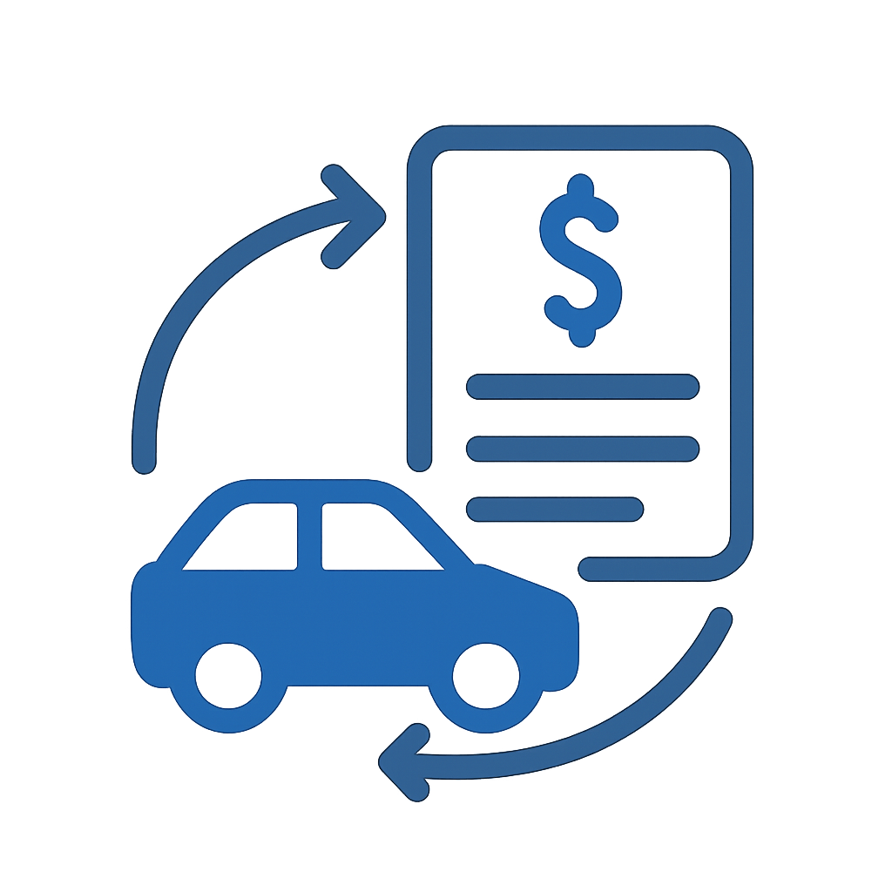
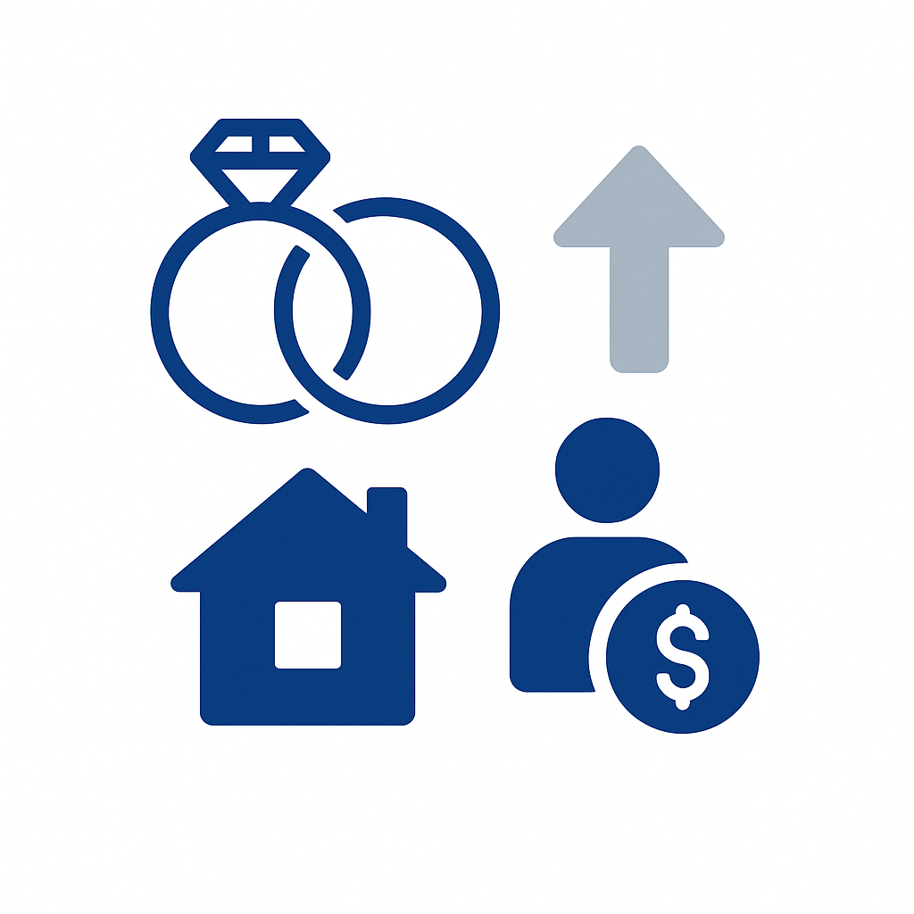
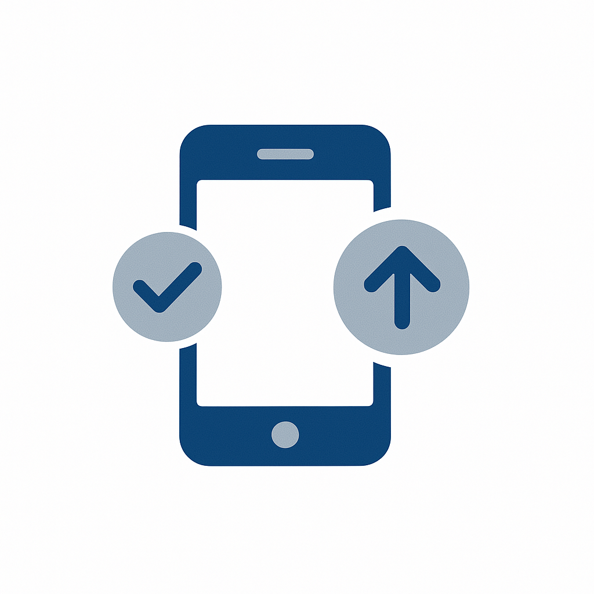

# 使用案例目錄

產業使用案例顯示特定垂直產業的組織如何套用Adobe Experience Platform和應用程式來取得可衡量的業務成果。 每個使用案例都描述具體的業務情境、其預期影響，以及提供詳細實作指引的[使用案例模式](/help/blueprints/use-case-patterns/overview.md)的連結。

依產業瀏覽以尋找與貴組織相關的使用案例，然後遵循實施參考的模式連結，包括決定指引、功能鏈和Experience League檔案。

| 產業 | 主要主題 |
| --- | --- |
| [汽車](automotive/automotive-overview.md) | 車輛購買歷程、服務生命週期、連線車輛體驗、車主忠誠度 |
| [B2B](b2b/b2b-overview.md) | 帳戶式行銷、銷售機會評分、管道加速、客戶擴展 |
| [金融服務](financial-services/financial-services-overview.md) | 產品推薦、流失預防、終生階段優惠、詐騙個人化 |
| [醫療保健](healthcare/healthcare-overview.md) | 預約管理、藥物依從性、患者入門、護理協調 |
| [保險](insurance/insurance-overview.md) | 保單續約、索賠體驗、風險預防、交叉銷售最佳化 |
| [媒體與娛樂](media-entertainment/media-entertainment-overview.md) | 內容推薦、訂閱保留、試用轉換、跨平台參與 |
| [零售業](retail/retail-overview.md) | 產品個人化、購物車回覆、交叉銷售最佳化、忠誠度參與 |
| [電信](telecommunications/telecommunications-overview.md) | 裝置升級、防止流失、計畫最佳化、網路參與 |
| [旅遊業及旅館業](travel-hospitality/travel-hospitality-overview.md) | 預訂個人化、放棄復原、忠誠度方案、季節性行銷活動 |
| [技術](technology/technology-overview.md) | 事件收集、即時資料轉送、分析整合、邊緣部署 |

## 使用案例如何連結至實作指引

每個使用案例都連結到&#x200B;**使用案例模式** — 一種可重複的實作方法，可描述讓使用案例變成現實所需的功能鏈、決策點和設定步驟。 使用案例模式進而與[關鍵業務目標](/help/blueprints/business-objectives/overview.md)連結，協助您將實作工作與策略性結果保持一致。

```
Industry Use Case → Use Case Pattern → Key Business Objective
```

## 依產業瀏覽

>[!BEGINTABS]

>[!TAB 零售業]

| | 使用案例 | 說明 | 成熟度 | 圖樣 |
| --- | --- | --- | --- | --- |
|  | [放棄的購物車電子郵件復原](retail/retail-overview.md#abandoned-cart-email-recovery) | 自動傳送個人化電子郵件提醒給放棄購物車的客戶，包括購物車內容和相關優惠方案。 | [!BADGE 基礎]{type=Neutral} | [事件觸發訊息](/help/blueprints/use-case-patterns/campaign-management-orchestration/event-triggered-messaging.md) |
|  | [詳細目錄型緊急行銷活動](retail/retail-overview.md#inventory-based-urgency-campaigns) | 當產品詳細目錄不足時觸發即時警報和行銷活動，產生緊迫感並鼓勵立即購買。 | [!BADGE 基礎]{type=Neutral} | [事件觸發訊息](/help/blueprints/use-case-patterns/campaign-management-orchestration/event-triggered-messaging.md) |
|  | [價格下降警示](retail/retail-overview.md#price-drop-alerts) | 當客戶願望清單中的產品或先前檢視的專案降價時，透過電子郵件或推播通知客戶。 | [!BADGE 基礎]{type=Neutral} | [事件觸發訊息](/help/blueprints/use-case-patterns/campaign-management-orchestration/event-triggered-messaging.md) |
| | [無庫存通知](retail/retail-overview.md#out-of-stock-notifications) | 允許客戶在缺貨的產品上市時註冊通知，然後透過電子郵件或簡訊自動通知他們。 | [!BADGE 基礎]{type=Neutral} | [事件觸發訊息](/help/blueprints/use-case-patterns/campaign-management-orchestration/event-triggered-messaging.md) |
|  | [個人化產品推薦](retail/retail-overview.md#personalized-product-recommendations) | 根據瀏覽歷史記錄、購買歷史記錄和類似的客戶行為，在首頁、類別頁面和產品詳細資料頁面上顯示個人化產品推薦。 | [!BADGE 新增]{type=Informative} | [行為建議](/help/blueprints/use-case-patterns/personalization/behavioral-recommendation.md) |
|  | [個人化類別頁面](retail/retail-overview.md#personalized-category-pages) | 動態個人化類別頁面，以首先根據客戶偏好、過去的購買和瀏覽行為顯示最相關的產品。 | [!BADGE 新增]{type=Informative} | [行為建議](/help/blueprints/use-case-patterns/personalization/behavioral-recommendation.md) |
|  | [新客戶歡迎系列](retail/retail-overview.md#new-customer-welcome-series) | 透過個人化的產品推薦、品牌故事和特殊優惠方案，為新客戶自動提供多封電子郵件歡迎系列。 | [!BADGE 新增]{type=Informative} | [多步驟協調歷程](/help/blueprints/use-case-patterns/campaign-management-orchestration/multi-step-orchestrated-journey.md) |
|  | [補充提醒](retail/retail-overview.md#replenishment-reminders) | 傳送定期購買產品的自動提醒給客戶（訂閱專案、消耗品），以鼓勵客戶重複購買。 | [!BADGE 新增]{type=Informative} | [多步驟協調歷程](/help/blueprints/use-case-patterns/campaign-management-orchestration/multi-step-orchestrated-journey.md) |
|  | [購買後後續行銷活動](retail/retail-overview.md#post-purchase-follow-up-campaigns) | 傳送購買後電子郵件，內含產品服務秘訣、相關產品、檢閱要求和忠誠計畫資訊。 | [!BADGE 新增]{type=Informative} | [多步驟協調歷程](/help/blueprints/use-case-patterns/campaign-management-orchestration/multi-step-orchestrated-journey.md) |
| | [社交校訂Personalization](retail/retail-overview.md#social-proof-personalization) | 根據客戶個人資料和偏好設定顯示個人化的社交證明。 | [!BADGE 新增]{type=Informative} | [已知訪客網頁/應用程式Personalization](/help/blueprints/use-case-patterns/personalization/known-visitor-web-app-personalization.md) |
|  | [交叉銷售和追加銷售建議](retail/retail-overview.md#cross-sell-and-upsell-recommendations) | 根據購買模式和產品關係，在結帳、電子郵件和產品頁面上顯示相關的交叉銷售和追加銷售產品。 | [!BADGE 進階]{type=Caution} | [Offer Decisioning](/help/blueprints/use-case-patterns/personalization/offer-decisioning.md) |
| | [VIP客戶專屬優惠方案](retail/retail-overview.md#vip-customer-exclusive-offers) | 識別高價值客戶，並提供專屬選件、搶先體驗銷售機會和個人化的購物體驗。 | [!BADGE 進階]{type=Caution} | [具有決策的跨頻道歷程](/help/blueprints/use-case-patterns/campaign-management-orchestration/cross-channel-journey-with-decisioning.md) |
| | [AI產品顧問](retail/retail-overview.md#ai-product-advisor) | 部署對話式AI顧問，引導購物者使用自然對話方塊、即時詳細目錄和個人化設定檔資料進行產品探索。 | [!BADGE 進階]{type=Caution} | [Brand Concierge對話體驗](/help/blueprints/use-case-patterns/conversational-experience/brand-concierge-conversational-experience.md) |
| | [跨管道歸因分析](retail/retail-overview.md#cross-channel-attribution-analysis) | 使用多重接觸歸因模型，測量電子郵件、付費和店內接觸點對購買轉換的貢獻度。 | [!BADGE 新增]{type=Informative} | [Customer Analytics與Insight世代](/help/blueprints/use-case-patterns/analysis/customer-analytics-insight-generation.md) |
| | [付費媒體的對象細分與啟用](retail/retail-overview.md#audience-segmentation--activation-for-paid-media) | 從統一的客戶設定檔建立高價值的受眾區段，並在付費媒體目的地（例如Google Ads、Meta和The Trade Desk）間啟用這些區段，以進行贏取和重新定位行銷活動。 | [!BADGE 新增]{type=Informative} | [Audience Activation到目的地](/help/blueprints/use-case-patterns/audience-building-activation/audience-activation-to-destinations.md) |
| | [贏取行銷活動的客戶隱藏](retail/retail-overview.md#customer-suppression-for-acquisition-campaigns) | 啟用付費媒體目的地的排除對象，藉此抑制現有客戶和最近轉換的客戶在贏取廣告上的支出，進而減少浪費的支出。 | [!BADGE 基礎]{type=Neutral} | [Audience Activation到目的地](/help/blueprints/use-case-patterns/audience-building-activation/audience-activation-to-destinations.md) |
| | [已知訪客的個人化Web體驗](retail/retail-overview.md#personalized-web-experiences-for-known-visitors) | 根據已驗證身分的網站訪客的即時設定檔、區段會籍和行為記錄，提供個人化的主圖橫幅、產品推薦和促銷內容。 | [!BADGE 進階]{type=Caution} | [已知訪客網頁/應用程式Personalization](/help/blueprints/use-case-patterns/personalization/known-visitor-web-app-personalization.md) |
| | [匿名訪客網頁Personalization](retail/retail-overview.md#anonymous-visitor-web-personalization) | 使用工作階段中的行為訊號（例如已檢視的頁面、已瀏覽的產品類別和反向連結來源），為未識別的網站訪客個人化內容。 | [!BADGE 新增]{type=Informative} | [匿名訪客網頁Personalization](/help/blueprints/use-case-patterns/personalization/anonymous-visitor-web-personalization.md) |
|  | [歡迎系列歷程](retail/retail-overview.md#welcome-series-journey) | 為新註冊客戶策劃多步驟歡迎歷程，跨電子郵件和推播頻道提供上線內容、產品教育和首次購買獎勵。 | [!BADGE 新增]{type=Informative} | [多步驟協調歷程](/help/blueprints/use-case-patterns/campaign-management-orchestration/multi-step-orchestrated-journey.md) |
|  | [購物車放棄復原](retail/retail-overview.md#cart-abandonment-recovery) | 客戶放棄購物車時，觸發即時電子郵件和推播通知，並提供個人化的產品提醒和完成購買的時間限制獎勵。 | [!BADGE 新增]{type=Informative} | [事件觸發訊息](/help/blueprints/use-case-patterns/campaign-management-orchestration/event-triggered-messaging.md) |
|  | [購買後參與歷程](retail/retail-overview.md#post-purchase-engagement-journey) | 透過精心安排的多步驟歷程，提供購買後通訊，包括訂單確認、送貨更新、交叉銷售建議及檢閱請求。 | [!BADGE 新增]{type=Informative} | [多步驟協調歷程](/help/blueprints/use-case-patterns/campaign-management-orchestration/multi-step-orchestrated-journey.md) |
| | [忠誠度等級升級行銷活動](retail/retail-overview.md#loyalty-tier-upgrade-campaign) | 識別接近忠誠度等級閾值的客戶，並提供目標式行銷活動，鼓勵他們根據購買記錄和偏好使用個人化優惠方案來達到下一個等級。 | [!BADGE 進階]{type=Caution} | [多步驟協調歷程](/help/blueprints/use-case-patterns/campaign-management-orchestration/multi-step-orchestrated-journey.md) |
| | [跨頻道行銷活動策劃](retail/retail-overview.md#cross-channel-campaign-orchestration) | 透過歷程分支、等待步驟和頻率上限，跨電子郵件、簡訊、推播和網路頻道協調行銷活動，以最大限度地提高參與度而不會疲勞。 | [!BADGE 進階]{type=Caution} | [具有決策的跨頻道歷程](/help/blueprints/use-case-patterns/campaign-management-orchestration/cross-channel-journey-with-decisioning.md) |
| | [Brand Concierge對話體驗](retail/retail-overview.md#brand-concierge-conversational-experience) | 在數位屬性間部署AI支援的品牌安全交談代理程式，以提供個人化產品指引、網站導覽說明，以及順暢地將工作交接給即時代理程式。 | [!BADGE 進階]{type=Caution} | [Brand Concierge對話體驗](/help/blueprints/use-case-patterns/conversational-experience/brand-concierge-conversational-experience.md) |

>[!TAB 汽車]

| | 使用案例 | 說明 | 成熟度 | 圖樣 |
| --- | --- | --- | --- | --- |
|  | [服務約會提醒](automotive/automotive-overview.md#service-appointment-reminders) | 根據車輛里程數、服務歷史記錄和客戶偏好設定，傳送個人化服務預約提醒。 | [!BADGE 基礎]{type=Neutral} | [事件觸發訊息](/help/blueprints/use-case-patterns/campaign-management-orchestration/event-triggered-messaging.md) |
|  | [車輛召回通知](automotive/automotive-overview.md#vehicle-recall-notifications) | 根據客戶車輛和位置，傳送包含服務排程選項和安全資訊的個人化召回通知。 | [!BADGE 基礎]{type=Neutral} | [事件觸發訊息](/help/blueprints/use-case-patterns/campaign-management-orchestration/event-triggered-messaging.md) |
|  | [測試磁碟機排程](automotive/automotive-overview.md#test-drive-scheduling) | 根據客戶偏好和位置，透過經銷商推薦和車輛可用性啟用個人化測試驅動程式排程。 | [!BADGE 基礎]{type=Neutral} | [事件觸發訊息](/help/blueprints/use-case-patterns/campaign-management-orchestration/event-triggered-messaging.md) |
|  | [新模型啟動促銷活動](automotive/automotive-overview.md#new-model-launch-campaigns) | 根據目前的車輛、偏好和購買記錄，鎖定可能對新模型啟動感興趣的客戶。 | [!BADGE 基礎]{type=Neutral} | [批次傳出訊息啟用](/help/blueprints/use-case-patterns/campaign-management-orchestration/batch-outbound-message-activation.md) |
|  | [折價促銷活動](automotive/automotive-overview.md#trade-in-value-campaigns) | 主動為準備好升級車輛的客戶提供以舊換新價值評估和行銷活動。 | [!BADGE 新增]{type=Informative} | [多步驟協調歷程](/help/blueprints/use-case-patterns/campaign-management-orchestration/multi-step-orchestrated-journey.md) |
|  | [零件與配件建議](automotive/automotive-overview.md#parts-and-accessories-recommendations) | 根據車輛型號、擁有時間及客戶喜好設定，建議相關零件、配件及升級。 | [!BADGE 新增]{type=Informative} | [行為建議](/help/blueprints/use-case-patterns/personalization/behavioral-recommendation.md) |
|  | [保固與延長服務計畫](automotive/automotive-overview.md#warranty-and-extended-service-plans) | 根據車輛使用年限、里程和客戶購買模式，在最佳時間建議保固和延長服務計畫。 | [!BADGE 新增]{type=Informative} | [多步驟協調歷程](/help/blueprints/use-case-patterns/campaign-management-orchestration/multi-step-orchestrated-journey.md) |
|  | [連線汽車功能啟用](automotive/automotive-overview.md#connected-car-feature-activation) | 根據車輛功能及客戶技術偏好設定，個人化連線車輛功能推薦和啟動行銷活動。 | [!BADGE 新增]{type=Informative} | [多步驟協調歷程](/help/blueprints/use-case-patterns/campaign-management-orchestration/multi-step-orchestrated-journey.md) |
|  | [經銷商網路協調](automotive/automotive-overview.md#dealer-network-coordination) | 根據客戶地點、偏好和經銷商詳細目錄，啟用個人化的經銷商推薦和協調。 | [!BADGE 新增]{type=Informative} | [已知訪客網頁/應用程式Personalization](/help/blueprints/use-case-patterns/personalization/known-visitor-web-app-personalization.md) |
|  | [車輛購買歷程Personalization](automotive/automotive-overview.md#vehicle-purchase-journey-personalization) | 使用相關的車輛建議、融資選項和經銷商資訊，個人化從研究到購買的車輛購買歷程。 | [!BADGE 進階]{type=Caution} | [具有決策的跨頻道歷程](/help/blueprints/use-case-patterns/campaign-management-orchestration/cross-channel-journey-with-decisioning.md) |
|  | [財務與保險優惠方案](automotive/automotive-overview.md#financing-and-insurance-offers) | 根據客戶信用設定檔、車輛選擇和購買時間表，展示個人化的融資和保險優惠方案。 | [!BADGE 進階]{type=Caution} | [Offer Decisioning](/help/blueprints/use-case-patterns/personalization/offer-decisioning.md) |
|  | [所有者忠誠度方案](automotive/automotive-overview.md#owner-loyalty-programs) | 根據擁有權記錄和忠誠度等級，個人化擁有者忠誠度方案通訊、獎勵和專屬優惠。 | [!BADGE 進階]{type=Caution} | [具有決策的跨頻道歷程](/help/blueprints/use-case-patterns/campaign-management-orchestration/cross-channel-journey-with-decisioning.md) |

>[!TAB 金融服務]

| | 使用案例 | 說明 | 成熟度 | 圖樣 |
| --- | --- | --- | --- | --- |
| | [交易式警示與建議](financial-services/financial-services-overview.md#transaction-based-alerts-and-recommendations) | 傳送交易的即時警報，並根據支出模式和帳戶活動提供個人化建議。 | [!BADGE 基礎]{type=Neutral} | [事件觸發訊息](/help/blueprints/use-case-patterns/campaign-management-orchestration/event-triggered-messaging.md) |
| | [信用卡應用程式放棄復原](financial-services/financial-services-overview.md#credit-card-application-abandonment-recovery) | 識別已開始但未完成信用卡應用程式的客戶，並透過個人化訊息和優惠重新與他們互動。 | [!BADGE 基礎]{type=Neutral} | [事件觸發訊息](/help/blueprints/use-case-patterns/campaign-management-orchestration/event-triggered-messaging.md) |
| | [詐騙警示Personalization](financial-services/financial-services-overview.md#fraud-alert-personalization) | 根據客戶通訊偏好設定和過去的互動記錄，個人化詐騙警示和安全性通訊。 | [!BADGE 基礎]{type=Neutral} | [事件觸發訊息](/help/blueprints/use-case-patterns/campaign-management-orchestration/event-triggered-messaging.md) |
|  | [高價值銷售機會培養](financial-services/financial-services-overview.md#high-value-lead-nurturing) | 根據設定檔資料和行為識別高價值潛在客戶，然後透過自動化歷程提供個人化內容和優惠方案，培植他們。 | [!BADGE 新增]{type=Informative} | [多步驟協調歷程](/help/blueprints/use-case-patterns/campaign-management-orchestration/multi-step-orchestrated-journey.md) |
|  | [個人化帳戶儀表板](financial-services/financial-services-overview.md#personalized-account-dashboard) | 根據客戶帳戶活動、偏好設定和財務目標，個人化線上銀行儀表板和行動應用程式體驗。 | [!BADGE 新增]{type=Informative} | [已知訪客網頁/應用程式Personalization](/help/blueprints/use-case-patterns/personalization/known-visitor-web-app-personalization.md) |
| | [投資Portfolio建議](financial-services/financial-services-overview.md#investment-portfolio-recommendations) | 根據客戶風險設定檔、投資記錄和財務目標，提供個人化的投資建議。 | [!BADGE 新增]{type=Informative} | [行為建議](/help/blueprints/use-case-patterns/personalization/behavioral-recommendation.md) |
| | [抵押貸款預先核准行銷活動](financial-services/financial-services-overview.md#mortgage-pre-approval-campaigns) | 根據設定檔資料、行為和生活階段指標，鎖定可能進入抵押貸款市場的客戶。 | [!BADGE 新增]{type=Informative} | [多步驟協調歷程](/help/blueprints/use-case-patterns/campaign-management-orchestration/multi-step-orchestrated-journey.md) |
|  | [現有客戶的產品推薦](financial-services/financial-services-overview.md#product-recommendation-for-existing-customers) | 根據現有客戶的設定檔、交易歷史記錄和生命週期階段，向其建議相關金融產品。 | [!BADGE 進階]{type=Caution} | [Offer Decisioning](/help/blueprints/use-case-patterns/personalization/offer-decisioning.md) |
|  | [預防流失行銷活動](financial-services/financial-services-overview.md#churn-prevention-campaigns) | 使用AI支援的預測來識別有流失風險的客戶，並透過保留優惠和個人化通訊與他們互動。 | [!BADGE 進階]{type=Caution} | [具有決策的跨頻道歷程](/help/blueprints/use-case-patterns/campaign-management-orchestration/cross-channel-journey-with-decisioning.md) |
|  | [終生階段式產品優惠方案](financial-services/financial-services-overview.md#life-stage-based-product-offers) | 識別進入新生命階段的客戶，並主動提供相關的金融產品和服務。 | [!BADGE 進階]{type=Caution} | [具有決策的跨頻道歷程](/help/blueprints/use-case-patterns/campaign-management-orchestration/cross-channel-journey-with-decisioning.md) |
| | [熟客方案參與度](financial-services/financial-services-overview.md#loyalty-program-engagement) | 根據客戶層級、點數平衡和贖回記錄，個人化忠誠計畫通訊、獎勵和優惠。 | [!BADGE 進階]{type=Caution} | [具有決策的跨頻道歷程](/help/blueprints/use-case-patterns/campaign-management-orchestration/cross-channel-journey-with-decisioning.md) |
| | [個人化的財務教育內容](financial-services/financial-services-overview.md#personalized-financial-education-content) | 根據客戶財務檔案、目標和興趣，提供個人化的財務教育內容、提示和資源。 | [!BADGE 進階]{type=Caution} | [具有決策的跨頻道歷程](/help/blueprints/use-case-patterns/campaign-management-orchestration/cross-channel-journey-with-decisioning.md) |
| | [AI金融產品指南](financial-services/financial-services-overview.md#ai-financial-product-guide) | 協助客戶瞭解金融產品，並透過以合規性審查內容和即時設定檔資料為基礎的對話式AI來導覽帳戶選項。 | [!BADGE 進階]{type=Caution} | [Brand Concierge對話體驗](/help/blueprints/use-case-patterns/conversational-experience/brand-concierge-conversational-experience.md) |
| | [產品採用Funnel和流失驅動程式分析](financial-services/financial-services-overview.md#product-adoption-funnel-and-churn-driver-analysis) | 識別客戶在上線流程中的流失位置，以及哪些行為可以預測產品損耗。 | [!BADGE 新增]{type=Informative} | [Customer Analytics與Insight世代](/help/blueprints/use-case-patterns/analysis/customer-analytics-insight-generation.md) |
|  | [次佳Offer Decisioning](financial-services/financial-services-overview.md#next-best-offer-decisioning) | 使用集中式決策邏輯，針對各個管道的每個客戶選取最相關的優惠方案，並結合適用性規則、業務限制和AI支援的排名策略。 | [!BADGE 進階]{type=Caution} | [Offer Decisioning](/help/blueprints/use-case-patterns/personalization/offer-decisioning.md) |
| | [Customer Journey Analytics儀表板](financial-services/financial-services-overview.md#customer-journey-analytics-dashboard) | 建立結合網頁、應用程式、電子郵件和客服中心資料的跨管道分析工作區，以視覺化客戶歷程、識別流失點及評估促銷活動歸因。 | [!BADGE 新增]{type=Informative} | [Customer Analytics與Insight世代](/help/blueprints/use-case-patterns/analysis/customer-analytics-insight-generation.md) |

>[!TAB 醫療保健]

| | 使用案例 | 說明 | 成熟度 | 圖樣 |
| --- | --- | --- | --- | --- |
|  | [約會提醒自動化](healthcare/healthcare-overview.md#appointment-reminder-automation) | 根據患者偏好和約會型別，透過電子郵件、簡訊和推播通知傳送個人化約會提醒。 | [!BADGE 基礎]{type=Neutral} | [事件觸發訊息](/help/blueprints/use-case-patterns/campaign-management-orchestration/event-triggered-messaging.md) |
|  | [造訪後後續追蹤行銷活動](healthcare/healthcare-overview.md#post-visit-follow-up-campaigns) | 根據造訪型別和患者需求，自動傳送造訪後調查、護理指示和後續預約提醒。 | [!BADGE 基礎]{type=Neutral} | [事件觸發訊息](/help/blueprints/use-case-patterns/campaign-management-orchestration/event-triggered-messaging.md) |
| | [實驗室結果通知](healthcare/healthcare-overview.md#lab-results-notification) | 當實驗室結果透過患者偏好的通訊通道提供個人化訊息時，通知患者。 | [!BADGE 基礎]{type=Neutral} | [事件觸發訊息](/help/blueprints/use-case-patterns/campaign-management-orchestration/event-triggered-messaging.md) |
| | [保險範圍驗證](healthcare/healthcare-overview.md#insurance-coverage-verification) | 在預約之前主動確認並傳達保險範圍資訊給患者，以減少帳單問題並改善患者體驗。 | [!BADGE 基礎]{type=Neutral} | [事件觸發訊息](/help/blueprints/use-case-patterns/campaign-management-orchestration/event-triggered-messaging.md) |
| | [電話健康約會提醒](healthcare/healthcare-overview.md#telehealth-appointment-reminders) | 傳送連線指示、準備提示和技術支援資訊的個人化電話健康預約提醒。 | [!BADGE 基礎]{type=Neutral} | [事件觸發訊息](/help/blueprints/use-case-patterns/campaign-management-orchestration/event-triggered-messaging.md) |
|  | [預防性照護提醒](healthcare/healthcare-overview.md#preventive-care-reminders) | 根據患者的年齡、病史和風險因素，主動提醒他們建議哪些預防性護理。 | [!BADGE 基礎]{type=Neutral} | [批次傳出訊息啟用](/help/blueprints/use-case-patterns/campaign-management-orchestration/batch-outbound-message-activation.md) |
|  | [藥物遵守行銷活動](healthcare/healthcare-overview.md#medication-adherence-campaigns) | 傳送個人化提醒與教育內容，協助病人遵守藥物治療時程表和治療計畫。 | [!BADGE 新增]{type=Informative} | [多步驟協調歷程](/help/blueprints/use-case-patterns/campaign-management-orchestration/multi-step-orchestrated-journey.md) |
| | [慢性病管理方案](healthcare/healthcare-overview.md#chronic-disease-management-programs) | 根據患者狀況和治療計畫，個人化慢性疾病管理通訊、教育內容和監控提醒。 | [!BADGE 新增]{type=Informative} | [多步驟協調歷程](/help/blueprints/use-case-patterns/campaign-management-orchestration/multi-step-orchestrated-journey.md) |
| | [新病人上線歷程](healthcare/healthcare-overview.md#new-patient-onboarding-journey) | 使用歡迎資訊、入口網站存取指示和預約排程指南，為新患者自動化多步驟上線歷程。 | [!BADGE 新增]{type=Informative} | [多步驟協調歷程](/help/blueprints/use-case-patterns/campaign-management-orchestration/multi-step-orchestrated-journey.md) |
| | [健康方案參與](healthcare/healthcare-overview.md#wellness-program-engagement) | 根據患者的健康目標、活動水準和偏好，個人化健康計畫溝通、挑戰和獎勵。 | [!BADGE 新增]{type=Informative} | [多步驟協調歷程](/help/blueprints/use-case-patterns/campaign-management-orchestration/multi-step-orchestrated-journey.md) |
| | [服務團隊協調](healthcare/healthcare-overview.md#care-team-coordination) | 根據護理計畫和偏好，實現患者與其護理團隊成員之間的個人化溝通和協調。 | [!BADGE 新增]{type=Informative} | [多步驟協調歷程](/help/blueprints/use-case-patterns/campaign-management-orchestration/multi-step-orchestrated-journey.md) |
| | [個人化健康內容傳遞](healthcare/healthcare-overview.md#personalized-health-content-delivery) | 根據患者條件、興趣和健康目標，提供個人化的健康教育內容、健康提示和資源。 | [!BADGE 進階]{type=Caution} | [具有決策的跨頻道歷程](/help/blueprints/use-case-patterns/campaign-management-orchestration/cross-channel-journey-with-decisioning.md) |
| | [病患歷程Funnel和護理差距分析](healthcare/healthcare-overview.md#patient-journey-funnel-and-care-gap-analysis) | 確定患者從哪裡脫離護理路徑，以及哪些成員人口在推薦的護理中存在差距。 | [!BADGE 新增]{type=Informative} | [Customer Analytics與Insight世代](/help/blueprints/use-case-patterns/analysis/customer-analytics-insight-generation.md) |
| | [病人入口網站內容Personalization](healthcare/healthcare-overview.md#patient-portal-content-personalization) | 根據工作階段瀏覽行為和參與歷史記錄，個人化患者入口網站體驗 | [!BADGE 新增]{type=Informative} | [行為建議](/help/blueprints/use-case-patterns/personalization/behavioral-recommendation.md) |
| | [病人參與和預約提醒](healthcare/healthcare-overview.md#patient-engagement--appointment-reminders) | 透過符合規定、可感知同意的多管道歷程，傳送個人化約會提醒、健康提示，以及後續照護通訊。 | [!BADGE 新增]{type=Informative} | [事件觸發訊息](/help/blueprints/use-case-patterns/campaign-management-orchestration/event-triggered-messaging.md) |

>[!TAB 保險]

| | 使用案例 | 說明 | 成熟度 | 圖樣 |
| --- | --- | --- | --- | --- |
|  | [原則更新行銷活動](insurance/insurance-overview.md#policy-renewal-campaigns) | 根據客戶原則記錄、宣告和偏好設定，傳送個人化原則更新提醒和優惠方案。 | [!BADGE 基礎]{type=Neutral} | [多步驟協調歷程](/help/blueprints/use-case-patterns/campaign-management-orchestration/multi-step-orchestrated-journey.md) |
| | [原則變更通知](insurance/insurance-overview.md#policy-change-notifications) | 根據客戶政策和偏好設定，傳送有關政策變更、更新和新的涵蓋範圍選項的個人化通知。 | [!BADGE 基礎]{type=Neutral} | [事件觸發訊息](/help/blueprints/use-case-patterns/campaign-management-orchestration/event-triggered-messaging.md) |
| | [報價放棄復原](insurance/insurance-overview.md#quote-abandonment-recovery) | 透過個人化的後續追蹤和優惠方案，重新吸引已開始但未完成保險報價的客戶。 | [!BADGE 基礎]{type=Neutral} | [事件觸發訊息](/help/blueprints/use-case-patterns/campaign-management-orchestration/event-triggered-messaging.md) |
| | [防止宣告詐騙](insurance/insurance-overview.md#claims-fraud-prevention) | 使用AI支援的詐騙偵測，識別可疑的索賠，並個人化調查通訊，同時維護客戶信任。 | [!BADGE 基礎]{type=Neutral} | [事件觸發訊息](/help/blueprints/use-case-patterns/campaign-management-orchestration/event-triggered-messaging.md) |
| | [災難性事件回應](insurance/insurance-overview.md#catastrophic-event-response) | 利用個人化的支援和索賠資訊，在自然災害或災難性事件期間主動與受影響地區的客戶溝通。 | [!BADGE 基礎]{type=Neutral} | [事件觸發訊息](/help/blueprints/use-case-patterns/campaign-management-orchestration/event-triggered-messaging.md) |
| | [代理程式與代理人協調](insurance/insurance-overview.md#agent-and-broker-coordination) | 根據政策需求和偏好，實現客戶與其代理商/經紀人之間的個人化溝通和協調。 | [!BADGE 基礎]{type=Neutral} | [批次傳出訊息啟用](/help/blueprints/use-case-patterns/campaign-management-orchestration/batch-outbound-message-activation.md) |
|  | [宣告程式Personalization](insurance/insurance-overview.md#claims-process-personalization) | 根據索賠型別、客戶偏好設定和索賠歷史記錄，個人化索賠處理通訊、更新和支援。 | [!BADGE 新增]{type=Informative} | [多步驟協調歷程](/help/blueprints/use-case-patterns/campaign-management-orchestration/multi-step-orchestrated-journey.md) |
| | [風險評估與預防](insurance/insurance-overview.md#risk-assessment-and-prevention) | 根據客戶政策型別、地點和風險因素，提供個人化的風險評估資訊和防範提示。 | [!BADGE 新增]{type=Informative} | [多步驟協調歷程](/help/blueprints/use-case-patterns/campaign-management-orchestration/multi-step-orchestrated-journey.md) |
| | [健康與預防方案](insurance/insurance-overview.md#wellness-and-prevention-programs) | 根據參與度和目標，為健康/人壽保險客戶提供個人化的健康計畫通訊和獎勵。 | [!BADGE 新增]{type=Informative} | [多步驟協調歷程](/help/blueprints/use-case-patterns/campaign-management-orchestration/multi-step-orchestrated-journey.md) |
|  | [交叉銷售產品建議](insurance/insurance-overview.md#cross-sell-product-recommendations) | 根據客戶現有保單、壽險階段和風險設定檔，建議其他保險產品。 | [!BADGE 進階]{type=Caution} | [Offer Decisioning](/help/blueprints/use-case-patterns/personalization/offer-decisioning.md) |
|  | [終生階段式產品優惠方案](insurance/insurance-overview.md#life-stage-based-product-offers) | 識別進入新生命階段的客戶，並主動提供相關的金融產品和服務。 | [!BADGE 進階]{type=Caution} | [具有決策的跨頻道歷程](/help/blueprints/use-case-patterns/campaign-management-orchestration/cross-channel-journey-with-decisioning.md) |
| | [折扣與節省機會](insurance/insurance-overview.md#discount-and-savings-opportunities) | 根據客戶設定檔和行為，識別並傳達個人化折扣機會。 | [!BADGE 進階]{type=Caution} | [Offer Decisioning](/help/blueprints/use-case-patterns/personalization/offer-decisioning.md) |
| | [保單持有人入口網站內容Personalization](insurance/insurance-overview.md#policyholder-portal-content-personalization) | 根據行為和原則組合，個人化已驗證的入口網站和應用程式體驗 | [!BADGE 新增]{type=Informative} | [行為建議](/help/blueprints/use-case-patterns/personalization/behavioral-recommendation.md) |

>[!TAB 媒體與娛樂]

| | 使用案例 | 說明 | 成熟度 | 圖樣 |
| --- | --- | --- | --- | --- |
|  | [新內容發行通知](media-entertainment/media-entertainment-overview.md#new-content-release-notifications) | 通知訂閱者新內容發行符合其偏好設定和檢視歷程記錄。 | [!BADGE 基礎]{type=Neutral} | [事件觸發訊息](/help/blueprints/use-case-patterns/campaign-management-orchestration/event-triggered-messaging.md) |
| | [監看清單與我的最愛提醒](media-entertainment/media-entertainment-overview.md#watchlist-and-favorites-reminders) | 傳送提醒給使用者，提醒他們關注清單中的內容或他們尚未觀看的最愛。 | [!BADGE 基礎]{type=Neutral} | [事件觸發訊息](/help/blueprints/use-case-patterns/campaign-management-orchestration/event-triggered-messaging.md) |
| | [即時活動檢視提醒](media-entertainment/media-entertainment-overview.md#live-event-viewing-reminders) | 通知使用者即將推出的即時活動、運動會或符合其興趣和檢視歷程的預告片。 | [!BADGE 基礎]{type=Neutral} | [事件觸發訊息](/help/blueprints/use-case-patterns/campaign-management-orchestration/event-triggered-messaging.md) |
| | [內容完成行銷活動](media-entertainment/media-entertainment-overview.md#content-completion-campaigns) | 提醒使用者完成觀看或聆聽他們已開始但未完成的內容。 | [!BADGE 基礎]{type=Neutral} | [事件觸發訊息](/help/blueprints/use-case-patterns/campaign-management-orchestration/event-triggered-messaging.md) |
|  | [內容推薦引擎](media-entertainment/media-entertainment-overview.md#content-recommendation-engine) | 使用行為訊號和選擇策略產生個人化內容建議，並透過網頁、電子郵件和應用程式內頻道傳送。 | [!BADGE 新增]{type=Informative} | [行為建議](/help/blueprints/use-case-patterns/personalization/behavioral-recommendation.md) |
| | [個人化首頁體驗](media-entertainment/media-entertainment-overview.md#personalized-homepage-experience) | 動態個人化首頁和內容探索頁面，以首先根據使用者個人資料和行為顯示最相關的內容。 | [!BADGE 新增]{type=Informative} | [行為建議](/help/blueprints/use-case-patterns/personalization/behavioral-recommendation.md) |
| | [個人化播放清單產生](media-entertainment/media-entertainment-overview.md#personalized-playlist-generation) | 根據使用者聆聽記錄、偏好設定和情緒指標，自動產生和更新個人化播放清單。 | [!BADGE 新增]{type=Informative} | [行為建議](/help/blueprints/use-case-patterns/personalization/behavioral-recommendation.md) |
| | [免費試用轉換行銷活動](media-entertainment/media-entertainment-overview.md#free-trial-conversion-campaigns) | 透過個人化內容建議和優惠方案與免費試用使用者互動，以鼓勵在試用結束前轉換訂閱。 | [!BADGE 新增]{type=Informative} | [多步驟協調歷程](/help/blueprints/use-case-patterns/campaign-management-orchestration/multi-step-orchestrated-journey.md) |
| | [跨平台內容同步](media-entertainment/media-entertainment-overview.md#cross-platform-content-sync) | 透過即時同步觀看記錄、偏好設定和推薦，提供跨裝置的順暢內容體驗。 | [!BADGE 新增]{type=Informative} | [已知訪客網頁/應用程式Personalization](/help/blueprints/use-case-patterns/personalization/known-visitor-web-app-personalization.md) |
| | [社交分享Personalization](media-entertainment/media-entertainment-overview.md#social-sharing-personalization) | 根據使用者社交連線和內容偏好設定，個人化社交分享提示和建議。 | [!BADGE 新增]{type=Informative} | [已知訪客網頁/應用程式Personalization](/help/blueprints/use-case-patterns/personalization/known-visitor-web-app-personalization.md) |
|  | [防止訂閱流失](media-entertainment/media-entertainment-overview.md#subscription-churn-prevention) | 識別有取消風險的訂閱者，並透過個人化內容建議、優惠方案和保留行銷活動與他們互動。 | [!BADGE 進階]{type=Caution} | [具有決策的跨頻道歷程](/help/blueprints/use-case-patterns/campaign-management-orchestration/cross-channel-journey-with-decisioning.md) |
| | [進階功能追加銷售](media-entertainment/media-entertainment-overview.md#premium-feature-upsell) | 識別將從高階功能中受益的使用者，並根據其使用模式提供個人化的追加銷售優惠。 | [!BADGE 進階]{type=Caution} | [Offer Decisioning](/help/blueprints/use-case-patterns/personalization/offer-decisioning.md) |
| | [訂閱者流失驅動程式與內容參與分析](media-entertainment/media-entertainment-overview.md#subscriber-churn-driver-and-content-engagement-analysis) | 識別訂閱者取消前的內容參與模式，並透過內容型別和同類群組來測量保留影響。 | [!BADGE 新增]{type=Informative} | [Customer Analytics與Insight世代](/help/blueprints/use-case-patterns/analysis/customer-analytics-insight-generation.md) |

>[!TAB 電信]

| | 使用案例 | 說明 | 成熟度 | 圖樣 |
| --- | --- | --- | --- | --- |
| | [資料使用警示與建議](telecommunications/telecommunications-overview.md#data-usage-alerts-and-recommendations) | 當客戶達到資料限制並根據使用模式建議計畫升級或附加元件時，傳送個人化警報。 | [!BADGE 基礎]{type=Neutral} | [事件觸發訊息](/help/blueprints/use-case-patterns/campaign-management-orchestration/event-triggered-messaging.md) |
| | [服務中斷通知](telecommunications/telecommunications-overview.md#service-outage-notifications) | 透過個人化更新和補償方案，主動通知客戶其所在區域的服務中斷狀況。 | [!BADGE 基礎]{type=Neutral} | [事件觸發訊息](/help/blueprints/use-case-patterns/campaign-management-orchestration/event-triggered-messaging.md) |
| | [帳單付款提醒](telecommunications/telecommunications-overview.md#bill-payment-reminders) | 透過偏好的管道，使用付款選項和帳戶餘額資訊來傳送個人化的帳單付款提醒。 | [!BADGE 基礎]{type=Neutral} | [事件觸發訊息](/help/blueprints/use-case-patterns/campaign-management-orchestration/event-triggered-messaging.md) |
| | [5G升級行銷活動](telecommunications/telecommunications-overview.md#5g-upgrade-campaigns) | 目標客戶符合5G網路升級的資格，並根據其位置和使用模式提供個人化優惠和權益。 | [!BADGE 基礎]{type=Neutral} | [批次傳出訊息啟用](/help/blueprints/use-case-patterns/campaign-management-orchestration/batch-outbound-message-activation.md) |
|  | [計畫最佳化行銷活動](telecommunications/telecommunications-overview.md#plan-optimization-campaigns) | 分析客戶使用模式，並根據需求建議最佳計畫變更，以節省成本或取得更好的功能。 | [!BADGE 新增]{type=Informative} | [多步驟協調歷程](/help/blueprints/use-case-patterns/campaign-management-orchestration/multi-step-orchestrated-journey.md) |
| | [新客戶上線歷程](telecommunications/telecommunications-overview.md#new-customer-onboarding-journey) | 透過歡迎資訊、帳戶設定指南和功能教學課程，為新客戶自動化個人化入門歷程。 | [!BADGE 新增]{type=Informative} | [多步驟協調歷程](/help/blueprints/use-case-patterns/campaign-management-orchestration/multi-step-orchestrated-journey.md) |
| | [網路效能Personalization](telecommunications/telecommunications-overview.md#network-performance-personalization) | 根據客戶位置、裝置和使用模式，個人化網路效能資訊和建議。 | [!BADGE 新增]{type=Informative} | [已知訪客網頁/應用程式Personalization](/help/blueprints/use-case-patterns/personalization/known-visitor-web-app-personalization.md) |
|  | [裝置升級建議](telecommunications/telecommunications-overview.md#device-upgrade-recommendations) | 識別符合裝置升級資格的客戶，並提供個人化的裝置建議和升級選件。 | [!BADGE 進階]{type=Caution} | [具有決策的跨頻道歷程](/help/blueprints/use-case-patterns/campaign-management-orchestration/cross-channel-journey-with-decisioning.md) |
|  | [高價值客戶的流失預防](telecommunications/telecommunications-overview.md#churn-prevention-for-high-value-customers) | 識別有流失風險的高價值客戶，並透過個人化的保留期選件和主動式客戶服務與他們互動。 | [!BADGE 進階]{type=Caution} | [具有決策的跨頻道歷程](/help/blueprints/use-case-patterns/campaign-management-orchestration/cross-channel-journey-with-decisioning.md) |
| | [家庭計畫管理](telecommunications/telecommunications-overview.md#family-plan-management) | 根據家庭使用模式和個別成員需求，為家庭計畫管理員提供個人化的通訊和優惠方案。 | [!BADGE 進階]{type=Caution} | [具有決策的跨頻道歷程](/help/blueprints/use-case-patterns/campaign-management-orchestration/cross-channel-journey-with-decisioning.md) |
| | [附加服務建議](telecommunications/telecommunications-overview.md#add-on-service-recommendations) | 根據客戶計畫、使用和偏好設定，建議相關的附加服務。 | [!BADGE 進階]{type=Caution} | [Offer Decisioning](/help/blueprints/use-case-patterns/personalization/offer-decisioning.md) |
| | [熟客方案參與度](telecommunications/telecommunications-overview.md#loyalty-program-engagement) | 根據客戶層級、點數平衡和贖回記錄，個人化忠誠計畫通訊、獎勵和優惠。 | [!BADGE 進階]{type=Caution} | [具有決策的跨頻道歷程](/help/blueprints/use-case-patterns/campaign-management-orchestration/cross-channel-journey-with-decisioning.md) |
| | [AI計畫顧問](telecommunications/telecommunications-overview.md#ai-plan-advisor) | 使用以即時使用資料、帳戶設定檔和完整計畫目錄為基礎的對話式人工智慧，引導訂閱者選擇個人化計畫。 | [!BADGE 進階]{type=Caution} | [Brand Concierge對話體驗](/help/blueprints/use-case-patterns/conversational-experience/brand-concierge-conversational-experience.md) |
| | [流失傾向與網路體驗分析](telecommunications/telecommunications-overview.md#churn-propensity-and-network-experience-analytics) | 將網路品質事件和服務連絡人與使用者流失建立關聯，以識別哪些體驗失敗會導致損耗。 | [!BADGE 新增]{type=Informative} | [Customer Analytics與Insight世代](/help/blueprints/use-case-patterns/analysis/customer-analytics-insight-generation.md) |
|  | [防止流失與回覆](telecommunications/telecommunications-overview.md#churn-prevention--win-back) | 使用預測模型和行為訊號來識別有風險的客戶，並在他們流失之前透過量身打造的優惠方案觸發個人化保留行銷活動。 | [!BADGE 進階]{type=Caution} | [具有決策的跨頻道歷程](/help/blueprints/use-case-patterns/campaign-management-orchestration/cross-channel-journey-with-decisioning.md) |

>[!TAB 旅遊業及旅館業]

| | 使用案例 | 說明 | 成熟度 | 圖樣 |
| --- | --- | --- | --- | --- |
|  | [購物車放棄復原歷程](travel-hospitality/travel-hospitality-overview.md#cart-abandonment-recovery-journey) | 自動偵測客戶何時放棄購物車，並透過個人化優惠觸發多步驟電子郵件歷程以鼓勵完成。 | [!BADGE 基礎]{type=Neutral} | [事件觸發訊息](/help/blueprints/use-case-patterns/campaign-management-orchestration/event-triggered-messaging.md) |
|  | [多頻道預約提醒](travel-hospitality/travel-hospitality-overview.md#multi-channel-booking-reminders) | 透過電子郵件、簡訊和推播通知傳送個人化預訂提醒給已開始但未完成預訂的客戶。 | [!BADGE 基礎]{type=Neutral} | [事件觸發訊息](/help/blueprints/use-case-patterns/campaign-management-orchestration/event-triggered-messaging.md) |
|  | [季節性行銷活動Personalization](travel-hospitality/travel-hospitality-overview.md#seasonal-campaign-personalization) | 根據季節性偏好、過去的季節性預訂和目前的季節性趨勢，個人化行銷活動和優惠方案。 | [!BADGE 基礎]{type=Neutral} | [批次傳出訊息啟用](/help/blueprints/use-case-patterns/campaign-management-orchestration/batch-outbound-message-activation.md) |
|  | [新訪客的個人化首頁](travel-hospitality/travel-hospitality-overview.md#personalized-homepage-for-new-visitors) | 根據訪客的地理位置、瀏覽行為和區段會籍，在首頁上顯示個人化建議。 | [!BADGE 新增]{type=Informative} | [匿名訪客網頁Personalization](/help/blueprints/use-case-patterns/personalization/anonymous-visitor-web-personalization.md) |
|  | [高意圖訪客目標定位](travel-hospitality/travel-hospitality-overview.md#high-intent-visitor-targeting) | 使用AI支援的傾向分數來識別具有高購買意圖的訪客，並透過個人化優惠和內容來鎖定他們。 | [!BADGE 新增]{type=Informative} | [已知訪客網頁/應用程式Personalization](/help/blueprints/use-case-patterns/personalization/known-visitor-web-app-personalization.md) |
|  | [預約後追加銷售行銷活動](travel-hospitality/travel-hospitality-overview.md#post-booking-upsell-campaigns) | 客戶完成預訂後，會自動觸發升級、遠足和其他輔助專案的向上銷售行銷活動。 | [!BADGE 新增]{type=Informative} | [多步驟協調歷程](/help/blueprints/use-case-patterns/campaign-management-orchestration/multi-step-orchestrated-journey.md) |
|  | [失效客戶的贏回行銷活動](travel-hospitality/travel-hospitality-overview.md#win-back-campaigns-for-lapsed-customers) | 識別失效的客戶，並根據他們過去的偏好以個人化的回饋優惠和內容與他們互動。 | [!BADGE 新增]{type=Informative} | [多步驟協調歷程](/help/blueprints/use-case-patterns/campaign-management-orchestration/multi-step-orchestrated-journey.md) |
|  | [動態行程建議](travel-hospitality/travel-hospitality-overview.md#dynamic-itinerary-recommendations) | 根據客戶過去的預訂、瀏覽記錄和偏好設定，顯示個人化的行程和目的地。 | [!BADGE 新增]{type=Informative} | [已知訪客網頁/應用程式Personalization](/help/blueprints/use-case-patterns/personalization/known-visitor-web-app-personalization.md) |
|  | 首頁上[最近瀏覽的產品](travel-hospitality/travel-hospitality-overview.md#recently-browsed-products-on-homepage) | 在首頁上顯示最近檢視的目的地，以提醒訪客其興趣並鼓勵回訪。 | [!BADGE 新增]{type=Informative} | [已知訪客網頁/應用程式Personalization](/help/blueprints/use-case-patterns/personalization/known-visitor-web-app-personalization.md) |
|  | [群組預訂建議](travel-hospitality/travel-hospitality-overview.md#group-booking-recommendations) | 識別經常預約團體旅行的客戶，並主動建議團體套裝和適閤家庭的選項。 | [!BADGE 新增]{type=Informative} | [行為建議](/help/blueprints/use-case-patterns/personalization/behavioral-recommendation.md) |
|  | [具有目標選件的退出意圖強制回應視窗](travel-hospitality/travel-hospitality-overview.md#exit-intent-modal-with-targeted-offers) | 當訪客顯示退出意圖時，會根據其區段和瀏覽行為顯示個人化強制回應視窗，其中包含相關優惠方案。 | [!BADGE 進階]{type=Caution} | [Offer Decisioning](/help/blueprints/use-case-patterns/personalization/offer-decisioning.md) |
|  | [忠誠計畫Personalization](travel-hospitality/travel-hospitality-overview.md#loyalty-program-personalization) | 根據客戶忠誠度等級，個人化網站體驗、優惠和通訊。 | [!BADGE 進階]{type=Caution} | [具有決策的跨頻道歷程](/help/blueprints/use-case-patterns/campaign-management-orchestration/cross-channel-journey-with-decisioning.md) |
| | [AI預約服務人員](travel-hospitality/travel-hospitality-overview.md#ai-booking-concierge) | 使用以即時可用性和忠誠度設定檔資料為根據的對話式AI，引導來賓完成行程規劃、會議室選擇和輔助選項。 | [!BADGE 進階]{type=Caution} | [Brand Concierge對話體驗](/help/blueprints/use-case-patterns/conversational-experience/brand-concierge-conversational-experience.md) |

>[!TAB B2B]

| | 使用案例 | 說明 | 成熟度 | 圖樣 |
| --- | --- | --- | --- | --- |
|  | [網路研討會與示範排程](b2b/b2b-overview.md#webinar-and-demo-scheduling) | 根據潛在客戶興趣、產業和參與記錄，個人化網路研討會邀請和示範排程。 | [!BADGE 基礎]{type=Neutral} | [事件觸發訊息](/help/blueprints/use-case-patterns/campaign-management-orchestration/event-triggered-messaging.md) |
|  | [Account-Based Marketing Personalization](b2b/b2b-overview.md#account-based-marketing-personalization) | 根據購買訊號為目標帳戶個人化行銷通訊 | [!BADGE 新增]{type=Informative} | [B2B 對象啟用](/help/blueprints/use-case-patterns/audience-building-activation/b2b-audience-activation.md) |
|  | [銷售機會評分與培養](b2b/b2b-overview.md#lead-scoring-and-nurturing) | 根據設定檔資料和行為自動對潛在客戶評分，然後透過為他人提供個人化的培養行銷活動，將高分的潛在客戶導向銷售。 | [!BADGE 新增]{type=Informative} | [多步驟協調歷程](/help/blueprints/use-case-patterns/campaign-management-orchestration/multi-step-orchestrated-journey.md) |
|  | 潛在客戶的[內容Personalization](b2b/b2b-overview.md#content-personalization-for-prospects) | 根據潛在客戶產業、角色、公司規模和參與記錄，個人化網站內容、資源和優惠。 | [!BADGE 新增]{type=Informative} | [已知訪客網頁/應用程式Personalization](/help/blueprints/use-case-patterns/personalization/known-visitor-web-app-personalization.md) |
|  | [活動註冊與後續追蹤](b2b/b2b-overview.md#event-registration-and-follow-up) | 根據事件型別和出席者設定檔，自動執行個人化的事件註冊確認、提醒和事件後追蹤。 | [!BADGE 新增]{type=Informative} | [多步驟協調歷程](/help/blueprints/use-case-patterns/campaign-management-orchestration/multi-step-orchestrated-journey.md) |
|  | [產品試用轉換行銷活動](b2b/b2b-overview.md#product-trial-conversion-campaigns) | 透過個人化產品推薦、培訓資源和優惠方案與試用使用者互動，以鼓勵轉換為付費計畫。 | [!BADGE 新增]{type=Informative} | [多步驟協調歷程](/help/blueprints/use-case-patterns/campaign-management-orchestration/multi-step-orchestrated-journey.md) |
|  | [客戶成功和上線](b2b/b2b-overview.md#customer-success-and-onboarding) | 根據購買的產品和客戶設定檔，透過相關培訓、資源和支援來個人化客戶入門歷程。 | [!BADGE 新增]{type=Informative} | [多步驟協調歷程](/help/blueprints/use-case-patterns/campaign-management-orchestration/multi-step-orchestrated-journey.md) |
|  | [競爭取代行銷活動](b2b/b2b-overview.md#competitive-replacement-campaigns) | 使用具有個人化訊息、移轉優惠和競爭比較的競爭對手產品來鎖定潛在客戶。 | [!BADGE 新增]{type=Informative} | [多步驟協調歷程](/help/blueprints/use-case-patterns/campaign-management-orchestration/multi-step-orchestrated-journey.md) |
|  | [個案研究和ROI Personalization](b2b/b2b-overview.md#case-study-and-roi-personalization) | 根據潛在客戶產業、公司規模和使用案例，提供個人化的案例研究、ROI計算器和成功案例。 | [!BADGE 新增]{type=Informative} | [已知訪客網頁/應用程式Personalization](/help/blueprints/use-case-patterns/personalization/known-visitor-web-app-personalization.md) |
| | [客戶宣傳計畫](b2b/b2b-overview.md#customer-advocacy-programs) | 根據使用情況和滿意度資料，尋找並吸引滿意的客戶進行宣傳機會。 | [!BADGE 新增]{type=Informative} | [多步驟協調歷程](/help/blueprints/use-case-patterns/campaign-management-orchestration/multi-step-orchestrated-journey.md) |
|  | [合約續約行銷活動](b2b/b2b-overview.md#contract-renewal-campaigns) | 透過個人化優惠、使用洞察和續約獎勵，主動與接近合約續約的客戶互動。 | [!BADGE 進階]{type=Caution} | [具有決策的跨頻道歷程](/help/blueprints/use-case-patterns/campaign-management-orchestration/cross-channel-journey-with-decisioning.md) |
|  | [追加銷售與擴充機會](b2b/b2b-overview.md#upsell-and-expansion-opportunities) | 根據使用模式和成長指標，識別準備好進行產品升級或額外授權的客戶。 | [!BADGE 進階]{type=Caution} | [具有決策的跨頻道歷程](/help/blueprints/use-case-patterns/campaign-management-orchestration/cross-channel-journey-with-decisioning.md) |
| | [以B2B帳戶為基礎的Audience Activation](b2b/b2b-overview.md#b2b-account-based-audience-activation) | 建立結合實體資料、購買群組訊號和人員層級參與度的帳戶層級受眾，然後將其啟用至LinkedIn、需求端平台和CRM目的地。 | [!BADGE 進階]{type=Caution} | [B2B 對象啟用](/help/blueprints/use-case-patterns/audience-building-activation/b2b-audience-activation.md) |
| | [購買群組Journey Orchestration](b2b/b2b-overview.md#buying-group-journey-orchestration) | 透過自動移交銷售人員，根據購買群組的角色、參與分數和帳戶資格狀態，策劃帳戶層級的歷程，以培育這些成員。 | [!BADGE 進階]{type=Caution} | [購買群組行銷](/help/blueprints/use-case-patterns/campaign-management-orchestration/buying-group-based-marketing.md) |
| | [Account-Based Marketing (ABM) Personalization](b2b/b2b-overview.md#account-based-marketing-abm-personalization) | 根據帳戶設定檔、參與記錄和購買訊號，個人化目標帳戶的行銷通訊和內容。 | [!BADGE 進階]{type=Caution} | [B2B 對象啟用](/help/blueprints/use-case-patterns/audience-building-activation/b2b-audience-activation.md) |

>[!TAB 技術]

| | 使用案例 | 說明 | 成熟度 | 圖樣 |
| --- | --- | --- | --- | --- |
| | [即時事件轉送](technology/technology-overview.md#real-time-event-forwarding) | 將透過Edge Network收集的即時行為事件轉送至第三方分析、資料倉儲和合作夥伴平台，以擴充和啟用。 | [!BADGE 基礎]{type=Neutral} | [事件轉送](/help/blueprints/use-case-patterns/audience-building-activation/event-forwarding.md) |

>[!ENDTABS]
