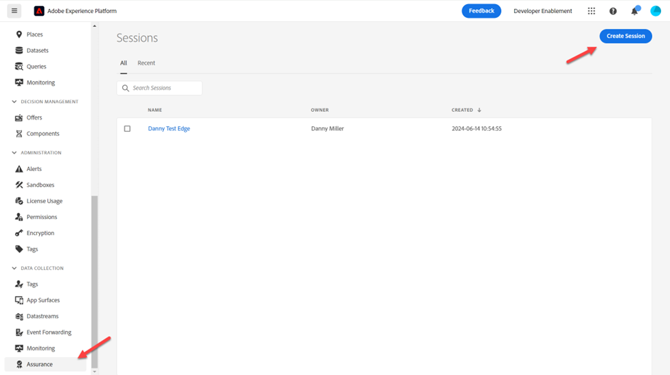

# 監視您的事件

## 導覽至Assurance

[Adobe Experience Platform Assurance](https://experienceleague.adobe.com/zh-hant/docs/experience-platform/assurance/home)是Adobe Experience Cloud的產品，可協助您檢查、校樣、模擬及驗證將資料收集到Adobe Experience Platform Edge的方式。

1. 前往Adobe Experience Platform -> Assurance ->建立工作階段

   

2. 按一下&#x200B;**開始**&#x200B;按鈕

![按一下[開始]按鈕以開始設定Assurance工作階段](assets/monitor-your-event-click-start-button.png)

## 設定工作階段

1. 名稱 — > \[Sandbox] Edge工作階段
1. URL —> https\：//www\.adobe.com
   - 請注意，此URL將由您客戶的實際網站取代
1. 按一下下一步按鈕

   輸入工作階段名稱和URL後![按[下一步]](assets/monitor-your-event-click-next-button.png)

4. 將連結複製到您稍後可參考的位置

5. 按一下&#x200B;**完成**&#x200B;按鈕

   ![複製Assurance工作階段連結並按一下[完成]](assets/monitor-your-event-copy-link.png)

6. 瀏覽至&#x200B;**設定**

   ![瀏覽至Assurance工作階段中的[設定]索引標籤](assets/monitor-your-event-navigate-to-settings.png "按一下設定")

7. 按一下&#x200B;**+**&#x200B;按鈕，然後按一下&#x200B;**完成**，以啟用&#x200B;**事件交易**&#x200B;和&#x200B;**Edge Delivery**

![啟用事件交易與Edge Delivery，然後按一下[完成]](assets/monitor-your-event-enable-event-transactions-and-edge-delivery.png)

## 開啟Postman

前往Postman ->建立網頁事件Edge （無驗證） ->標頭

1. 將&#x200B;**x-adobe-aep-validation-token**&#x200B;新增至具有上述從Assurance複製的連結的標頭。 在您從Assurance複製的連結中，於=之後抓取&#x200B;**ID**&#x200B;值。 例如[https://www.adobe.com/?adb\_validation\_sessionid=](https://www.adobe.com/?adb_validation_sessionid=efa4a9ed-02d8-4647-80fa-f01a5be273d0)[`efa4a9ed-02d8-4647-80fa-f01a5be273d0`](https://www.adobe.com/?adb_validation_sessionid=efa4a9ed-02d8-4647-80fa-f01a5be273d0)
1. 我們只會使用[`efa4a9ed-02d8-4647-80fa-f01a5be273d0`](https://www.adobe.com/?adb_validation_sessionid=efa4a9ed-02d8-4647-80fa-f01a5be273d0)值，而非完整URL

   

3. 在Postman中，儲存並執行&#x200B;**建立網頁事件Edge （無驗證）**&#x200B;請求

## 檢視Assurance記錄

返回Assurance，您應該會看到許多顯示的事件。 將您的資料串流ID加入搜尋，直接篩選為相關的事件型別

視需要在右側邊欄上選取事件並開啟任何訊息。

要尋找的事件型別：

- hitReceived （顯示Edge收到的裝載）
- evaluatingRule （如果您設定SSF，會顯示正在評估的規則）
- Firdestinations （會傳送至哪些目的地）
- segmentsDiscovered （它是否符合任何邊緣區段的資格）
- com.adobe.experience\_platform.edge\_segmentation/response （它回應了哪些區段）

探索這些內容，並瞭解Assurance如何解譯每個步驟。
