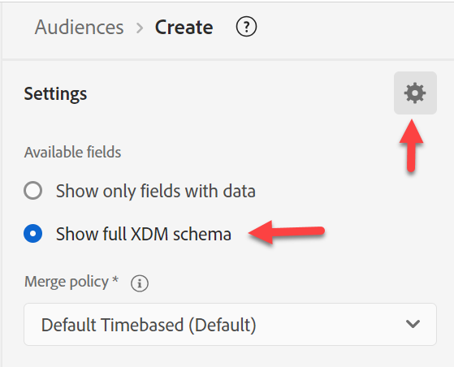
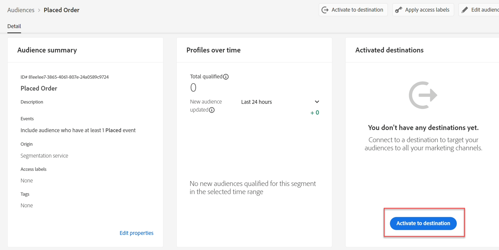
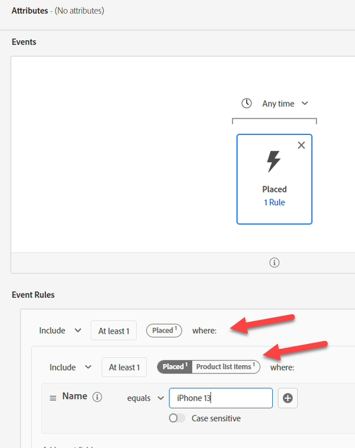

# 建立受眾#1

## 實驗室目標

建立只尋找已下訂iPhone 14之設定檔的受眾

## 劃分對象

首先，請建立您的第一個對象。 它由許多我們需要整合的片段組成。 按一下左側邊欄上的「對象」 ，然後按一下右上方的「建立對象」按鈕。

我們將此使用案例分成幾個片段，並使用多個對象加以解決。 原因是因為我們嘗試讓此成為串流，而有兩個因素在防止此情況：

1. 排除子句「iPhone 14/Pixel 7沒有順序」
1. 排除子句「沒有作用中的iPhone 14/Pixel 7」。 我們將在最後討論其後果。

## 第1部分 — 探索

我們對象的第一個部分是尋找「iPhone 14沒有訂單」。 假設我們是AEP的新行銷人員，但未設計結構描述。 在左側欄的「事件」索引標籤中搜尋「Order」

![在左側邊欄的[事件]索引標籤中搜尋[順序]](assets/build-audience-1-search-order-in-events-tab.png)

您會取得許多與訂單相關的物件

- 屬性：例如訂單識別碼、訂單日期
- 檔案夾：例如「訂單」、「計畫訂單詳細資料」
- 事件型態：例如「下訂單」、「已出貨訂單」等。

>[!NOTE]
>
>&#x200B;* 訂單「資料夾」沒有「i」。 即使已填入我們的說明，但此說明並沒有，這可能會讓您的行銷人員感到困惑，因為他們可能會嘗試使用該說明或想知道它是什麼。
>&#x200B;* 事件卡片的「i」只會重複型別，因為事件型別是一個欄位，而不是多個。
>&#x200B;* 只有在合併的設定檔中有超過2%的值存在時，才會顯示摘要資料。 在篩選字串時，這也會推動任何自動完成。

使用「訂購事件型別」卡片，並將其拖曳至畫布上。

>[!TIP]
>
>**選擇性：**
>
>每個事件都有事件型別。  我們可以在「事件型別」上篩選，而不使用事件型別卡。
>
>請記得先前我們擴充「訂單結構描述事件型別」時的情形。 我們已新增現在於下拉式清單中看到的值。  這些相同的值會顯示為事件型別卡片
>
>如果您想要的話，可以使用其中一種方法。
>
>在新對象中，進入XDM體驗事件並拖曳事件型別。
>
>
>
>使用事件型別卡片進行篩選，與使用事件型別欄位進行篩選相同
>
>
>
>使用事件型別卡的好處：
>
>- 它會顯示對象中事件型別的名稱，讓您輕鬆快速地瞭解
>- 此程式快速且所需步驟較少
>
>使用事件型別欄位的好處：
>
>- 如果我們想要在一個條件中包含多個型態，它可讓您選取多個事件型態（例如「擷取訂單」或「交貨訂單」）
>- 它支援區分大小寫

>[!NOTE]
>
>針對「無訂單存在」，有幾個選項可考慮。  我們正在選擇一個簡單的方法，但在現實世界中，我們要思考以下幾點：
>
>- 已下單但已撿料或已出貨
>- 已下單但已取消
>- 已下多份訂單，但有一份已取消

我們的行銷人員從訓練中得知，已載入多個資料來源：

- 訂單（由訂單系統跨所有管道擷取）
- 網路（使用者端追蹤使用者點選的內容，包括網站上的訂單）
- 電子商務（由網站上的電子商務系統擷取）

我們應該使用哪個來源？ 它們邏輯上都會表示相同的「已下訂單」事件。 但它們實際儲存在不同的系統中。 我們如何知道要使用哪種？ 最好的方式是檢視每個結構描述物件和每個要瞭解的欄位的說明。

>[!NOTE]
>
>說明中應該會有相關資訊來協助您做出這些決策，例如：
>
>1. 資料來自何處？
>2. 它包含或不包含什麼？
>3. 延遲為何？
>4. 是否已將任何系統指定為「真相來源」？
>5. 我們需要考慮任何細微差別嗎？

我們想要使用「已下訂單」，但請記住，根據我們的使用案例，我們可能有以下需求，這可能會影響我們從哪個來源提取：

- 過去30分鐘現場購買
- 已下單但未取消的訂單
- 在就緒後1天內擷取的訂單

>[!TIP]
>
>假設我們今天在網站上下了單一訂單（請記住，訂單是由所有三個系統記錄的）：
>
>1. 今天下的訂單會計算多少事件？
>2. 從客戶的角度下了多少訂單？
>3. 如果我們依「送貨方法=隔夜」篩選（假設他們選擇此方式），會計入多少個事件？
>4. 我們應如何解決此問題（受眾或資料模型）？

完成一些分析後，我們將使用`Orders Event of Event Type=”order. placed”`。 我們希望確保我們的對象在速度上做出權衡（當「訂單」在傳送前進行一些處理時，網站資料會隨著每次點按而流入），使用真實來源。 此外，未來我們可能會想要排除已取消和可以透過任何管道完成的使用者。

## 第2部分 — 建立對象

開啟顯示完整結構描述

以您開始的工作為基礎。  按一下「已放置」卡片，然後在左側邊欄上從搜尋&#x200B;**中清除**&#x200B;已放置並向下切入：

XDM體驗事件 — >產品清單專案資料夾

>[!WARNING]
>
>行銷人員常見的混淆是在此處使用裝置而非產品（因為我們將在iPhone上篩選）。 同樣地，這也是描述清楚的另一個原因。

我們正在尋找可以篩選的專案，這些專案可能包含iPhone。 請注意，我們有三個選項

- 名稱
- 產品
- SKU

他們都可以是好的候選人，但是我們不得而知。  按一下「i」以取得每個專案的詳細資訊。

>[!NOTE]
>
>您可以變更任何OOTB欄位的說明。 更新或甚至隱藏未使用的欄位，以減少使用者的混淆。 在您的產業/企業中，這些OOTB說明可能沒有意義。
>
>好的描述甚至可能包含範例
>
>- 名稱說明=在此產品檢視中向使用者呈現的產品顯示名稱。 例如： iPhone 14， Pixel 7
>- SKU說明=庫存單位(SKU)，供應商所定義之產品的唯一識別碼。 例如：iP14、Pix7
>- 產品說明=產品本身的XDM識別碼。 例如： 123， 456

開啟「僅顯示含有資料的欄位」

![開啟[僅顯示含有資料的欄位]](assets/build-audience-1-turn-on-show-only-fields-with-data.png)

>[!NOTE]
>
>**可觀察的結構描述**
>
>只有欄位中有資料。  這是以AEP為基礎的應用程式排除的方法，可讓您不使用實際上無用的欄位。
>
>**完整XDM結構描述**
>
>這是聯合結構描述中的所有欄位，無論是否有資料載入其中。

一旦您開啟「僅顯示含有資料的欄位」，您就會注意到您想使用「離開」的欄位。

向下展開至「XDM ExperienceEvent >產品清單專案>維度>模型」

模型看起來很像，但沒有任何說明。

將其拖曳至「已放置事件」卡片。

![將[模型]欄位拖曳到[已置入]事件卡](assets/build-audience-1-drag-it-onto-the-placed-event-card.png)

新增iPhone 14

在「已放置事件」上方，將「任何時間」變更為「今天」

>[!NOTE]
>
>我們篩選於今天，因為我們不關心一週、一個月或一年前下的訂單。  此外，更長的回顧將在下一節中介紹。  在某個時間點，訂單會變成&quot;*擁有*&quot;，我們將為此建立區段。

提供說明

將評估方法變更為&#x200B;**串流**

**將對象**&#x200B;儲存為「*iPhone 14*&#x200B;已下訂單」

按一下藍色按鈕&#x200B;**啟用受眾**&#x200B;到目的地

選取&#x200B;**串流DEP Webhook**&#x200B;目的地，然後按[下一步]

![選取串流DEP Webhook目的地並按一下[下一步]](assets/build-audience-1-select-streaming-dep-webhook-destination.png)

不要變更對應，按一下「下一步」和「完成」

>[!NOTE]
>
>**容器**
>
>請注意，當我們依產品清單中的名稱進行篩選時，它會自動新增一些容器。 原因在於產品清單專案是Array資料型別。 在陣列上篩選時，會建立容器（在我們的範例中稱為產品清單專案）。
>
>
>
>
>
>容器是參考事件變數或陣列元素的方式。 您可以在此部落格中閱讀更多有關其後果的資訊，但為了簡單起見，這可讓您指定陣列中的單一元素是否同時符合兩個條件，或者條件是否可分佈在兩個元素中。
>
>[https://experienceleaguecommunities.adobe.com/t5/adobe-experience-platform-blogs/how-exactly-do-containers-work-in-aep-segmentation-a-deeper-look/ba-p/458780](https://experienceleaguecommunities.adobe.com/t5/adobe-experience-platform-blogs/how-exactly-do-containers-work-in-aep-segmentation-a-deeper-look/ba-p/458780)

>[!WARNING]
>
>**時間篩選器**
>
>雖然需求中未指定任何內容，但此對象發生問題，我們應返回並與業務部門進行澄清。
>
>需求沒有時間篩選器。 也就是說，如果某人在一年或五年前下訂單，即符合此資格。 請一律嘗試納入方法，以確保您不會落入此陷阱，或一律在新版本推出時更新您的對象。
>
>如果我們變更新增的時間篩選器，Edge區段變成「串流」或「批次」之前可以追溯到多久以前？

>[!CAUTION]
>
>**產品儲存在兩個地方嗎？**
>
>請注意不同的路徑命名慣例和說明。 與先前的對象比較
>
>- XDM個別設定檔>部門>作用中產品>產品ID屬性>產品名稱
>  - 說明：產品名稱。
>- XDM ExperienceEvent >產品清單專案>維度>模型
>  - 說明：在此產品檢視中向使用者呈現的產品顯示名稱。
>
>出於不同原因和目的，當我們開始將相同的值儲存在不同的位置時，我們需要考慮對使用者的影響以及設定檔將如何合併這些內容(以及合併原則將如何解決此衝突（如果需要）。
>
>我們目前的說明讓行銷人員很難知道要使用哪個網域
